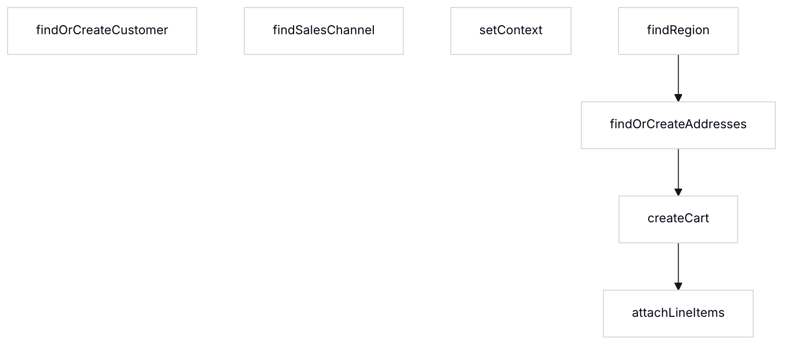

```mermaid
%%{
    init: {
      'theme': 'base',
      'themeVariables': {
        'background': '#F9FAFB',
        'primaryColor': '#FFFFFF',
        'primaryTextColor': '#030712',
        'primaryBorderColor': '#D1D5DB',
        'lineColor': '#11181C',
        'fontFamily': 'Inter',
        'fontSize': '13px',
        'clusterBkg': 'transparent',
        'clusterBorder': 'transparent'
      }
    }
  }%%
	flowchart TB
		
		findOrCreateCustomer[findOrCreateCustomer]
		
		findSalesChannel[findSalesChannel]
		
		setContext[setContext]
		
		findRegion[findRegion]
		
		findOrCreateAddresses[findOrCreateAddresses]
		
		createCart[createCart]
		
		attachLineItems[attachLineItems]

		findRegion --> findOrCreateAddresses
		
		findOrCreateAddresses --> createCart
		
		createCart --> attachLineItems
```