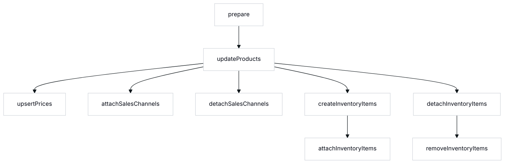

```mermaid
%%{
    init: {
      'theme': 'base',
      'themeVariables': {
        'background': '#F9FAFB',
        'primaryColor': '#FFFFFF',
        'primaryTextColor': '#030712',
        'primaryBorderColor': '#D1D5DB',
        'lineColor': '#11181C',
        'fontFamily': 'Inter',
        'fontSize': '13px',
        'clusterBkg': 'transparent',
        'clusterBorder': 'transparent'
      }
    }
  }%%
	flowchart TB
		
		prepare[prepare]
		
		updateProducts[updateProducts]
		
		
		upsertPrices[upsertPrices]
		
		attachSalesChannels[attachSalesChannels]
		
		detachSalesChannels[detachSalesChannels]
		
		createInventoryItems[createInventoryItems]
		
		attachInventoryItems[attachInventoryItems]
		
		detachInventoryItems[detachInventoryItems]
		
		removeInventoryItems[removeInventoryItems]

		prepare --> updateProducts
		
		updateProducts --> upsertPrices
		
		updateProducts --> attachSalesChannels
		
		updateProducts --> detachSalesChannels
		
		updateProducts --> createInventoryItems
		
		updateProducts --> detachInventoryItems
		
		createInventoryItems --> attachInventoryItems
		
		detachInventoryItems --> removeInventoryItems
```