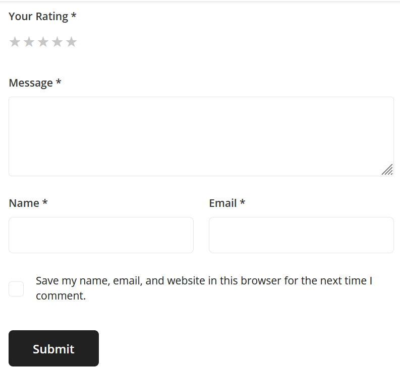

<h1>Medusa plugin reviews</h1>

    This plugin allows you to add reviews from your customers to your products and services in 
medusa js.

  You don't have to configure anything for this plugin to work. But you have to link the plugin 
after installing with npm|yarn: <b>npm link medusa-plugin-reviews</b> and after <b>medusa run 
migrations
</b> to apply migrations to the database.

Below you see a small inspiration image that shows how the plugin works.

