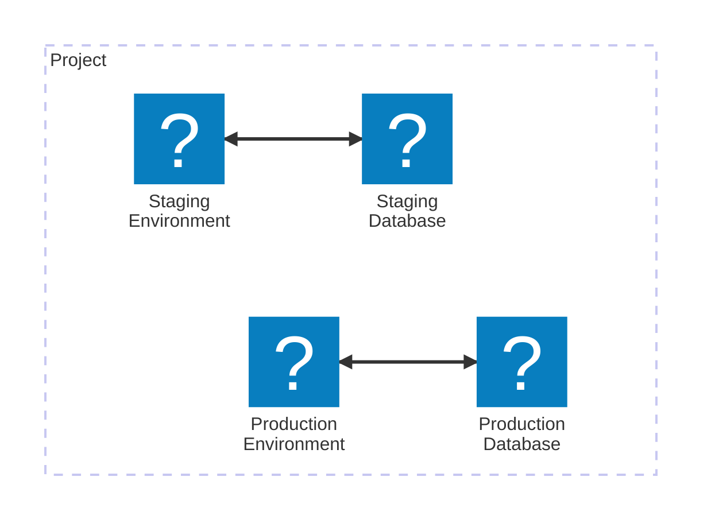
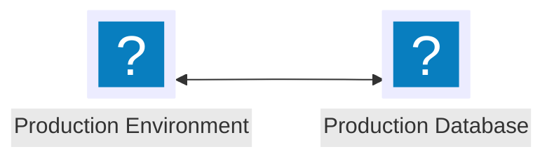

export const metadata = {
  title: `Mermaid Icon Test`,
}

# {metadata.title}

```mermaid
architecture-beta
    group project[Project]
    service prod(medusa:terminal)[Production Environment] in project
    service proddb(medusa:database)[Production Database] in project
    service staging(medusa:terminal)[Staging Environment] in project
    service stagingdb(medusa:database)[Staging Database] in project
    prod:R <--> L:proddb
    staging:R <--> L:stagingdb
```

```mermaid
flowchart LR
    B@{ icon: "medusa:terminal", form: "square", label: "Production Environment" }
    A@{ icon: "medusa:database", form: "square", label: "Production Database" }
    B <--> A
```
