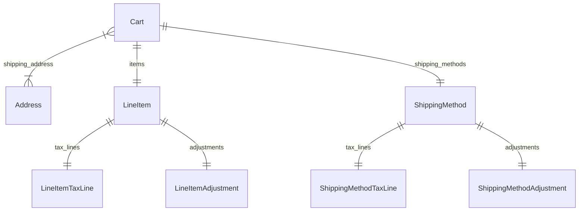

import TypeList from "@site/src/components/TypeList"

# Cart Module Data Models Reference

This documentation provides a reference to the data models in the Cart Module

## Relations Overview

## Classes

- [Address](../cart_models/classes/cart_models.Address.mdx)
- [Cart](../cart_models/classes/cart_models.Cart.mdx)
- [LineItemAdjustment](../cart_models/classes/cart_models.LineItemAdjustment.mdx)
- [LineItemTaxLine](../cart_models/classes/cart_models.LineItemTaxLine.mdx)
- [LineItem](../cart_models/classes/cart_models.LineItem.mdx)
- [ShippingMethodAdjustment](../cart_models/classes/cart_models.ShippingMethodAdjustment.mdx)
- [ShippingMethodTaxLine](../cart_models/classes/cart_models.ShippingMethodTaxLine.mdx)
- [ShippingMethod](../cart_models/classes/cart_models.ShippingMethod.mdx)
