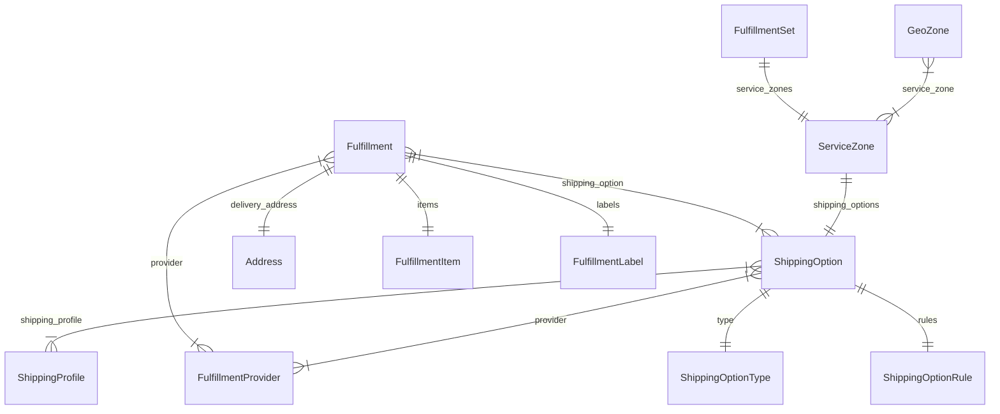

import TypeList from "@site/src/components/TypeList"

# Fulfillment Module Data Models Reference

This documentation provides a reference to the data models in the Fulfillment Module

## Relations Overview

## Classes

- [Address](../fulfillment_models/classes/fulfillment_models.Address.mdx)
- [FulfillmentItem](../fulfillment_models/classes/fulfillment_models.FulfillmentItem.mdx)
- [FulfillmentLabel](../fulfillment_models/classes/fulfillment_models.FulfillmentLabel.mdx)
- [FulfillmentProvider](../fulfillment_models/classes/fulfillment_models.FulfillmentProvider.mdx)
- [FulfillmentSet](../fulfillment_models/classes/fulfillment_models.FulfillmentSet.mdx)
- [Fulfillment](../fulfillment_models/classes/fulfillment_models.Fulfillment.mdx)
- [GeoZone](../fulfillment_models/classes/fulfillment_models.GeoZone.mdx)
- [ServiceZone](../fulfillment_models/classes/fulfillment_models.ServiceZone.mdx)
- [ShippingOptionRule](../fulfillment_models/classes/fulfillment_models.ShippingOptionRule.mdx)
- [ShippingOptionType](../fulfillment_models/classes/fulfillment_models.ShippingOptionType.mdx)
- [ShippingOption](../fulfillment_models/classes/fulfillment_models.ShippingOption.mdx)
- [ShippingProfile](../fulfillment_models/classes/fulfillment_models.ShippingProfile.mdx)
