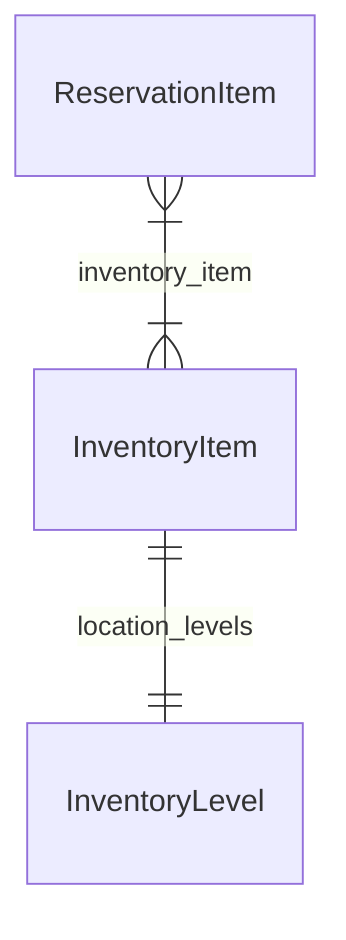

import TypeList from "@site/src/components/TypeList"

# Inventory Module Data Models Reference

This documentation provides a reference to the data models in the Inventory Module

## Relations Overview

## Classes

- [InventoryItem](../inventory_next_models/classes/inventory_next_models.InventoryItem.mdx)
- [InventoryLevel](../inventory_next_models/classes/inventory_next_models.InventoryLevel.mdx)
- [ReservationItem](../inventory_next_models/classes/inventory_next_models.ReservationItem.mdx)
