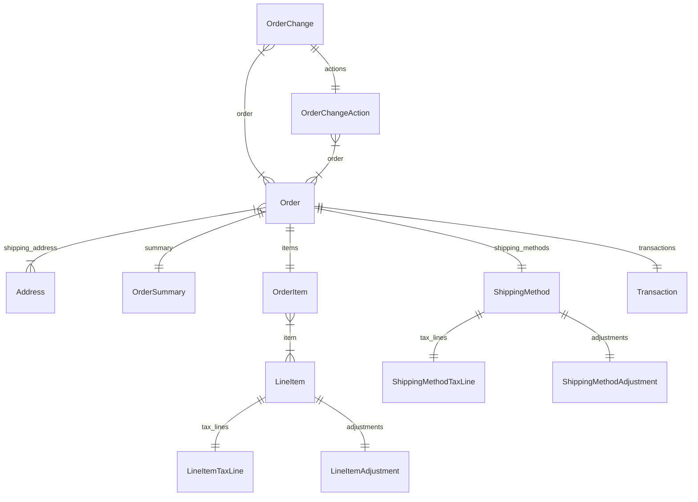

import TypeList from "@site/src/components/TypeList"

# Order Module Data Models Reference

This documentation provides a reference to the data models in the Order Module

## Relations Overview

## Classes

- [Address](../order_models/classes/order_models.Address.mdx)
- [LineItemAdjustment](../order_models/classes/order_models.LineItemAdjustment.mdx)
- [LineItemTaxLine](../order_models/classes/order_models.LineItemTaxLine.mdx)
- [LineItem](../order_models/classes/order_models.LineItem.mdx)
- [OrderChangeAction](../order_models/classes/order_models.OrderChangeAction.mdx)
- [OrderChange](../order_models/classes/order_models.OrderChange.mdx)
- [OrderItem](../order_models/classes/order_models.OrderItem.mdx)
- [OrderSummary](../order_models/classes/order_models.OrderSummary.mdx)
- [Order](../order_models/classes/order_models.Order.mdx)
- [ShippingMethodAdjustment](../order_models/classes/order_models.ShippingMethodAdjustment.mdx)
- [ShippingMethodTaxLine](../order_models/classes/order_models.ShippingMethodTaxLine.mdx)
- [ShippingMethod](../order_models/classes/order_models.ShippingMethod.mdx)
- [Transaction](../order_models/classes/order_models.Transaction.mdx)
