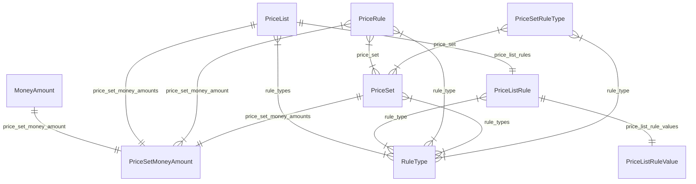

import TypeList from "@site/src/components/TypeList"

# Pricing Module Data Models Reference

This documentation provides a reference to the data models in the Pricing Module

## Relations Overview

## Classes

- [MoneyAmount](../pricing_models/classes/pricing_models.MoneyAmount.mdx)
- [PriceListRuleValue](../pricing_models/classes/pricing_models.PriceListRuleValue.mdx)
- [PriceListRule](../pricing_models/classes/pricing_models.PriceListRule.mdx)
- [PriceList](../pricing_models/classes/pricing_models.PriceList.mdx)
- [PriceRule](../pricing_models/classes/pricing_models.PriceRule.mdx)
- [PriceSetMoneyAmount](../pricing_models/classes/pricing_models.PriceSetMoneyAmount.mdx)
- [PriceSetRuleType](../pricing_models/classes/pricing_models.PriceSetRuleType.mdx)
- [PriceSet](../pricing_models/classes/pricing_models.PriceSet.mdx)
- [RuleType](../pricing_models/classes/pricing_models.RuleType.mdx)
