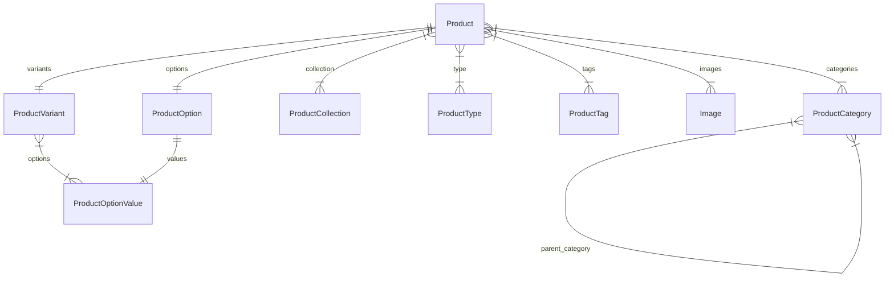

import TypeList from "@site/src/components/TypeList"

# Product Module Data Models Reference

This documentation provides a reference to the data models in the Product Module

## Relations Overview

## Classes

- [ProductCategory](../product_models/classes/product_models.ProductCategory.mdx)
- [ProductCollection](../product_models/classes/product_models.ProductCollection.mdx)
- [Image](../product_models/classes/product_models.Image.mdx)
- [ProductOptionValue](../product_models/classes/product_models.ProductOptionValue.mdx)
- [ProductOption](../product_models/classes/product_models.ProductOption.mdx)
- [ProductTag](../product_models/classes/product_models.ProductTag.mdx)
- [ProductType](../product_models/classes/product_models.ProductType.mdx)
- [ProductVariant](../product_models/classes/product_models.ProductVariant.mdx)
- [Product](../product_models/classes/product_models.Product.mdx)
