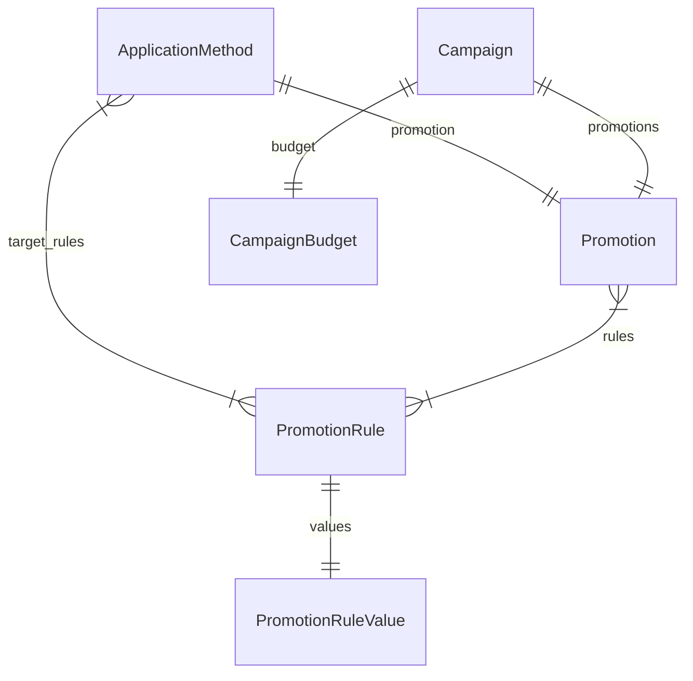

import TypeList from "@site/src/components/TypeList"

# Promotion Module Data Models Reference

This documentation provides a reference to the data models in the Promotion Module

## Relations Overview

## Classes

- [ApplicationMethod](../promotion_models/classes/promotion_models.ApplicationMethod.mdx)
- [CampaignBudget](../promotion_models/classes/promotion_models.CampaignBudget.mdx)
- [Campaign](../promotion_models/classes/promotion_models.Campaign.mdx)
- [PromotionRuleValue](../promotion_models/classes/promotion_models.PromotionRuleValue.mdx)
- [PromotionRule](../promotion_models/classes/promotion_models.PromotionRule.mdx)
- [Promotion](../promotion_models/classes/promotion_models.Promotion.mdx)
