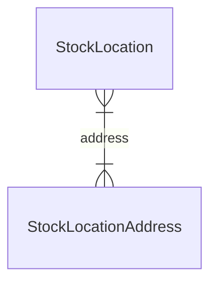

import TypeList from "@site/src/components/TypeList"

# Stock Location Module Data Models Reference

This documentation provides a reference to the data models in the Stock Location Module

## Relations Overview

## Classes

- [StockLocationAddress](../stock_location_models/classes/stock_location_models.StockLocationAddress.mdx)
- [StockLocation](../stock_location_models/classes/stock_location_models.StockLocation.mdx)
