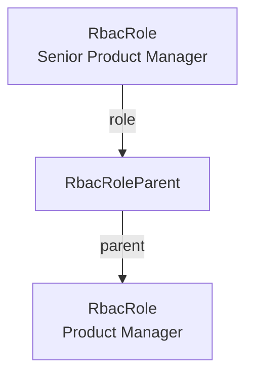

export const metadata = {
  title: `RBAC Concepts`,
}

# {metadata.title}

<EnterpriseNotice featureFlag="rbac" featureFlagHref="../page.mdx#how-to-use-the-rbac-module" />

In this guide, you'll learn about the main concepts of the role-based access control (RBAC) Module: policies, roles, role hierarchy, and how roles link to admin users.

## Policy

A policy, represented by the `RbacPolicy` data model, is the smallest unit of access in RBAC. It allows an operation on a resource.

A policy has a `key` in the format `resource:operation`, where:

- `resource` is the entity the policy applies to, such as `product` or `order`.
- `operation` is the action allowed on the resource, such as `read`, `create`, `update`, or `delete`.

For example, the `order:read` policy allows viewing orders.

### Granular Policies

Since policies are defined at the resource-operation level, you can create granular access control by granting access to parent resources, but not to their children.

For example, the `product:read` policy allows viewing products, but not their variants. To allow viewing variants, you would also need to grant the `product_variant:read` policy.

### Wildcard Policies

A policy can use the wildcard `*` for its resource, operation, or both:

- `product:*` allows all operations on products.
- `*:read` allows reading all resources.
- `*:*` allows all operations on all resources. This is the policy granted to the Super Admin role.

### Registered Policies

Medusa registers the policies for its commerce resources, such as products and orders. When the application starts, Medusa compares the policies registered in code with those in the database, then:

- Creates a policy for each registered policy that doesn't exist in the database yet.
- Updates a policy whose name or description changed in code.
- Restores a policy that was previously deleted from the database, if it's registered in code again.
- Deletes a policy from the database if it's no longer registered in code.

You can also define policies for your custom resources. Learn how in the [Defining Custom Policies](../define-policies/page.mdx) guide.

---

## Role

A role, represented by the `RbacRole` data model, groups a set of policies under a name, such as "Product Manager" or "Order Manager". You assign roles to admin users (or any actor type) to control what they can access.

A role has the following main properties:

- `name`: The role's unique name.
- `description`: An optional description of the role's purpose.
- `policies`: The policies granted by the role.

When an admin user is assigned a role, they gain all the policies of that role.

### Super Admin Role

When you enable the RBAC feature flag, the Medusa application does the following:

1. Creates a Super Admin role with the `*:*` wildcard policy. This role has full access to all resources and operations. It's created by the RBAC Module when the application starts or when you run database migrations.
2. Grants the Super Admin role to all existing admin users. This ensures your current users keep their full access after enabling RBAC. This happens the first time you run database migrations after enabling the RBAC feature flag.

New users created with the [user CLI command](../../../medusa-cli/commands/user/page.mdx) are also assigned the Super Admin role by default while RBAC is enabled.

---

## Role Hierarchy

A role can have one or more parent roles. When a role has a parent, it inherits all the parent's policies in addition to its own.

This hierarchy is represented by the `RbacRoleParent` data model. Each record links a role to one of its parents, so a role can have multiple parent records. The `RbacRole` data model exposes these records through its `parents` relation.

For example, if a "Senior Product Manager" role has the "Product Manager" role as a parent, it inherits all of the Product Manager's policies. The following diagram shows how an `RbacRoleParent` record links these two roles:

Role inheritance is resolved recursively, so a role inherits the policies of its parents, their parents, and so on. Medusa prevents circular inheritance: a role can't be a parent of itself, directly or indirectly.

---

## Linking Roles to Admin Users

Roles are linked to admin users through a [module link](!docs!/learn/fundamentals/module-links) between the [User Module](../../user/page.mdx) and the RBAC Module.

An admin user can have multiple roles. Their effective policies are the union of the policies from all their assigned roles, including any policies inherited through role hierarchy.

When you assign a role to a user in your customizations, the user performing the assignment must already have all the policies granted by that role. This prevents an admin user from granting access that they don't have themselves.

Learn how the link is defined and how to manage it in the [Links to Other Modules](../links-to-other-modules/page.mdx) guide.

---

## Permission Resolution

When the RBAC feature flag is enabled, Medusa checks an admin user's effective policies before allowing an operation on a resource. A request is allowed if the user has a matching policy, including a wildcard policy that covers the resource or operation.

When the RBAC feature flag is disabled, no access control is enforced, and admin users have access to all resources and operations.
