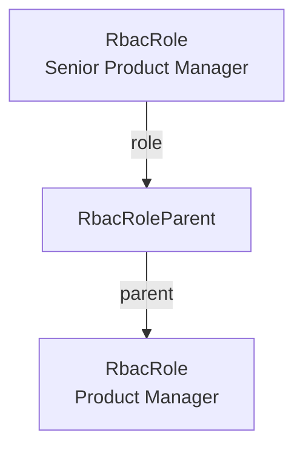

export const metadata = {
  title: `RBAC Concepts`,
}

# {metadata.title}

<EnterpriseNotice featureFlag="rbac" featureFlagHref="../page.mdx#how-to-use-the-rbac-module" />

In this guide, you'll learn about the main concepts of the role-based access control (RBAC) Module: policies, roles, role hierarchy, and role assignments.

## Policy

A policy, represented by the `RbacPolicy` data model, is the smallest unit of access in RBAC. It allows an operation on a resource.

A policy has a `key` in the format `resource:operation`, where:

- `resource` is the entity the policy applies to, such as `product` or `order`.
- `operation` is the action allowed on the resource, such as `read`, `create`, `update`, or `delete`.

For example, the `order:read` policy allows viewing orders.

### Granular Policies

Since policies are defined at the resource-operation level, you can create granular access control by granting access to parent resources, but not to their children.

For example, the `product:read` policy allows viewing products, but not their variants. To allow viewing variants, you would also need to grant the `product_variant:read` policy.

### Wildcard Policies

A policy can use the wildcard `*` for its resource, operation, or both:

- `product:*` allows all operations on products.
- `*:read` allows reading all resources.
- `*:*` allows all operations on all resources. This is the policy granted to the Super Admin role.

### Core Policies

Medusa defines a policy for every operation on each of its own commerce resources, such as products and orders. Every time the application starts, the RBAC Module syncs those core policies to the database, matching them by their `key`. The sync does the following:

- Creates a policy that doesn't exist in the database yet.
- Updates a policy whose name or description changed.
- Restores a policy that was previously deleted.

The sync never deletes a policy, and it never changes a policy that you created yourself.

<Note>

You can't delete a core policy from the Medusa Admin dashboard, since policies are read-only there. If you delete one in your customizations, with the Delete Policy API route or the `deleteRbacPoliciesWorkflow`, the next restart restores it.

</Note>

You can also create policies for your custom resources. Learn how in the [Define Custom Policies](../define-policies/page.mdx) guide.

---

## Role

A role, represented by the `RbacRole` data model, groups a set of policies under a name, such as "Product Manager" or "Order Manager". You assign roles to admin users (or any actor type) to control what they can access.

A role has the following main properties:

- `name`: The role's unique name.
- `description`: An optional description of the role's purpose.
- `policies`: The policies granted by the role.

An admin user assigned a role gains all the policies of that role.

### Super Admin Role

When you enable the RBAC feature flag, the Medusa application does the following:

1. Creates a Super Admin role with the `*:*` wildcard policy. This role has full access to all resources and operations. It's created by the RBAC Module when the application starts or when you run database migrations.
2. Grants the Super Admin role to all existing admin users. This ensures your current users keep their full access after enabling RBAC. This happens the first time you run database migrations after enabling the RBAC feature flag.

New users created with the [user CLI command](../../../medusa-cli/commands/user/page.mdx) are also assigned the Super Admin role by default while RBAC is enabled.

---

## Role Hierarchy

A role can have one or more parent roles. When a role has a parent, it inherits all the parent's policies in addition to its own.

This hierarchy is represented by the `RbacRoleParent` data model. Each record links a role to one of its parents, so a role can have multiple parent records. The `RbacRole` data model exposes these records through its `parents` relation.

For example, if a "Senior Product Manager" role has the "Product Manager" role as a parent, it inherits all of the Product Manager's policies. The following diagram shows how an `RbacRoleParent` record links these two roles:



Role inheritance is resolved recursively, so a role inherits the policies of its parents, their parents, and so on. Medusa prevents circular inheritance: a role can't be a parent of itself, directly or indirectly.

---

## Role Assignment

A role assignment, represented by the `RbacRoleAssignment` data model, grants a role to an entity. Each assignment is a single record with the following main properties:

- `role_id`: The ID of the granted role.
- `reference`: The type of entity the role is granted to, such as `user` or `invite`.
- `reference_id`: The ID of that entity, such as a user ID or invite ID.
- `scope` and `scope_id`: An optional constraint on where the role applies.

Since the assignment stores the entity's type and ID rather than pointing to a specific data model, you can grant roles to admin users, pending invites, or your own custom entities.

An entity can have multiple roles. Its effective policies are the union of the policies from all its assignments, including any policies inherited through role hierarchy.

### Assign a Role

To assign or remove a role in your customizations, use the `assignRolesWorkflow` and `unassignRolesWorkflow` workflows. For example:

export const assignHighlights = [
  ["10", "reference", "The type of entity to assign the role to."],
  ["11", "reference_id", "The ID of that entity."],
  ["14", "granting_actor_id", "The user performing the assignment."],
]

```ts highlights={assignHighlights}
import {
  assignRolesWorkflow,
} from "@medusajs/medusa/core-flows"

await assignRolesWorkflow(container).run({
  input: {
    assignments: [
      {
        role_id: "role_123",
        reference: "user",
        reference_id: "user_123",
      },
    ],
    granting_actor_id: "user_456",
  },
})
```

When you pass a `granting_actor_id`, the workflow checks that the granting actor already has all the policies of the roles being assigned. This prevents an admin user from granting access that they don't have themselves.

Learn how to retrieve an entity's roles in the [Links to Other Modules](../links-to-other-modules/page.mdx) guide.

### Scoped Assignments

An assignment's `scope` and `scope_id` restrict the role to a single entity instance. For example, an assignment whose `scope` is `organization` and whose `scope_id` is `org_123` grants its policies on requests acting within that organization.

A request only acts within a scope if your application sets one, as explained in the [Permission Resolution](#permission-resolution) section. Requests without a scope consider every assignment, scoped or not.

When you assign a role with the `assignRolesWorkflow`, you pass the two values as one `scope` object instead:

export const scopedHighlights = [
  ["12", "scope", "Restrict the role to this organization."],
  ["16", "granting_scope", "Resolve the granting actor's roles in the same scope."],
]

```ts highlights={scopedHighlights}
import {
  assignRolesWorkflow,
} from "@medusajs/medusa/core-flows"

await assignRolesWorkflow(container).run({
  input: {
    assignments: [
      {
        role_id: "role_123",
        reference: "user",
        reference_id: "user_123",
        scope: { type: "organization", id: "org_123" },
      },
    ],
    granting_actor_id: "user_456",
    granting_scope: { type: "organization", id: "org_123" },
  },
})
```

The workflow stores the object's `type` in the assignment's `scope` property, and its `id` in the `scope_id` property.

### Granting Scope

When you assign a role, you can pass a `granting_scope` to restrict the granting actor's effective policies to a specific scope. This prevents a user from granting a role in a scope where they don't have access.

In the above example, the user assigning the role can only grant it in the `org_123` organization, since their effective policies are resolved in that scope. They can't assign the role in another organization, since they don't have access there.

If you omit `granting_scope`, the workflow resolves the granting actor's effective policies across all their assignments, whatever scope each one has. A user with a role in one organization can then grant that role in another, so pass `granting_scope` whenever the grant happens within a scope.

An unscoped assignment always counts, in both cases. For example, a Super Admin can assign roles in any scope, since they have the `*:*` wildcard policy without a scope.

Medusa's own resources don't use scopes. An assignment without a scope applies to every request.

---

## Permission Resolution

When the RBAC feature flag is enabled, Medusa checks an admin user's effective policies before allowing an operation on a resource. A request succeeds if the user has a matching policy, including a wildcard policy that covers the resource or operation. Otherwise, the request fails with a `403` error.

Medusa resolves the roles of the request's actor for the scope the request acts within, considering the assignments that are unscoped or scoped to it. Your application sets that scope in a middleware that runs before the route's access check. Medusa's own routes don't set a scope, and requests without one consider every assignment of the actor.

Medusa also applies the policies to the fields a request asks for. If the actor can't read a related resource, Medusa removes the fields of that resource from the response instead of rejecting the request.

When the RBAC feature flag is disabled, Medusa enforces no access control, and admin users have access to all resources and operations.
