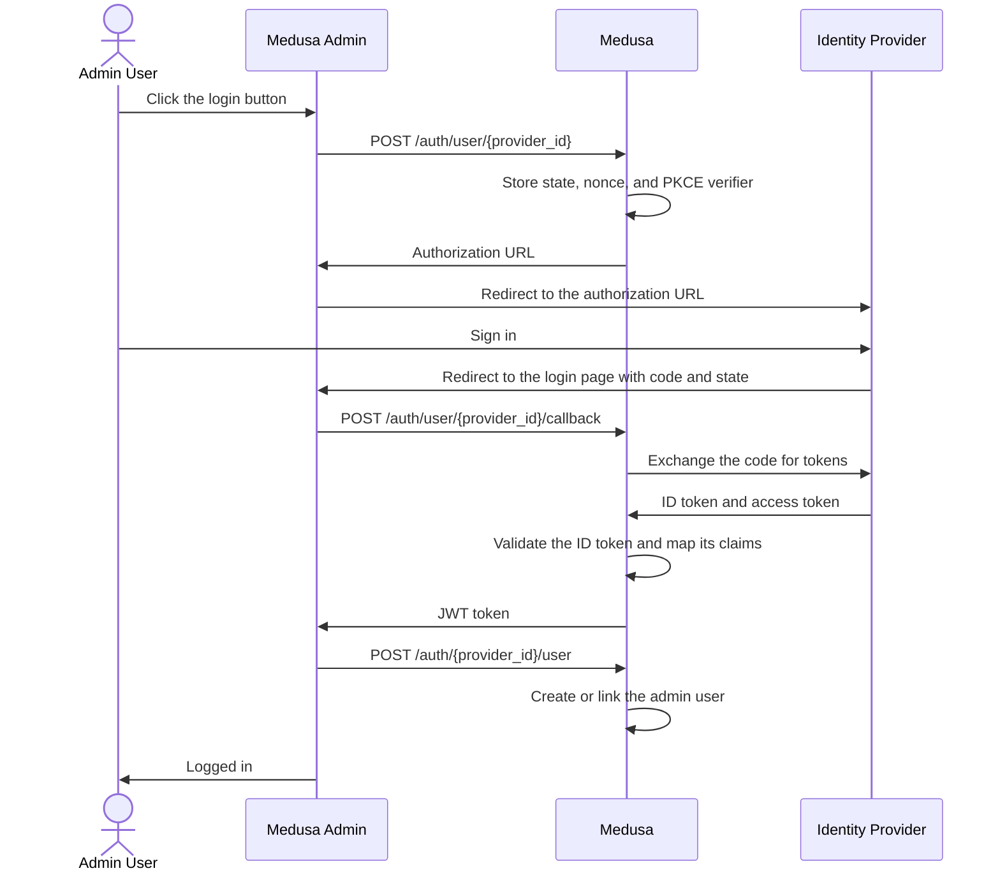

export const metadata = {
  title: `How SSO Works in Medusa`,
}

# {metadata.title}

<EnterpriseNotice beta featureName="module provider" />

In this guide, you'll learn how Medusa authenticates an actor type with an identity provider using the [OIDC Auth Module Provider](../page.mdx).

<Note title="Looking for social login?">

SSO with OIDC is intended for the users of your organization, such as admin users authenticating with your company's identity provider.

To let customers log in to your storefront with a social account, use the [Google](../../../commerce-modules/auth/auth-providers/google/page.mdx) or [GitHub](../../../commerce-modules/auth/auth-providers/github/page.mdx) Auth Module Providers instead. They don't require an enterprise license.

</Note>

## The Authentication Flow

The OIDC provider implements the [authorization code flow](https://openid.net/specs/openid-connect-core-1_0.html#CodeFlowAuth) with [PKCE](https://datatracker.ietf.org/doc/html/rfc7636), which is the flow recommended for browser-based applications.

This guide follows an admin user logging in to the Medusa Admin dashboard with a registered OIDC identity provider like Okta.

<Note>

The same flow applies to any frontend and actor type, such as customers logging in to your storefront. The difference is that you implement the flow yourself, as explained in the [SSO in a Custom Frontend](../custom-frontend/page.mdx) guide.

</Note>

### 0. The Admin User Clicks the Login Button

The flow starts on the dashboard's login page, which shows a "Continue with" button for every identity provider that admin users are allowed to use.

You don't add that button manually. The dashboard renders it once you [allow the provider for admin users](../page.mdx#4-allow-the-provider-for-the-actor-types-that-use-it), and handles every step that follows.

<Note type="warning">

The OIDC provider doesn't support registration, since the identity provider owns the user's credentials. So, a request to the `/auth/user/{provider_id}/register` API route fails with an error.

</Note>

### 1. The Dashboard Starts the Authentication

Once the user clicks the login button, the dashboard sends a request to the `/auth/user/{provider_id}` API route. For example, `POST /auth/user/okta` for the `okta` provider.

The API route builds the identity provider's authorization URL and returns it in the response's `location` property. Before it does, it generates and stores three single-use values:

- A `state` value, which the identity provider echoes back so Medusa can recognize its own request.
- A `nonce`, which the identity provider includes in the ID token so Medusa can tie the token to this login attempt.
- A PKCE code verifier, which Medusa sends the hash of. Only the application that holds the verifier can exchange the authorization code later.

The values expire after the [state_ttl_seconds option](../provider-options/page.mdx#state_ttl_seconds), which defaults to ten minutes.

When the dashboard receives the response with the `location` property, it redirects the browser to the returned URL.

### 2. The User Authenticates with the Identity Provider

The browser lands on the identity provider's own sign-in page, where the user signs in. For example, the user signs in with their Okta credentials if the `okta` provider is used.

Once the user signs in, the identity provider redirects the browser back to the Medusa Admin dashboard's login page, where the user clicked the button, adding a `code` and a `state` query parameter to the URL. That page is the one you set in the [callback_url option](../provider-options/page.mdx#callback_url) and registered with your identity provider.

### 3. The Dashboard Sends the Callback to Medusa

The dashboard sends the query parameters it received to the `/auth/user/{provider_id}/callback` API route. For example, it sends a request to `/auth/user/okta/callback` if the `okta` provider is used.

Medusa then:

1. Matches the `state` parameter against the stored value, and rejects the request if it doesn't match or expired.
2. Exchanges the `code` for tokens at the identity provider's token endpoint, sending the stored PKCE verifier with it.
3. Validates the ID token's signature against the identity provider's public keys, along with its issuer, audience, expiration, and nonce.
4. Maps the token's claims to an auth identity, and applies the [require_verified_email](../provider-options/page.mdx#require_verified_email) and [allowed_email_domains](../provider-options/page.mdx#allowed_email_domains) checks.

If every check passes, Medusa returns a JWT token for the authenticated user.

The auth identity is keyed by the token's `sub` claim, which identity providers guarantee to be stable, and it holds the mapped claims in its `user_metadata`. On later logins, Medusa finds the existing identity and refreshes the stored claims.

<Note>

Medusa trusts none of the ID token's claims until it validates the token. So, an attacker can't authenticate by crafting a token, replaying an old one, or sending a code that another application received.

</Note>

### 4. Medusa Creates the Admin User

An [auth identity](../../../commerce-modules/auth/auth-identity-and-actor-types/page.mdx) isn't an admin user, so the token that the callback returned has an empty `actor_id` when the user logs in for the first time.

The dashboard detects that, then sends the token to the `/auth/{provider_id}/user` API route. For example, it sends a request to `/auth/okta/user` if the `okta` provider is used.

The API route then:

- Links the auth identity to the existing admin user whose email matches the authenticated email, if there is one.
- Otherwise, creates an admin user from the identity's claims and links it to the identity.

Finally, the dashboard refreshes the token so it's bound to the created user, and the user lands in the dashboard. On the user's next login, the token already carries their user's ID, so the dashboard skips this step.
