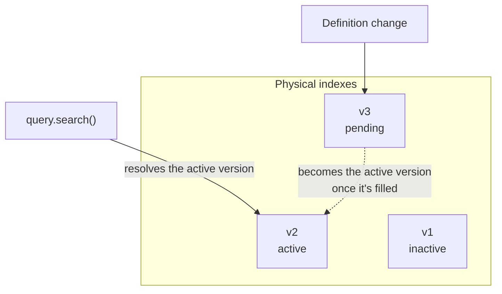
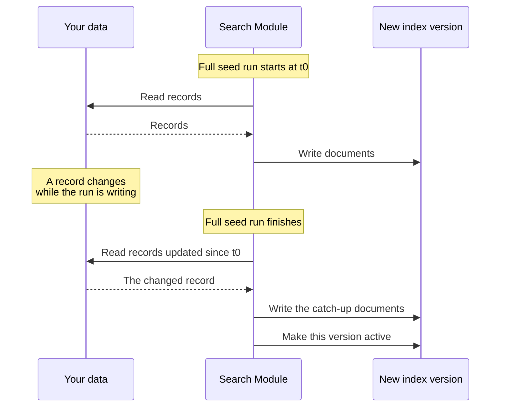

import { Table, TypeList, Prerequisites } from "docs-ui"

export const metadata = {
  title: `Reindexing and Migrations`,
}

# {metadata.title}

In this guide, you'll learn how the Search Module creates physical indexes, fills them, and rebuilds them when a definition changes.

<Prerequisites
  items={[
    {
      text: "Medusa v2.21.1+",
      link: "https://github.com/medusajs/medusa/releases/tag/v2.21.1"
    }
  ]}
/>

## Index Migrations

A [search index definition](../index-definitions/page.mdx) declares what an index should look like. The physical index in the search engine is a separate thing, so the [Search Module](../page.mdx) has to bring the two in line. It does that with an index migration.

Index migrations run as part of the `db:migrate` command:

```bash npx2yarn
npx medusa db:migrate
```

<Note title="Tip">

You can pass `--skip-search` to `db:migrate` to skip search migrations.

</Note>

You can also run them on their own with the following command:

```bash npx2yarn
npx medusa db:migrate:search
```

The command plans the actions first, then prints what it did:

```bash
info:    Migrating search indexes...
┌────────────────────────────────────┐
│                                    │
│   Created following search indexes │
│     - product (product)            │
│                                    │
└────────────────────────────────────┘
info:    Search indexes migrated. They are filled when the application starts
```

Every action is idempotent, so running it twice has no adverse effect. When the physical indexes already match every definition, the command prints `Search indexes already up-to-date` and changes nothing.

The command reports each action under one of the following:

<Table>
  <Table.Header>
    <Table.Row>
      <Table.HeaderCell>
        Action
      </Table.HeaderCell>
      <Table.HeaderCell>
        When it Happens
      </Table.HeaderCell>
    </Table.Row>
  </Table.Header>
  <Table.Body>
    <Table.Row>
      <Table.Cell>
        `create`
      </Table.Cell>
      <Table.Cell>
        No version of the index has ever gone live, so the module builds its first version. Nothing serves the index until a seed fills that version.
      </Table.Cell>
    </Table.Row>
    <Table.Row>
      <Table.Cell>
        `migrate`
      </Table.Cell>
      <Table.Cell>
        The definition's `fields` or `settings` changed, or the index moved to another provider. The module builds a new version to match, leaving the active one serving reads.
      </Table.Cell>
    </Table.Row>
    <Table.Row>
      <Table.Cell>
        `noop`
      </Table.Cell>
      <Table.Cell>
        The physical index already matches the definition.
      </Table.Cell>
    </Table.Row>
  </Table.Body>
</Table>

### How Index Changes Are Handled

An index name, such as `product`, isn't one physical index. The Search Module keeps a version per physical index it has ever built for that name, and one of them is the index's active version. A query resolves the name to the active version, so which physical index answers a search can change without your code changing.

That's what makes a schema change zero-downtime. When a definition changes, the module builds a new version alongside the active one, fills it, then makes the new version active. Reads keep hitting the old version throughout and never see a half-built one. A version that fails to fill stays behind without ever going live, so the active version keeps answering queries.



A version is also what lets an index move between providers. Setting a different `provider` on a definition makes the module build the new version on that provider, and the old provider's data only gets dropped once the new version is active.

<Note title="Warning" type="warning">

The module only fills a new version in worker or shared mode. An application running in server mode never seeds, so the new version stays inactive until a worker or shared process runs, or until you rebuild the index [on demand](#seeding-on-demand).

</Note>

---

## Seeding at Application Start

When your application starts in worker or shared mode, the Search Module checks every index and fills the ones that need data. An application running in server mode skips this entirely, so at least one worker or shared process has to run for an index to be filled.

The module runs an index definition's [seed](../index-definitions/page.mdx#fill-the-index-with-seed) function in the following cases:

1. A migration created the index and nothing has filled it yet.
2. The index exists and holds no documents, such as after an engine restart wiped it.
3. A migration built a new version of the index, which the module fills and then makes active.
4. The previous seed didn't complete, so the module resumes it.
5. You rebuild the index on demand with the Search Module's `reindex` method. Refer to [Seeding on Demand](#seeding-on-demand).
6. The module runs the catch-up pass that follows a full run, which picks up what changed while that run was writing. Refer to [The Catch-Up Pass](#the-catch-up-pass).

The first four cases run when your application starts. The module records every seed run, so an interrupted run passes its `last_key` back to the `seed` function and resumes where it stopped.

---

## Seeding on Demand

You can rebuild an index manually from the [Medusa Admin dashboard](!user-guide!/settings/search), or programmatically with the `reindex` method of the Search Module's service.

For example, the following workflow step rebuilds only the published products in the `product` index:

export const highlights = [
  ["15", "index", "The indexes to rebuild. Defaults to every index."],
  ["16", "filters", "Passed to the definition's `seed` function."],
]

```ts title="src/workflows/steps/reindex-products.ts" highlights={highlights}
import { Modules } from "@medusajs/framework/utils"
import {
  createStep,
  StepResponse,
} from "@medusajs/framework/workflows-sdk"

export const reindexProductsStep = createStep(
  "reindex-products",
  async (_, { container }) => {
    const searchModuleService = container.resolve(
      Modules.SEARCH
    )

    const result = await searchModuleService.reindex({
      index: "product",
      filters: { status: "published" },
    })

    return new StepResponse(result)
  }
)
```

### Parameters

`reindex` accepts the following input:

<TypeList
  types={[
    {
      name: "index",
      type: "`string` \\| `string[]`",
      optional: true,
      defaultValue: "Every registered index",
      description: "The name of an index, or an array of names, to rebuild."
    },
    {
      name: "strategy",
      type: "`\"swap\"` \\| `\"in_place\"`",
      optional: true,
      defaultValue: "swap",
      description: "How to rebuild the index. Refer to [Reindex Strategies](#reindex-strategies)."
    },
    {
      name: "filters",
      type: "`Record<string, unknown>`",
      optional: true,
      description: "Filters passed to the definition's `seed` function for a partial rebuild."
    }
  ]}
  sectionTitle="Seeding on Demand"
/>

### Returns

`reindex` returns to an object with the following properties:

<TypeList
  types={[
    {
      name: "job_id",
      type: "`string`",
      optional: false,
      description: "The ID of the job that performed the reindex."
    },
    {
      name: "indexes",
      type: "`string[]`",
      optional: false,
      description: "The names of the indexes that the method rebuilt."
    }
  ]}
  sectionTitle="Returns"
/>

The method rebuilds every index before it returns this objectg, so you don't poll the `job_id` to know when it finished.

### Reindex Strategies

You can specify how the module rebuilds an index with the `strategy` option. The two strategies are:

<Table>
  <Table.Header>
    <Table.Row>
      <Table.HeaderCell>
        Strategy
      </Table.HeaderCell>
      <Table.HeaderCell>
        Description
      </Table.HeaderCell>
    </Table.Row>
  </Table.Header>
  <Table.Body>
    <Table.Row>
      <Table.Cell>
        `swap` (default)
      </Table.Cell>
      <Table.Cell>
        Fills a new version of the index, then makes it the active one. The version already serving reads keeps doing so throughout.
      </Table.Cell>
    </Table.Row>
    <Table.Row>
      <Table.Cell>
        `in_place`
      </Table.Cell>
      <Table.Cell>
        Writes into the version already serving reads, rather than building a new one. Cheaper, but the index serves partial data while the seed runs.
      </Table.Cell>
    </Table.Row>
  </Table.Body>
</Table>

<Note title="Tip">

Passing `filters` to `reindex` always rebuilds in place, even if you set `strategy` to `swap`. A partial rebuild would only hold the filtered slice, so making it the active version would drop every other document.

</Note>

---

## The Catch-Up Pass

A full seed run reads your data while your application keeps writing to it, so a record that changes mid-run might land in the index stale, or not at all.

To close that gap, the module runs `seed` a second time as soon as the run finishes, passing it `catchup.since`, which is the time the run started. A swap only makes the new index active once this pass finishes.

The following diagram shows a full seed run and the catch-up pass that follows it:



`graphSeed` handles the pass for you. To handle it in a `seed` function you write yourself, refer to [Handle the Catch-Up Pass](../index-definitions/page.mdx#handle-the-catch-up-pass).

---

## Keeping Indexes in Sync

An index holds a copy of your data, so it can fall behind the database. The [`events` and `consume`](../index-definitions/page.mdx#keep-an-index-up-to-date) properties of an index definition close that gap as changes happen, and a reindex repairs it when the gap grows too wide.

### Why an Index Diverges

An index drifts from the database for one of the following reasons:

<Table>
  <Table.Header>
    <Table.Row>
      <Table.HeaderCell>
        Reason
      </Table.HeaderCell>
      <Table.HeaderCell>
        Details
      </Table.HeaderCell>
    </Table.Row>
  </Table.Header>
  <Table.Body>
    <Table.Row>
      <Table.Cell>
        A change emits no declared event
      </Table.Cell>
      <Table.Cell>
        Nothing routes a change whose event name is missing from the definition's `events` array. The same applies to a change that emits no event at all, such as a direct SQL update.
      </Table.Cell>
    </Table.Row>
    <Table.Row>
      <Table.Cell>
        `consume` throws
      </Table.Cell>
      <Table.Cell>
        The Event Bus Module logs the failure. The change never lands in the index.
      </Table.Cell>
    </Table.Row>
    <Table.Row>
      <Table.Cell>
        A filtered rebuild left documents behind
      </Table.Cell>
      <Table.Cell>
        A rebuild that passes `filters` writes over the documents its seed produces and keeps the rest, since it never clears the index. Documents outside the filtered slice keep whatever they held. Refer to [Reindex Strategies](#reindex-strategies).
      </Table.Cell>
    </Table.Row>
  </Table.Body>
</Table>

### Recover with a Reindex

A reindex is the repair path for a diverged index, since it rebuilds documents from the definition's `seed` function rather than from an event. Refer to [Seeding on Demand](#seeding-on-demand) for how to call it.

Two details matter when you reindex to recover:

- Pass `filters` to rebuild only the affected slice. A filtered run costs less than a full rebuild, and it always writes in place, so the documents outside the slice keep serving reads.
- Omit `filters` for a full repair. Both strategies then rebuild every document from the seed, and either one drops what the seed no longer produces. Keep the default `swap` if the index must keep answering queries while it rebuilds.

<Note title="Tip">

Query the `search_index_sync` entity to find out whether a run succeeded, how many documents it wrote, and the error it failed with.

</Note>
