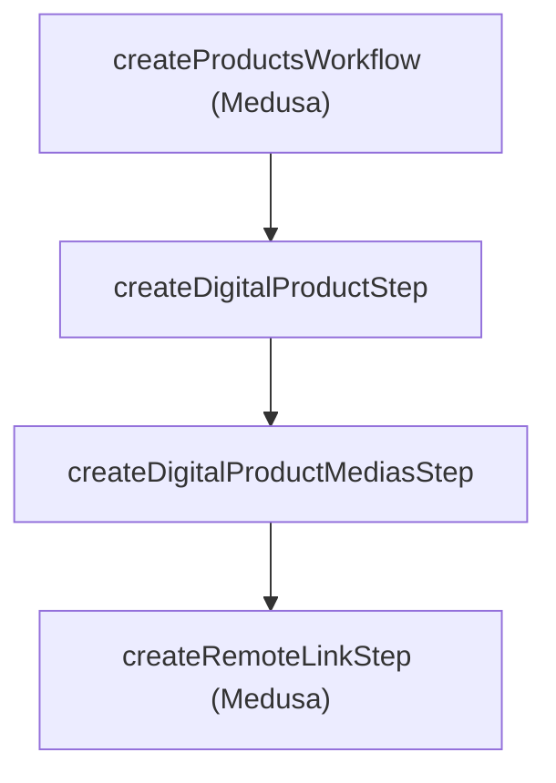
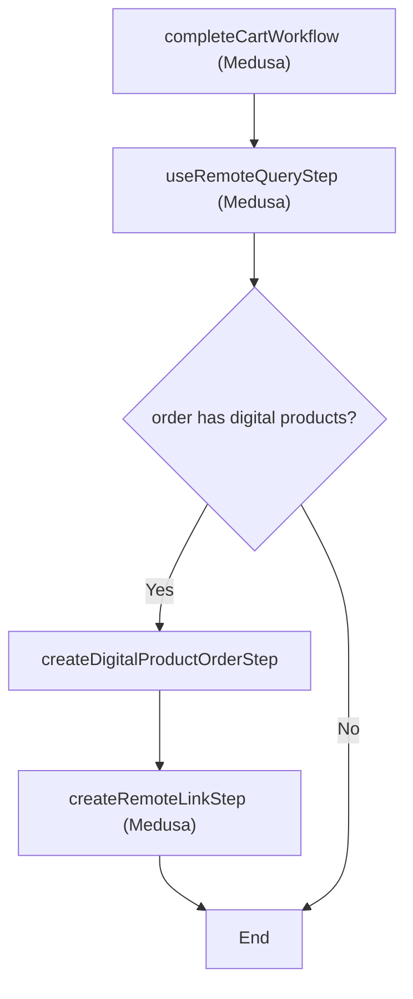

import { Github, PlaySolid } from "@medusajs/icons"

export const metadata = {
  title: `Digital Products Recipe Example`,
}

# {metadata.title}

This document provides an example of implementing the digital product recipe.

<Note>

You can implement digital products as you see fit for your use case. This is only an example of one way to implement it.

</Note>

## Features

By following this example, you’ll have a commerce application with the following features:

1. Digital products with multiple media items.
2. Manage digital products from the admin dashboard.
3. Handle and fulfill digital product orders.
4. Allow customers to download their digital product purchases from the storefront.
5. All other commerce features that Medusa provides.

<CardList items={[
  {
    href: "https://github.com/medusajs/examples/tree/main/digital-product",
    title: "Digital Products Example Repository",
    text: "Find the full code for this recipe example in this repository.",
    startIcon: <Github />,
    showLinkIcon: false
  },
  {
    href: "https://res.cloudinary.com/dza7lstvk/raw/upload/v1721654620/OpenApi/Digital_Products_Postman_vjr3jg.yml",
    title: "OpenApi Specs for Postman",
    text: "Imported this OpenApi Specs file into tools like Postman.",
    startIcon: <PlaySolid />,
    showLinkIcon: false
  },
]} />

---

<Note type="check">

- [A new Medusa application installed.](!docs!#get-started)

</Note>

## Step 1: Create the Digital Product Module

The first step is to create a digital product module that holds the data models related to a digital product.

Create the directory `src/modules/digital-product`.

### Create Data Models

Create the file `src/modules/digital-product/models/digital-product.ts` with the following content:

```ts title="src/modules/digital-product/models/digital-product.ts"
import { model } from "@medusajs/utils"
import DigitalProductMedia from "./digital-product-media"
import DigitalProductOrder from "./digital-product-order"

const DigitalProduct = model.define("digital_product", {
  id: model.id().primaryKey(),
  name: model.text(),
  medias: model.hasMany(() => DigitalProductMedia, {
    mappedBy: "digitalProduct",
  }),
  orders: model.manyToMany(() => DigitalProductOrder, {
    mappedBy: "products",
  }),
})
.cascades({
  delete: ["medias"],
})

export default DigitalProduct
```

This creates a `DigitalProduct` data model. It has many medias and orders, which you’ll create next.

Create the file `src/modules/digital-product/models/digital-product-media.ts` with the following content:

export const dpmModelHighlights = [
  ["8", "fileId", "The file ID is retrieved from the File Module when the file is uploaded."]
]

```ts title="src/modules/digital-product/models/digital-product-media.ts" highlights={dpmModelHighlights}
import { model } from "@medusajs/utils"
import { MediaType } from "../types"
import DigitalProduct from "./digital-product"

const DigitalProductMedia = model.define("digital_product_media", {
  id: model.id().primaryKey(),
  type: model.enum(MediaType),
  fileId: model.text(),
  mimeType: model.text(),
  digitalProduct: model.belongsTo(() => DigitalProduct, {
    mappedBy: "medias",
  }),
})

export default DigitalProductMedia
```

This creates a `DigitalProductMedia` data model, which represents a media file that belongs to the digital product. The `fileId` property holds the ID of the uploaded file as returned by the File Module, which is explained in later sections.

Notice that the above data model uses an enum from a `types` file. So, create the file `src/modules/digital-product/types/index.ts` with the following content:

```ts title="src/modules/digital-product/types/index.ts"
export enum MediaType {
  MAIN = "main",
  PREVIEW = "preview"
}
```

This enum indicates that a digital product media can either be used to preview the digital product, or is the main file available on purchase.

Next, create the file `src/modules/digital-product/models/digital-product-order.ts` with the following content:

```ts title="src/modules/digital-product/models/digital-product-order.ts"
import { model } from "@medusajs/utils"
import { OrderStatus } from "../types"
import DigitalProduct from "./digital-product"

const DigitalProductOrder = model.define("digital_product_order", {
  id: model.id().primaryKey(),
  status: model.enum(OrderStatus),
  products: model.manyToMany(() => DigitalProduct, {
    mappedBy: "orders",
  }),
})

export default DigitalProductOrder
```

This creates a `DigitalProductOrder` data model, which represents an order of digital products.

This data model also uses an enum from the `types` file. So, add the following to the `src/modules/digital-product/types/index.ts` file:

```ts title="src/modules/digital-product/types/index.ts"
export enum OrderStatus {
  PENDING = "pending",
  SENT = "sent"
}
```

### Create Main Module Service

Next, create the main service of the module at `src/modules/digital-product/service.ts` with the following content:

```ts title="src/modules/digital-product/service.ts"
import { MedusaService } from "@medusajs/utils"
import DigitalProduct from "./models/digital-product"
import DigitalProductOrder from "./models/digital-product-order"
import DigitalProductMedia from "./models/digital-product-media"

class DigitalProductModuleService extends MedusaService({
  DigitalProduct,
  DigitalProductMedia,
  DigitalProductOrder,
}) {

}

export default DigitalProductModuleService
```

The service extends the [service factory](https://docs.medusajs.com/v2/advanced-development/modules/service-factory), which provides basic data-management features.

### Create Module Definition

After that, create the module definition at `src/modules/digital-product/index.ts` with the following content:

```ts title="src/modules/digital-product/index.ts"
import DigitalProductModuleService from "./service"
import { Module } from "@medusajs/utils"

export const DIGITAL_PRODUCT_MODULE = "digitalProductModuleService"

export default Module(DIGITAL_PRODUCT_MODULE, {
  service: DigitalProductModuleService,
})
```

### Add Module to Medusa Configuration

Finally, add the module to the list of modules in `medusa-config.js`:

```tsx title="medusa-config.js"
module.exports = defineConfig({
  // ...
  modules: {
    digitalProductModuleService: {
      resolve: "./modules/digital-product",
    },
  },
})
```

### Further Reads

- [How to Create a Module](!docs!/basics/modules-and-services)
- [How to Create a Data Model](!docs!/basics/data-models)

---

## Step 2: Define Links

In this step, you’ll define links between your module’s data models and data models from Medusa’s commerce modules.

Start by creating the file `src/links/digital-product-variant.ts` with the following content:

```ts title="src/links/digital-product-variant.ts"
import DigitalProductModule from "../modules/digital-product"
import ProductModule from "@medusajs/product"
import { defineLink } from "@medusajs/utils"

export default defineLink(
  DigitalProductModule.linkable.digitalProduct,
  ProductModule.linkable.productVariant
)
```

This defines a link between `DigitalProduct` and the Product Module’s `ProductVariant`. This allows product variants that customers purchase to be digital products.

Next, create the file `src/links/digital-product-order.ts` with the following content:

export const orderLinkHighlights = [
  ["8", "deleteCascade", "Delete the digital product order when its linked Medusa order is deleted."]
]

```ts title="src/links/digital-product-order.ts"
import DigitalProductModule from "../modules/digital-product"
import OrderModule from "@medusajs/order"
import { defineLink } from "@medusajs/utils"

export default defineLink(
  {
    linkable: DigitalProductModule.linkable.digitalProductOrder,
    deleteCascade: true,
  },
  OrderModule.linkable.order
)

```

This defines a link between `DigitalProductOrder` and the Order Module’s `Order`. This keeps track of orders that include purchases of digital products.

`deleteCascades` is enabled on the `digitalProductOrder` so that when a Medusa order is deleted, its linked digital product order is also deleted.

### Further Read

- [How to Define Module Links](!docs!/advanced-development/modules/module-links)

---

## Step 3: Run Migrations and Sync Links

To create tables for the digital product data models in the database, start by generating the migrations for the Digital Product Module with the following command:

```bash
npx medusa migrations generate digitalProductModuleService
```

This generates a migration in the `src/modules/digital-product/migrations` directory.

Then, reflect the migrations in the database with the following command:

```bash
npx medusa migrations run
```

Next, to reflect your links in the database, run the `links sync` command:

```bash
npx medusa links sync
```

---

## Step 4: List Digital Products Admin API Route

In this step, you’ll create the admin API route to list digital products.

Create the file `src/api/admin/digital-products/route.ts` with the following content:

```ts title="src/api/admin/digital-products/route.ts"
import { 
  AuthenticatedMedusaRequest, 
  MedusaResponse,
} from "@medusajs/medusa"
import { remoteQueryObjectFromString } from "@medusajs/utils"

export const GET = async (
  req: AuthenticatedMedusaRequest,
  res: MedusaResponse
) => {
  const { 
    fields, 
    limit = 20, 
    offset = 0,
  } = req.validatedQuery || {}
  const remoteQuery = req.scope.resolve("remoteQuery")

  const query = remoteQueryObjectFromString({
    entryPoint: "digital_product",
    fields: [
      "*",
      "medias.*",
      "product_variant.*",
      ...(fields || []),
    ],
    variables: {
      skip: offset,
      take: limit,
    },
  })

  const { 
    rows, 
    metadata: { count, take, skip },
  } = await remoteQuery(query)

  res.json({
    digital_products: rows,
    count,
    limit: take,
    offset: skip,
  })
}
```

This adds a `GET` API route at `/admin/digital-products`.

In the route handler, you use the remote query to retrieve the list of digital products and their relations. The route handler also supports pagination.

### Test API Route

To test out the API route, start the Medusa application:

```bash npm2yarn
npm run dev
```

Then, obtain a JWT token as an admin user with the following request:

```bash
curl -X POST 'http://localhost:9000/auth/user/emailpass' \
-H 'Content-Type: application/json' \
--data-raw '{
    "email": "admin@medusajs.com",
    "password": "supersecret"
}'
```

Finally, send the following request to retrieve the list of digital products:

```bash
curl -L 'http://localhost:9000/admin/digital-products' \
-H 'Authorization: Bearer {token}'
```

Make sure to replace `{token}` with the JWT token you retrieved.

### Further Reads

- [How to Create an API Route](!docs!/basics/api-routes)
- [Learn more about the remote query](!docs!/advanced-development/modules/remote-query)

---

## Step 5: Create Digital Product Workflow

In this step, you’ll create a workflow that creates a digital product. You’ll use this workflow in the next section.

This workflow has the following steps:



1. `createProductsWorkflow`: Create the Medusa product that the digital product is associated with its variant. Medusa provides this workflow through the `@medusajs/core-flows` package, which you can use as a step.
2. `createDigitalProductStep`: Create the digital product.
3. `createDigitalProductMediasStep`: Create the medias associated with the digital product.
4. `createRemoteLinkStep`: Create the link between the digital product and the product variant. Medusa provides this step through the `@medusajs/core-flows` package.

You’ll implement the second and third steps.

### createDigitalProductStep (Second Step)

Create the file `src/workflows/create-digital-product/steps/create-digital-product.ts` with the following content:

export const createDpHighlights = [
  ["19", "createDigitalProducts", "Create the digital product."],
  ["24", "digital_product", "Pass the digital product to the compensation function."],
  ["31", "deleteDigitalProducts", "Delete the digital product if an error occurs in the workflow."]
]

```ts title="src/workflows/create-digital-product/steps/create-digital-product.ts" highlights={createDpHighlights} collapsibleLines="1-7" expandMoreLabel="Show Imports"
import {
  createStep,
  StepResponse,
} from "@medusajs/workflows-sdk"
import DigitalProductModuleService from "../../../modules/digital-product/service"
import { DIGITAL_PRODUCT_MODULE } from "../../../modules/digital-product"

export type CreateDigitalProductStepInput = {
  name: string
}

const createDigitalProductStep = createStep(
  "create-digital-product-step",
  async (data: CreateDigitalProductStepInput, { container }) => {
    const digitalProductModuleService: DigitalProductModuleService = 
      container.resolve(DIGITAL_PRODUCT_MODULE)

    const digitalProduct = await digitalProductModuleService
      .createDigitalProducts(data)
    
    return new StepResponse({
      digital_product: digitalProduct,
    }, {
      digital_product: digitalProduct,
    })
  },
  async ({ digital_product }, { container }) => {
    const digitalProductModuleService: DigitalProductModuleService = 
      container.resolve(DIGITAL_PRODUCT_MODULE)
    
    await digitalProductModuleService.deleteDigitalProducts(
      digital_product.id
    )
  }
)

export default createDigitalProductStep
```

This creates the `createDigitalProductStep`. In this step, you create a digital product.

In the compensation function, which is executed if an error occurs in the workflow, you delete the digital products.

### createDigitalProductMediasStep (Third Step)

Create the file `src/workflows/create-digital-product/steps/create-digital-product-medias.ts` with the following content:

export const createDigitalProductMediaHighlights = [
  ["29", "createDigitalProductMedias", "Create the digital product medias."],
  ["34", "digital_product_medias", "Pass the digital product medias to the compensation function."],
  ["41", "deleteDigitalProductMedias", "Delete the digital product medias if an error occurs in the workflow."]
]

```ts title="src/workflows/create-digital-product/steps/create-digital-product-medias.ts" highlights={createDigitalProductMediaHighlights} collapsibleLines="1-8" expandMoreLabel="Show Imports"
import {
  createStep,
  StepResponse,
} from "@medusajs/workflows-sdk"
import DigitalProductModuleService from "../../../modules/digital-product/service"
import { DIGITAL_PRODUCT_MODULE } from "../../../modules/digital-product"
import { MediaType } from "../../../modules/digital-product/types"

export type CreateDigitalProductMediaInput = {
  type: MediaType
  fileId: string
  mimeType: string
  digital_product_id: string
}

type CreateDigitalProductMediasStepInput = {
  medias: CreateDigitalProductMediaInput[]
}

const createDigitalProductMediasStep = createStep(
  "create-digital-product-medias",
  async ({ 
    medias,
  }: CreateDigitalProductMediasStepInput, { container }) => {
    const digitalProductModuleService: DigitalProductModuleService = 
      container.resolve(DIGITAL_PRODUCT_MODULE)

    const digitalProductMedias = await digitalProductModuleService
      .createDigitalProductMedias(medias)

    return new StepResponse({
      digital_product_medias: digitalProductMedias,
    }, {
      digital_product_medias: digitalProductMedias,
    })
  },
  async ({ digital_product_medias }, { container }) => {
    const digitalProductModuleService: DigitalProductModuleService = 
      container.resolve(DIGITAL_PRODUCT_MODULE)
    
    await digitalProductModuleService.deleteDigitalProductMedias(
      digital_product_medias.map((media) => media.id)
    )
  }
)

export default createDigitalProductMediasStep
```

This creates the `createDigitalProductMediasStep`. In this step, you create medias of the digital product.

In the compensation function, you delete the digital product medias.

### Create createDigitalProductWorkflow

Finally, create the file `src/workflows/create-digital-product/index.ts` with the following content:

export const createDpWorkflowHighlights = [
  ["35", "createProductsWorkflow", "Create the Medusa product."],
  ["41", "createDigitalProductStep", "Create the digital product."],
  ["45", "createDigitalProductMediasStep", "Create the digital product's medias."],
  ["59", "createRemoteLinkStep", "Link the digital product to the first variant of the product."],
]

```ts title="src/workflows/create-digital-product/index.ts" highlights={createDpWorkflowHighlights} collapsibleLines="1-22" expandMoreLabel="Show Imports"
import { 
  createWorkflow,
  transform,
} from "@medusajs/workflows-sdk"
import {
  CreateProductWorkflowInputDTO,
} from "@medusajs/types"
import { 
  createProductsWorkflow,
  createRemoteLinkStep,
} from "@medusajs/core-flows"
import { 
  Modules,
} from "@medusajs/utils"
import createDigitalProductStep, { 
  CreateDigitalProductStepInput,
} from "./steps/create-digital-product"
import createDigitalProductMediasStep, { 
  CreateDigitalProductMediaInput,
} from "./steps/create-digital-product-medias"
import { DIGITAL_PRODUCT_MODULE } from "../../modules/digital-product"

type CreateDigitalProductWorkflowInput = {
  digital_product: CreateDigitalProductStepInput & {
    medias: Omit<CreateDigitalProductMediaInput, "digital_product_id">[]
  }
  product: CreateProductWorkflowInputDTO
}

const createDigitalProductWorkflow = createWorkflow(
  "create-digital-product",
  (input: CreateDigitalProductWorkflowInput) => {
    const { medias, ...digitalProductData } = input.digital_product

    const product = createProductsWorkflow.runAsStep({
      input: {
        products: [input.product],
      },
    })

    const { digital_product } = createDigitalProductStep(
      digitalProductData
    )

    const { digital_product_medias } = createDigitalProductMediasStep(
      transform({
        digital_product,
        medias,
      },
      (data) => ({
        medias: data.medias.map((media) => ({
          ...media,
          digital_product_id: data.digital_product.id,
        })),
      })
      )
    )

    createRemoteLinkStep([{
      [DIGITAL_PRODUCT_MODULE]: {
        digital_product_id: digital_product.id,
      },
      [Modules.PRODUCT]: {
        product_variant_id: product[0].variants[0].id,
      },
    }])

    return {
      digital_product: {
        ...digital_product,
        medias: digital_product_medias,
      },
    }
  }
)

export default createDigitalProductWorkflow
```

This creates the `createDigitalProductWorkflow`. The workflow accepts as a parameter the digital product and the Medusa product to create.

In the workflow, you run the following steps:

1. `createProductsWorkflow` as a step to create a Medusa product.
2. `createDigitalProductStep` to create the digital product.
3. `createDigitalProductMediasStep` to create the digital product’s medias.
4. `createRemoteLinkStep` to link the digital product to the product variant.

You’ll test out the workflow in the next section.

### Further Reads

- [How to Create a Workflow](!docs!/basics/workflows)
- [What is the Compensation Function](!docs!/advanced-development/workflows/compensation-function)
- [Learn more about the remote link function](!docs!/advanced-development/modules/remote-link)

---

## Step 6: Create Digital Product API Route

In this step, you’ll add the API route to create a digital product.

In the file `src/api/admin/digital-products/route.ts` add a new route handler:

```ts title="src/api/admin/digital-products/route.ts"
// other imports...
import { z } from "zod"
import createDigitalProductWorkflow from "../../../workflows/create-digital-product"
import { CreateDigitalProductMediaInput } from "../../../workflows/create-digital-product/steps/create-digital-product-medias"
import { createDigitalProductsSchema } from "../../validation-schemas"

// ...

type CreateRequestBody = z.infer<
  typeof createDigitalProductsSchema
>

export const POST = async (
  req: AuthenticatedMedusaRequest<CreateRequestBody>,
  res: MedusaResponse
) => {
  const { result } = await createDigitalProductWorkflow(
    req.scope
  ).run({
    input: {
      digital_product: {
        name: req.validatedBody.name,
        medias: req.validatedBody.medias.map((media) => ({
          fileId: media.file_id,
          mimeType: media.mime_type,
          ...media,
        })) as Omit<CreateDigitalProductMediaInput, "digital_product_id">[],
      },
      product: req.validatedBody.product,
    },
  })

  res.json({
    digital_product: result.digital_product,
  })
}
```

This adds a `POST` API route at `/admin/digital-products`. In the route handler, you execute the `createDigitalProductWorkflow` created in the previous step, passing data from the request body as input.

The route handler imports a validation schema from a `validation-schema` file. So, create the file `src/api/validation-schemas.ts` with the following content:

```ts title="src/api/validation-schemas.ts"
import { 
  AdminCreateProduct,
} from "@medusajs/medusa/dist/api/admin/products/validators"
import { z } from "zod"
import { MediaType } from "../modules/digital-product/types"

export const createDigitalProductsSchema = z.object({
  name: z.string(),
  medias: z.array(z.object({
    type: z.nativeEnum(MediaType),
    file_id: z.string(),
    mime_type: z.string(),
  })),
  product: AdminCreateProduct,
})
```

This defines the expected request body schema.

Finally, create the file `src/api/middlewares.ts` with the following content:

```ts title="src/api/middlewares.ts"
import { 
  MiddlewaresConfig, 
} from "@medusajs/medusa"
import { 
  validateAndTransformBody,
} from "@medusajs/medusa/dist/api/utils/validate-body"
import { createDigitalProductsSchema } from "./validation-schemas"

export const config: MiddlewaresConfig = {
  routes: [
    {
      matcher: "/admin/digital-products",
      method: "POST",
      middlewares: [
        validateAndTransformBody(createDigitalProductsSchema),
      ],
    },
  ],
}
```

This adds a validation middleware to ensure that the body of `POST` requests sent to `/admin/digital-products` match the `createDigitalProductsSchema`.

### Further Read

- [How to Create a Middleware](!docs!/advanced-development/api-routes/middlewares)

---

## Step 7: Upload Digital Product Media API Route

To upload the digital product media files, use Medusa’s file module.

In this step, you’ll create an API route for uploading preview and main digital product media files.

<Note>

Your Medusa application uses the local file module provider by default, which uploads files to a local directory. However, you can use other file module providers, such as the [S3 module provider](../../../../architectural-modules/file/s3/page.mdx).

</Note>

Before creating the API route, install the [multer express middleware](https://expressjs.com/en/resources/middleware/multer.html) to support file uploads:

```bash npm2yarn
npm install multer
npm install --save-dev @types/multer
```

Then, create the file `src/api/admin/digital-products/upload/[type]/route.ts` with the following content:

export const uploadHighlights = [
  ["12", "access", "If the media type is `main`, upload the file with `private` access. Otherwise, upload it publically."],
]

```ts title="src/api/admin/digital-products/upload/[type]/route.ts" highlights={uploadHighlights} collapsibleLines="1-7" expandMoreLabel="Show Imports"
import {
  AuthenticatedMedusaRequest,
  MedusaResponse,
} from "@medusajs/medusa"
import { uploadFilesWorkflow } from "@medusajs/core-flows"
import { MedusaError } from "@medusajs/utils"

export const POST = async (
  req: AuthenticatedMedusaRequest,
  res: MedusaResponse
) => {
  const access = req.params.type === "main" ? "private" : "public"
  const input = req.files as Express.Multer.File[]

  if (!input?.length) {
    throw new MedusaError(
      MedusaError.Types.INVALID_DATA,
      "No files were uploaded"
    )
  }

  const { result } = await uploadFilesWorkflow(req.scope).run({
    input: {
      files: input?.map((f) => ({
        filename: f.originalname,
        mimeType: f.mimetype,
        content: f.buffer.toString("binary"),
        access,
      })),
    },
  })

  res.status(200).json({ files: result })
}

```

This adds a `POST` API route at `/admin/digital-products/upload/[type]` where `[type]` is either `preview` or `main`.

In the route handler, you use the `uploadFilesWorkflow` imported from `@medusajs/core-flows` to upload the file. If the file type is `main`, it’s uploaded with private access, as only customers who purchased it can download it. Otherwise, it’s uploaded with `public` access.

Next, add to the file `src/api/middlewares.ts` the `multer` middleware on this API route:

```ts title="src/api/middlewares.ts"
// other imports...
import multer from "multer"

const upload = multer({ storage: multer.memoryStorage() })

export const config: MiddlewaresConfig = {
  routes: [
    // ...
    {
      matcher: "/admin/digital-products/upload**",
      method: "POST",
      middlewares: [
        upload.array("files"),
      ],
    },
  ],
}
```

You’ll test out this API route in the next step as you use these API routes in the admin customizations.

---

## Step 8: Add Digital Products UI Route in Admin

In this step, you’ll add a UI route to the Medusa Admin that displays a list of digital products.

Before you create the UI route, create the file `src/admin/types/index.ts` that holds the following types:

```ts title="src/admin/types/index.ts"
import { ProductVariantDTO } from "@medusajs/types"

export enum MediaType {
  MAIN = "main",
  PREVIEW = "preview"
}

export type DigitalProductMedia = {
  id: string
  type: MediaType
  fileId: string
  mimeType: string
  digitalProducts?: DigitalProduct
}

export type DigitalProduct = {
  id: string
  name: string
  medias?: DigitalProductMedia[]
  product_variant?:ProductVariantDTO
}

```

These types will be used by the UI route.

Next, create the file `src/admin/routes/digital-products/page.tsx` with the following content:

export const digitalProductPageHighlights = [
  ["48", `"Digital Products"`, "Show a sidebar item pointing to this page."]
]

```tsx title="src/admin/routes/digital-products/page.tsx" highlights={digitalProductPageHighlights} collapsibleLines="1-7" expandMoreLabel="Show Imports"
import { defineRouteConfig } from "@medusajs/admin-shared"
import { PhotoSolid } from "@medusajs/icons"
import { Container, Heading, Table } from "@medusajs/ui"
import { useState } from "react"
import { Link } from "react-router-dom"
import { DigitalProduct } from "../../types"

const DigitalProductsPage = () => {
  const [digitalProducts, setDigitalProducts] = useState<
    DigitalProduct[]
  >([])
  // TODO fetch digital products...

  return (
    <Container>
      <div className="flex justify-between items-center mb-4">
        <Heading level="h2">Digital Products</Heading>
        {/* TODO add create button */}
      </div>
      <Table>
        <Table.Header>
          <Table.Row>
            <Table.HeaderCell>Name</Table.HeaderCell>
            <Table.HeaderCell>Action</Table.HeaderCell>
          </Table.Row>
        </Table.Header>
        <Table.Body>
          {digitalProducts.map((digitalProduct) => (
            <Table.Row key={digitalProduct.id}>
              <Table.Cell>
                {digitalProduct.name}
              </Table.Cell>
              <Table.Cell>
                <Link to={`/products/${digitalProduct.product_variant.product_id}`}>
                  View Product
                </Link>
              </Table.Cell>
            </Table.Row>
          ))}
        </Table.Body>
      </Table>
      {/* TODO add pagination component */}
    </Container>
  )
}

export const config = defineRouteConfig({
  label: "Digital Products",
  icon: PhotoSolid,
})

export default DigitalProductsPage

```

This creates a UI route that's displayed at the `/digital-products` path in the Medusa Admin. The UI route also adds a sidebar item with the label “Digital Products" pointing to the UI route.

In the React component of the UI route, you just display the table of digital products.

Next, replace the first `TODO` with the following:

export const paginationHighlights = [
  ["7", "currentPage", "The number of the current page."],
  ["8", "pageLimit", "The number of digital products to show per page."],
  ["9", "count", "The total count of digital products."],
  ["10", "pagesCount", "The number of pages based on `count` and `pageLimit`."],
  ["13", "canNextPage", "Whether there’s a next page based on whether the current page is less than `pagesCount - 1`."],
  ["17", "canPreviousPage", "Whether there’s a previous pages based on whether the current page is greater than `0`."],
  ["22", "nextPage", "A function used to increment the `currentPage`."],
  ["28", "previousPage", "A function used to decrement the `currentPage`."]
]

```tsx title="src/admin/routes/digital-products/page.tsx" highlights={paginationHighlights}
// other imports...
import { useMemo } from "react"

const DigitalProductsPage = () => {
  // ...
    
  const [currentPage, setCurrentPage] = useState(0)
  const pageLimit = 20
  const [count, setCount] = useState(0)
  const pagesCount = useMemo(() => {
    return count / pageLimit
  }, [count])
  const canNextPage = useMemo(
    () => currentPage < pagesCount - 1, 
    [currentPage, pagesCount]
  )
  const canPreviousPage = useMemo(
    () => currentPage > 0, 
    [currentPage]
  )

  const nextPage = () => {
    if (canNextPage) {
      setCurrentPage((prev) => prev + 1)
    }
  }

  const previousPage = () => {
    if (canPreviousPage) {
      setCurrentPage((prev) => prev - 1)
    }
  }
  
  // TODO fetch digital products
    
  // ...
}
```

This defines the following pagination variables:

1. `currentPage`: The number of the current page.
2. `pageLimit`: The number of digital products to show per page.
3. `count`: The total count of digital products.
4. `pagesCount`: A memoized variable that holds the number of pages based on `count` and `pageLimit`.
5. `canNextPage`: A memoized variable that indicates whether there’s a next page based on whether the current page is less than `pagesCount - 1`.
6. `canPreviousPage`: A memoized variable that indicates whether there’s a previous pages based on whether the current page is greater than `0`.
7. `nextPage`: A function that increments the `currentPage`.
8. `previousPage`: A function that decrements the `currentPage`.

Then, replace the new `TODO fetch digital products` with the following:

export const fetchDigitalProductsHighlights = [
  ["7", "fetchProducts", "A function that fetches the digital products from the Medusa application."],
  ["27", "fetchProducts", "Fetch the digital products whenever the `currentPage` changes."]
]

```tsx title="src/admin/routes/digital-products/page.tsx" highlights={fetchDigitalProductsHighlights}
// other imports
import { useEffect } from "react"

const DigitalProductsPage = () => {
  // ...
    
  const fetchProducts = () => {
    const query = new URLSearchParams({
      limit: `${pageLimit}`,
      offset: `${pageLimit * currentPage}`,
    })
    
    fetch(`/admin/digital-products?${query.toString()}`, {
      credentials: "include",
    })
    .then((res) => res.json())
    .then(({ 
      digital_products: data, 
      count,
    }) => {
      setDigitalProducts(data)
      setCount(count)
    })
  }

  useEffect(() => {
    fetchProducts()
  }, [currentPage])
    
  // ...
}
```

This defines a `fetchProducts` function that fetches the digital products using the API route you created in step 4. You also call that function within a `useEffect` callback which is executed whenever the `currentPage` changes.

Finally, replace the `TODO add pagination component` in the return statement with `Table.Pagination` component:

```tsx title="src/admin/routes/digital-products/page.tsx"
return (
    <Container>
      {/* ... */}
      <Table.Pagination
        count={count}
        pageSize={pageLimit}
        pageIndex={currentPage}
        pageCount={pagesCount}
        canPreviousPage={canPreviousPage}
        canNextPage={canNextPage}
        previousPage={previousPage}
        nextPage={nextPage}
      />
    </Container>
  )
```

The `Table.Pagination` component accepts as props the pagination variables you defined earlier.

### Test UI Route

To test the UI route out, start the Medusa application, go to `localhost:9000/app`, and log in as an admin user.

Once you log in, you’ll find a new sidebar item, “Digital Products.” If you click on it, you’ll see the UI route you created with a table of digital products.

### Further Reads

- [How to Create UI Routes](!docs!/advanced-development/admin/ui-routes)
- [How to Create Admin Widgets](!docs!/advanced-development/admin/widgets)

---

## Step 9: Add Create Digital Product Form in Admin

In this step, you’ll add a form for admins to create digital products. The form opens in a drawer or side window from within the Digital Products UI route you created in the previous section.

Create the file `src/admin/components/create-digital-product-form/index.tsx` with the following content:

```tsx title="src/admin/components/create-digital-product-form/index.tsx"
import { useState } from "react"
import { Input, Button, Select, toast } from "@medusajs/ui"
import { MediaType } from "../../types"

type CreateMedia = {
  type: MediaType
  file?: File
}

type Props = {
  onSuccess?: () => void
}

const CreateDigitalProductForm = ({
  onSuccess,
}: Props) => {
  const [name, setName] = useState("")
  const [medias, setMedias] = useState<CreateMedia[]>([])
  const [productTitle, setProductTitle] = useState("")
  const [loading, setLoading] = useState(false)

  const onSubmit = async (e: React.FormEvent<HTMLFormElement>) => {
    // TODO handle submit
  }

  return (
    <form onSubmit={onSubmit}>
      {/* TODO show form inputs */}
      <Button 
        type="submit"
        isLoading={loading}
      >
        Create
      </Button>
    </form>
  )
}

export default CreateDigitalProductForm
```

This creates a React component that shows a form and handles creating a digital product on form submission.

You currently don’t display the form. Replace the return statement with the following:

```tsx title="src/admin/components/create-digital-product-form/index.tsx"
return (
  <form onSubmit={onSubmit}>
    <Input
      name="name"
      placeholder="Name"
      type="text"
      value={name}
      onChange={(e) => setName(e.target.value)}
    />
    <fieldset className="my-4">
      <legend className="mb-2">Media</legend>
      <Button type="button" onClick={onAddMedia}>Add Media</Button>
      {medias.map((media, index) => (
        <fieldset className="my-2 p-2 border-solid border rounded">
          <legend>Media {index + 1}</legend>
          <Select 
            value={media.type} 
            onValueChange={(value) => changeFiles(
              index,
              {
                type: value as MediaType,
              }
            )}
          >
            <Select.Trigger>
              <Select.Value placeholder="Media Type" />
            </Select.Trigger>
            <Select.Content>
              <Select.Item value={MediaType.PREVIEW}>
                Preview
              </Select.Item>
              <Select.Item value={MediaType.MAIN}>
                Main
              </Select.Item>
            </Select.Content>
          </Select>
          <Input
            name={`file-${index}`}
            type="file"
            onChange={(e) => changeFiles(
              index,
              {
                file: e.target.files[0],
              }
            )}
            className="mt-2"
          />
        </fieldset>
      ))}
    </fieldset>
    <fieldset className="my-4">
      <legend className="mb-2">Product</legend>
      <Input
        name="product_title"
        placeholder="Product Title"
        type="text"
        value={productTitle}
        onChange={(e) => setProductTitle(e.target.value)}
      />
    </fieldset>
    <Button 
      type="submit"
      isLoading={loading}
    >
      Create
    </Button>
  </form>
)
```

This shows input fields for the digital product and product’s names. It also shows a fieldset of media files, with the ability to add more media files on a button click.

Add in the component the `onAddMedia` function that is triggered by a button click to add a new media:

```tsx title="src/admin/components/create-digital-product-form/index.tsx"
const onAddMedia = () => {
  setMedias((prev) => [
    ...prev,
    {
      type: MediaType.PREVIEW,
    },
  ])
}
```

And add in the component a `changeFiles` function that saves changes related to a media in the `medias` state variable:

```tsx title="src/admin/components/create-digital-product-form/index.tsx"
const changeFiles = (
  index: number,
  data: Partial<CreateMedia>
) => {
  setMedias((prev) => [
    ...(prev.slice(0, index)),
    {
      ...prev[index],
      ...data,
    },
    ...(prev.slice(index + 1)),
  ])
}
```

On submission, the media files should first be uploaded before the digital product is created.

So, add before the `onSubmit` function the following new function:

```tsx title="src/admin/components/create-digital-product-form/index.tsx"
const uploadMediaFiles = async (
  type: MediaType
) => {
  const formData = new FormData()
  const mediaWithFiles = medias.filter(
    (media) => media.file !== undefined && 
      media.type === type
  )

  if (!mediaWithFiles.length) {
    return
  }

  mediaWithFiles.forEach((media) => {
    formData.append("files", media.file)
  })

  const { files } = await fetch(`/admin/digital-products/upload/${type}`, {
    method: "POST",
    credentials: "include",
    body: formData,
  }).then((res) => res.json())

  return {
    mediaWithFiles,
    files,
  }
}
```

This function accepts a type of media to upload (`preview` or `main`). In the function, you upload the files of the specified type using the API route you created in step 7. You return the uploaded files and their associated media.

Next, you’ll implement the `onSubmit` function. Replace it with the following:

export const uploadMediaHighlights = [
  ["9", "uploadMediaFiles", "Upload preview media."],
  ["13", "uploadMediaFiles", "Upload the main media."]
]

```tsx title="src/admin/components/create-digital-product-form/index.tsx" highlights={uploadMediaHighlights}
const onSubmit = async (e: React.FormEvent<HTMLFormElement>) => {
  e.preventDefault()
  setLoading(true)

  try {
    const {
      mediaWithFiles: previewMedias,
      files: previewFiles,
    } = await uploadMediaFiles(MediaType.PREVIEW) || {}
    const {
      mediaWithFiles: mainMedias,
      files: mainFiles,
    } = await uploadMediaFiles(MediaType.MAIN) || {}

    const mediaData = []

    previewMedias?.forEach((media, index) => {
      mediaData.push({
        type: media.type,
        file_id: previewFiles[index].id,
        mime_type: media.file!.type,
      })
    })

    mainMedias?.forEach((media, index) => {
      mediaData.push({
        type: media.type,
        file_id: mainFiles[index].id,
        mime_type: media.file!.type,
      })
    })

    // TODO create digital product
  } catch (e) {
    console.error(e)
    setLoading(false)
  }
}
```

In this function, you use the `uploadMediaFiles` function to upload `preview` and `main` media files. Then, you prepare the media data that’ll be used when creating the digital product in a `mediaData` variable.

<Note>

Notice that you use the `id` of uploaded files, as returned in the response of `/admin/digital-products/upload/[type]` as the `file_id` value of the media to be created.

</Note>

Finally, replace the new `TODO` in `onSubmit` with the following:

```tsx title="src/admin/components/create-digital-product-form/index.tsx"
fetch(`/admin/digital-products`, {
  method: "POST",
  credentials: "include",
  headers: {
    "Content-Type": "application/json",
  },
  body: JSON.stringify({
    name,
    medias: mediaData,
    product: {
      title: productTitle,
      options: [{
        title: "Default",
        values: ["default"],
      }],
      variants: [{
        title: productTitle,
        options: {
          Default: "default",
        },
        // delegate setting the prices to the
        // product's page.
        prices: [],
      }],
    },
  }),
})
.then((res) => res.json())
.then(({ message }) => {
  if (message) {
    throw message
  }
  onSuccess?.()
})
.catch((e) => {
  console.error(e)
  toast.error("Error", {
    description: `An error occurred while creating the digital product: ${e}`,
  })
})
.finally(() => setLoading(false))
```

In this snippet, you send a `POST` request to `/admin/digital-products` to create a digital product.

You’ll make changes now to `src/admin/routes/digital-products/page.tsx` to show the form.

First, add a new `open` state variable:

```tsx title="src/admin/routes/digital-products/page.tsx"
const DigitalProductsPage = () => {
  const [open, setOpen] = useState(false)
  // ...
}
```

Then, replace the `TODO add create button` in the return statement to show the `CreateDigitalProductForm` component:

```tsx title="src/admin/routes/digital-products/page.tsx"
// other imports...
import { Drawer } from "@medusajs/ui"
import CreateDigitalProductForm from "../../components/create-digital-product-form"

const DigitalProductsPage = () => {
  // ...
    
  return (
    <Container>
      {/* Replace the TODO with the following */}
      <Drawer open={open} onOpenChange={(openChanged) => setOpen(openChanged)}>
        <Drawer.Trigger 
          onClick={() => {
            setOpen(true)
          }}
          asChild
        >
          <Button>Create</Button>
        </Drawer.Trigger>
        <Drawer.Content>
          <Drawer.Header>
            <Drawer.Title>Create Product</Drawer.Title>
          </Drawer.Header>
          <Drawer.Body>
            <CreateDigitalProductForm onSuccess={() => {
              setOpen(false)
              if (currentPage === 0) {
                fetchProducts()
              } else {
                setCurrentPage(0)
              }
            }} />
          </Drawer.Body>
        </Drawer.Content>
      </Drawer>
    </Container>
  )
}
```

This adds a Create button in the Digital Products UI route and, when it’s clicked, shows the form in a drawer or side window.

You pass to the `CreateDigitalProductForm` component an `onSuccess` prop that, when the digital product is created successfully, re-fetches the digital products.

### Test Create Form Out

To test the form, open the Digital Products page in the Medusa Admin. There, you’ll find a new Create button.

If you click on the button, a form will open in a drawer. Fill in the details of the digital product to create one.

After you create the digital product, you’ll find it in the table. You can also click on View Product to edit the product’s details, such as the variant’s price.

<Note title="Tip">

To use this digital product in later steps (such as to create an order), you must make the following changes to its associated product details:

1. Change the status to published.
2. Add it to the default sales channel.
3. Disable manage inventory of the variant.
4. Add prices to the variant.

</Note>

---

## Step 10: Customize Cart Completion

In this step, you’ll customize the cart completion flow to not only create a Medusa order, but also create a digital product order.

To customize the cart completion flow, you’ll create a workflow and then use that workflow in an API route defined at `src/api/store/carts/[id]/complete/route.ts`.



The workflow has the following steps:

1. `completeCartWorkflow` to create a Medusa order from the cart. Medusa provides this workflow through the `@medusajs/core-flows` package and you can use it as a step.
2. `useRemoteQueryStep` to retrieve the order’s items with the digital products associated with the purchased product variants. Medusa provides this step through the `@medusajs/core-flows` package.
3. If the order has digital products, you:
    1. create the digital product order.
    2. link the digital product order with the Medusa order. Medusa provides a `createRemoteLinkStep` in the `@medusajs/core-flows` package that can be used here.

You’ll only implement the `3.a` step of the workflow.

### createDigitalProductOrderStep (Step 3.a)

Create the file `src/workflows/create-digital-product-order/steps/create-digital-product-order.ts` with the following content:

export const createDpoHighlights = [
  ["33", "createDigitalProductOrders", "Create the digital product order."],
  ["41", "digital_product_order", "Pass the created digital product order to the compensation function."],
  ["48", "deleteDigitalProductOrders", "Delete the digital product order if an error occurs in the workflow."]
]

```ts title="src/workflows/create-digital-product-order/steps/create-digital-product-order.ts" highlights={createDpoHighlights} collapsibleLines="1-15" expandMoreLabel="Show Imports"
import {
  createStep,
  StepResponse,
} from "@medusajs/workflows-sdk"
import { 
  OrderLineItemDTO,
  ProductVariantDTO,
} from "@medusajs/types"
import { 
  DigitalProductData, 
  OrderStatus,
} from "../../../modules/digital-product/types"
import DigitalProductModuleService from "../../../modules/digital-product/service"
import { DIGITAL_PRODUCT_MODULE } from "../../../modules/digital-product"

type StepInput = {
  items: (OrderLineItemDTO & {
    variant: ProductVariantDTO & {
      digital_product: DigitalProductData
    }
  })[]
}

const createDigitalProductOrderStep = createStep(
  "create-digital-product-order",
  async ({ items }: StepInput, { container }) => {
    const digitalProductModuleService: DigitalProductModuleService = 
      container.resolve(DIGITAL_PRODUCT_MODULE)

    const digitalProductIds = items.map((item) => item.variant.digital_product.id)

    const digitalProductOrder = await digitalProductModuleService
      .createDigitalProductOrders({
        status: OrderStatus.PENDING,
        products: digitalProductIds,
      })

    return new StepResponse({
      digital_product_order: digitalProductOrder,
    }, {
      digital_product_order: digitalProductOrder,
    })
  },
  async ({ digital_product_order }, { container }) => {
    const digitalProductModuleService: DigitalProductModuleService = 
      container.resolve(DIGITAL_PRODUCT_MODULE)

    await digitalProductModuleService.deleteDigitalProductOrders(
      digital_product_order.id
    )
  }
)

export default createDigitalProductOrderStep
```

This creates the `createDigitalProductOrderStep`. In this step, you create a digital product order.

In the compensation function, you delete the digital product order.

### Create createDigitalProductOrderWorkflow

Create the file `src/workflows/create-digital-product-order/index.ts` with the following content:

export const createDpoWorkflowHighlights = [
  ["24", "completeCartWorkflow", "Create an order for the cart."],
  ["30", "useRemoteQueryStep", "Retrieve the order's items and their associated variants and linked digital products."],
  ["55", "when", "Check whether the order has any digital products."],
  ["60", "then", "Perform the callback function if an order has digital products."],
  ["63", "createDigitalProductOrderStep", "Create the digital product order."],
  ["65", "createRemoteLinkStep", "Link the digital product order to the Medusa order."]
]

```ts title="src/workflows/create-digital-product-order/index.ts" highlights={createDpoWorkflowHighlights} collapsibleLines="1-16" expandMoreLabel="Show Imports"
import {
  createWorkflow,
  transform,
  when,
} from "@medusajs/workflows-sdk"
import {
  completeCartWorkflow,
  useRemoteQueryStep,
  createRemoteLinkStep,
} from "@medusajs/core-flows"
import {
  Modules,
} from "@medusajs/utils"
import createDigitalProductOrderStep from "./steps/create-digital-product-order"
import { DIGITAL_PRODUCT_MODULE } from "../../modules/digital-product"

type WorkflowInput = {
  cart_id: string
}

const createDigitalProductOrderWorkflow = createWorkflow(
  "create-digital-product-order",
  (input: WorkflowInput) => {
    const order = completeCartWorkflow.runAsStep({
      input: {
        id: input.cart_id,
      },
    })

    const { items } = useRemoteQueryStep({
      entry_point: "order",
      fields: [
        "*",
        "items.*",
        "items.variant.*",
        "items.variant.digital_product.*",
      ],
      variables: {
        filters: {
          id: order.id,
        },
      },
      throw_if_key_not_found: true,
      list: false,
    })

    const itemsWithDigitalProducts = transform({
      items,
    },
    (data) => {
      return data.items.filter((item) => item.variant.digital_product !== undefined)
    }
    )

    const digital_product_order = when(
      itemsWithDigitalProducts, 
      (itemsWithDigitalProducts) => {
      return itemsWithDigitalProducts.length
    })
    .then(() => {
      const { 
        digital_product_order,
      } = createDigitalProductOrderStep({ items })
  
      createRemoteLinkStep([{
        [DIGITAL_PRODUCT_MODULE]: {
          digital_product_order_id: digital_product_order.id,
        },
        [Modules.ORDER]: {
          order_id: order.id,
        },
      }])

      return digital_product_order
    })

    return {
      order,
      digital_product_order,
    }
  }
)

export default createDigitalProductOrderWorkflow
```

This creates the workflow `createDigitalProductOrderWorkflow`. It runs the following steps:

1. `completeCartWorkflow` as a step to create the Medusa order.
2. `useRemoteQueryStep` to retrieve the order’s items with their associated variants and linked digital products.
3. Use `when` to check whether the order has digital products. If so:
    1. Use the `createDigitalProductOrderStep` to create the digital product order.
    2. Use the `createRemoteLinkStep` to link the digital product order to the Medusa order.

The workflow returns the Medusa order and the digital product order, if created.

### Cart Completion API Route

Next, create the file `src/api/store/carts/[id]/complete/route.ts` with the following content:

```ts title="src/api/store/carts/[id]/complete/route.ts"
import { MedusaRequest, MedusaResponse } from "@medusajs/medusa"
import createDigitalProductOrderWorkflow from "../../../../../workflows/create-digital-product-order"

export const POST = async (
  req: MedusaRequest,
  res: MedusaResponse
) => {
  const { result } = await createDigitalProductOrderWorkflow(req.scope)
    .run({
      input: {
        cart_id: req.params.id,
      },
    })

  res.json({
    type: "order",
    ...result,
  })
}
```

This overrides the Cart Completion API route. In the route handler, you execute the `createDigitalProductOrderWorkflow` and return the created order in the response.

### Test Cart Completion

To test out the cart completion, it’s recommended to use the [Next.js Starter storefront](../../../../nextjs-starter/page.mdx) to place an order.

Once you place the order, the cart completion route you added above will run, creating the order and digital product order, if the order has digital products.

In a later step, you’ll add an API route to allow customers to view and download their purchased digital products.

### Further Read

- [Conditions in Workflows with When-Then](!docs!/advanced-development/workflows/conditions)

---

## Step 11: Fulfill Digital Products Scheduled Job

In this step, you’ll create a scheduled job that automatically fulfills digital products.

<Note type="soon">

The fulfillment provider is under development, so this scheduled job doesn’t currently cover how to create fulfillment.

</Note>

Create the file `src/jobs/create-digital-fulfillment.ts` with the following content:

```ts title="src/jobs/create-digital-fulfillment.ts"
import {
  MedusaContainer,
} from "@medusajs/types"
import DigitalProductModuleService from "../modules/digital-product/service"
import { DIGITAL_PRODUCT_MODULE } from "../modules/digital-product"
import { OrderStatus } from "../modules/digital-product/types"

export default async function createDigitalFulfillment(
  container: MedusaContainer
) {
  const digitalProductModuleService: DigitalProductModuleService = container
    .resolve(DIGITAL_PRODUCT_MODULE)

  const limit = 20
  let page = 0
  let pagesCount = 0

  do {
    const [
      digitalProductOrders, 
      count,
    ] = await digitalProductModuleService.listAndCountDigitalProductOrders({
      status: OrderStatus.PENDING,
    }, {
      skip: page * limit,
      take: limit,
    })

    // TODO create fulfillment for the digital product's items.

    if (!pagesCount) {
      pagesCount = count / limit
    }

    page++
    
  } while (false)
}

export const config = {
  name: "create-digital-fulfillment",
  schedule: "*/5 * * * *", // Check every 5 minutes
}
```

This creates a scheduled job that runs every five minutes. This scheduled job finds the digital product orders whose status is `pending` to fulfill them. 

### Further Reads

- [How to Create a Scheduled Job](!docs!/basics/scheduled-jobs)

---

## Step 12: Create Store API Routes

In this step, you’ll create three store API routes:

1. Retrieve the preview files of a digital product. This is useful when the customer is browsing the products before purchase.
2. List the digital products that the customer has purchased.
3. Get the download link to a media of the digital product that the customer purchased.

### Retrieve Digital Product Previews API Route

Create the file `src/api/store/digital-products/[id]/preview/route.ts` with the following content:

export const previewRouteHighlights = [
  ["29", "listDigitalProductMedias", "Get the digital product's preview medias."],
  ["37", "retrieveFile", "Get the file's details using the File Module's main service."]
]

```ts title="src/api/store/digital-products/[id]/preview/route.ts" highlights={previewRouteHighlights} collapsibleLines="1-15" expandMoreLabel="Show Imports"
import { 
  MedusaRequest, 
  MedusaResponse,
} from "@medusajs/medusa"
import {
  ModuleRegistrationName,
} from "@medusajs/utils"
import { 
  DIGITAL_PRODUCT_MODULE,
} from "../../../../../modules/digital-product"
import DigitalProductModuleService from "../../../../../modules/digital-product/service"
import { 
  MediaType,
} from "../../../../../modules/digital-product/types"

export const GET = async (
  req: MedusaRequest,
  res: MedusaResponse
) => {
  const fileModuleService = req.scope.resolve(
    ModuleRegistrationName.FILE
  )

  const digitalProductModuleService: DigitalProductModuleService = 
    req.scope.resolve(
      DIGITAL_PRODUCT_MODULE
    )
  
  const medias = await digitalProductModuleService.listDigitalProductMedias({
    digital_product_id: req.params.id,
    type: MediaType.PREVIEW,
  })

  const normalizedMedias = await Promise.all(
    medias.map(async (media) => {
      const { fileId, ...mediaData } = media
      const fileData = await fileModuleService.retrieveFile(fileId)

      return {
        ...mediaData,
        url: fileData.url,
      }
    })
  )

  res.json({
    previews: normalizedMedias,
  })
}
```

This adds a `GET` API route at `/store/digital-products/[id]/preview`, where `[id]` is the ID of the digital product to retrieve its preview media.

In the route handler, you retrieve the preview media of the digital product and then use the File Module’s service to get the URL of the preview file.

You return in the response the preview files. 

### List Digital Product Purchases API Route

Create the file `src/api/store/customers/me/digital-products/route.ts` with the following content:

export const purchasedDpHighlights = [
  ["15", "remoteQueryObjectFromString", "Retrieve the customer's purchased digital products."]
]

```ts title="src/api/store/customers/me/digital-products/route.ts" highlights={purchasedDpHighlights} collapsibleLines="1-8" expandMoreLabel="Show Imports"
import { 
  AuthenticatedMedusaRequest, 
  MedusaResponse,
} from "@medusajs/medusa"
import { 
  remoteQueryObjectFromString,
} from "@medusajs/utils"

export const GET = async (
  req: AuthenticatedMedusaRequest,
  res: MedusaResponse
) => {
  const remoteQuery = req.scope.resolve("remoteQuery")

  const query = remoteQueryObjectFromString({
    entryPoint: "customer",
    fields: [
      "orders.digital_product_order.products.*",
      "orders.digital_product_order.products.medias.*",
    ],
    variables: {
      filters: {
        id: req.auth_context.actor_id,
      },
    },
  })

  const result = await remoteQuery(query)

  const digitalProducts = {}

  result[0].orders.forEach((order) => {
    order.digital_product_order.products.forEach((product) => {
      digitalProducts[product.id] = product
    })
  })

  res.json({
    digital_products: Object.values(digitalProducts),
  })
}

```

This adds a `GET` API route at `/store/customers/me/digital-products`. All API routes under `/store/customers/me` require customer authentication.

In the route handler, you use remote query to retrieve the customer’s orders and linked digital product orders, and return the purchased digital products in the response.

### Get Digital Product Media Download URL API Route

Create the file `src/api/store/customers/me/digital-products/[mediaId]/download/route.ts` with the following content:

export const downloadUrlHighlights = [
  ["20", "remoteQueryObjectFromString", "Get the customer's orders and linked digital orders."],
  ["37", "remoteQueryObjectFromString", "Get the digital product orders of the customer and associated products and media."],
  ["62", "foundMedia", "Set `foundMedia` if the media's ID is equal to the ID passed as a route parameter."],
  ["68", "!foundMedia", "If `foundMedia` isn't set, throw an error."],
  ["75", "retrieveFile", "Retrieve the details of the media's file."]
]

```ts title="src/api/store/customers/me/digital-products/[mediaId]/download/route.ts" highlights={downloadUrlHighlights} collapsibleLines="1-10" expandMoreLabel="Show Imports"
import { 
  AuthenticatedMedusaRequest, 
  MedusaResponse,
} from "@medusajs/medusa"
import { 
  ModuleRegistrationName,
  remoteQueryObjectFromString,
  MedusaError,
} from "@medusajs/utils"

export const POST = async (
  req: AuthenticatedMedusaRequest,
  res: MedusaResponse
) => {
  const fileModuleService = req.scope.resolve(
    ModuleRegistrationName.FILE
  )
  const remoteQuery = req.scope.resolve("remoteQuery")

  const customerQuery = remoteQueryObjectFromString({
    entryPoint: "customer",
    fields: [
      "orders.digital_product_order.*",
    ],
    variables: {
      filters: {
        id: req.auth_context.actor_id,
      },
    },
  })

  const customerResult = await remoteQuery(customerQuery)
  const customerDigitalOrderIds = customerResult[0].orders
    .filter((order) => order.digital_product_order !== undefined)
    .map((order) => order.digital_product_order.id)

  const dpoQuery = remoteQueryObjectFromString({
    entryPoint: "digital_product_order",
    fields: [
      "products.medias.*",
    ],
    variables: {
      filters: {
        id: customerDigitalOrderIds,
      },
    },
  })

  const dpoResult = await remoteQuery(dpoQuery)

  if (!dpoResult.length) {
    throw new MedusaError(
      MedusaError.Types.NOT_ALLOWED,
      "Customer didn't purchase digital product."
    )
  }

  let foundMedia = undefined

  dpoResult[0].products.some((product) => {
    return product.medias.some((media) => {
      foundMedia = media.id === req.params.mediaId ? media : undefined

      return foundMedia !== undefined
    })
  })

  if (!foundMedia) {
    throw new MedusaError(
      MedusaError.Types.NOT_ALLOWED,
      "Customer didn't purchase digital product."
    )
  }

  const fileData = await fileModuleService.retrieveFile(foundMedia.fileId)

  res.json({
    url: fileData.url,
  })
}
```

This adds a `POST` API route at `/store/customers/me/digital-products/[mediaId]`, where `[mediaId]` is the ID of the digital product media to download.

In the route handler, you retrieve the customer’s orders and linked digital orders, then check if the digital orders have the required media file. If not, an error is thrown.

If the media is found in th customer's previous purchases, you use the File Module’s service to retrieve the download URL of the media and return it in the response.

You’ll test out these API routes in the next step.

### Further Reads

- [What are protected API routes](!docs!/advanced-development/api-routes/protected-routes)

---

## Step 13: Customize Next.js Starter

In this section, you’ll customize the [Next.js Starter storefront](../../../../nextjs-starter/page.mdx) to:

1. Show a preview button on a digital product’s page to view the preview files.
2. Add a new tab in the customer’s dashboard to view their purchased digital products.
3. Allow customers to download the digital products through the new page in the dashboard.

### Add Types

In `src/types/global.ts`, add the following types that you’ll use in your customizations:

```ts title="src/types/global.ts"
import { BaseProductVariant } from "@medusajs/types/dist/http/product/common"

// ...

export type DigitalProduct = {
  id: string
  name: string
  medias?: DigitalProductMedia[]
}

export type DigitalProductMedia = {
  id: string
  fileId: string
  type: "preview" | "main"
  mimeType: string
}

export type VariantWithDigitalProduct = BaseProductVariant & {
  digital_product?: DigitalProduct
}

```

### Retrieve Digital Products with Variants

To retrieve the digital products details when retrieving a product and its variants, in the `src/lib/data/products.ts` file, change the `getProductsById` and `getProductByHandle` functions to pass the digital products in the `fields` property passed to the `sdk.store.product.list` method:

export const fieldHighlights = [
  ["12"], ["27"]
]

```ts title="src/lib/data/products.ts" highlights={fieldHighlights}
export const getProductsById = cache(async function ({
  ids,
  regionId,
}: {
  ids: string[]
  regionId: string
}) {
  return sdk.store.product
    .list(
      {
        // ...
        fields: "*variants.calculated_price,*variants.digital_product",
      }
      // ...
    )
    // ...
})

export const getProductByHandle = cache(async function (
  handle: string,
  regionId: string
) {
  return sdk.store.product
    .list(
      {
        // ...
        fields: "*variants.calculated_price,*variants.digital_product",
      }
      // ...
    )
    // ...
})
```

When a customer views a product’s details page, digital products linked to variants are also retrieved.

### Get Digital Product Preview Links

To retrieve the links of a digital product’s preview media, add in `src/lib/data/products.ts` the following function:

```ts title="src/lib/data/products.ts"
export const getDigitalProductPreview = cache(async function ({
  id,
}: {
  id: string
}) {
  const { previews } = await fetch(
    `${process.env.NEXT_PUBLIC_MEDUSA_BACKEND_URL}/store/digital-products/${id}/preview`, {
    credentials: "include",
  }).then((res) => res.json())

  // for simplicity, return only the first preview url
  // instead you can show all the preview media to the customer
  return previews.length ? previews[0].url : ""
})
```

This function uses the API route you created in the previous section to get the preview links and return the first preview link.

### Add Preview Button

To add a button that shows the customer the preview media of a digital product, first, in `src/modules/products/components/product-actions/index.tsx`, cast the `selectedVariant` variable in the component to the `VariantWithDigitalProduct` type you created earlier:

```tsx title="src/modules/products/components/product-actions/index.tsx"
// other imports...
import { VariantWithDigitalProduct } from "../../../../types/global"

export default function ProductActions({
  product,
  region,
  disabled,
}: ProductActionsProps) {

  // ...
    
  const selectedVariant = useMemo(() => {
    // ...
  }, [product.variants, options]) as VariantWithDigitalProduct
    
  // ...
}
```

Then, add the following function in the component:

```tsx title="src/modules/products/components/product-actions/index.tsx"
// other imports...
import { getDigitalProductPreview } from "../../../../lib/data/products"

export default function ProductActions({
  product,
  region,
  disabled,
}: ProductActionsProps) {
  // ...
    
  const handleDownloadPreview = async () => {
    if (!selectedVariant?.digital_product) {
      return
    }

    const downloadUrl = await getDigitalProductPreview({
      id: selectedVariant?.digital_product.id,
    })

    if (downloadUrl.length) {
      window.open(downloadUrl)
    }
  }
    
  // ...
}
```

This function uses the `getDigitalProductPreview` function you created earlier to retrieve the preview URL of the selected variant’s digital product.

Finally, in the `return` statement, add a new button above the add-to-cart button:

```tsx title="src/modules/products/components/product-actions/index.tsx"
return (
  <div>
    {/* Before add to cart */}
    {selectedVariant?.digital_product && (
      <Button
        onClick={handleDownloadPreview}
        variant="secondary"
        className="w-full h-10"
      >
        Download Preview
      </Button>
      )}
  </div>
)
```

This button is only shown if the selected variant has a digital product. When it’s clicked, the preview URL is retrieved to show the preview media to the customer.

### Test Preview Out

To test it out, run the Next.js starter with the Medusa application, then open the details page of a product that’s digital. You should see a “Download Preview” button to download the preview media of the product.

### Add Digital Purchases Page

You’ll now create the page customers can view their purchased digital product in.

Start by creating the file `src/lib/data/digital-products.ts` with the following content:

```ts title="src/lib/data/digital-products.ts"
"use server"

import { DigitalProduct } from "../../types/global"
import { getAuthHeaders } from "./cookies"

export const getCustomerDigitalProducts = async () => {
  const { digital_products } = await fetch(
    `${process.env.NEXT_PUBLIC_MEDUSA_BACKEND_URL}/store/customers/me/digital-products`, {
    credentials: "include",
    headers: {
      ...getAuthHeaders(),
    },
  }).then((res) => res.json())

  return digital_products as DigitalProduct[]
}
```

The `getCustomerDigitalProducts` retrieves the logged-in customer’s purchased digital products by sending a request to the API route you created earlier.

Then, create the file `src/modules/account/components/digital-products-list/index.tsx` with the following content:

```tsx title="src/modules/account/components/digital-products-list/index.tsx"
"use client"

import { Table } from "@medusajs/ui"
import { DigitalProduct } from "../../../../types/global"
import { getDigitalMediaDownloadLink } from "../../../../lib/data/digital-products"

type Props = {
  digitalProducts: DigitalProduct[]
}

export const DigitalProductsList = ({
  digitalProducts,
}: Props) => {
  return (
    <Table>
      <Table.Header>
        <Table.Row>
          <Table.HeaderCell>Name</Table.HeaderCell>
          <Table.HeaderCell>Action</Table.HeaderCell>
        </Table.Row>
      </Table.Header>
      <Table.Body>
        {digitalProducts.map((digitalProduct) => {
          const medias = digitalProduct.medias?.filter((media) => media.type === "main")
          const showMediaCount = (medias?.length || 0) > 1
          return (
            <Table.Row key={digitalProduct.id}>
              <Table.Cell>
                {digitalProduct.name}
              </Table.Cell>
              <Table.Cell>
                <ul>
                  {medias?.map((media, index) => (
                    <li key={media.id}>
                      <a href="#">
                        Download{showMediaCount ? ` ${index + 1}` : ``}
                      </a>
                    </li>
                  ))}
                </ul>
              </Table.Cell>
            </Table.Row>
          )
        })}
      </Table.Body>
    </Table>
  )
}
```

This adds a `DigitalProductsList` component that receives a list of digital products and shows them in a table.

Each digital product’s media has a download link. You’ll implement its functionality afterwards.

Next, create the file `src/app/[countryCode]/(main)/account/@dashboard/digital-products/page.tsx` with the following content:

```tsx title="src/app/[countryCode]/(main)/account/@dashboard/digital-products/page.tsx"
import { Metadata } from "next"

import { getCustomerDigitalProducts } from "../../../../../../lib/data/digital-products"
import { DigitalProductsList } from "../../../../../../modules/account/components/digital-products-list"

export const metadata: Metadata = {
  title: "Digital Products",
  description: "Overview of your purchased digital products.",
}

export default async function DigitalProducts() {
  const digitalProducts = await getCustomerDigitalProducts()

  return (
    <div className="w-full" data-testid="orders-page-wrapper">
      <div className="mb-8 flex flex-col gap-y-4">
        <h1 className="text-2xl-semi">Digital Products</h1>
        <p className="text-base-regular">
          View the digital products you've purchased and download them.
        </p>
      </div>
      <div>
        <DigitalProductsList digitalProducts={digitalProducts} />
      </div>
    </div>
  )
}
```

This adds a new route in your Next.js application to show the customer’s purchased digital products.

In the route, you retrieve the digital’s products using the `getCustomerDigitalProducts` function and pass them as the prop of the `DigitalProductsList` component.

Finally, to add a tab in the customer’s account dashboard that links to this page, add it in the `src/modules/account/components/account-nav/index.tsx` file:

```tsx title="src/modules/account/components/account-nav/index.tsx"
// other imports...
import { Photo } from "@medusajs/icons"

const AccountNav = ({
  customer,
}: {
  customer: HttpTypes.StoreCustomer | null
}) => {
  // ...
    
  return (
    <div>
      {/* Add before log out */}
      <li>
        <LocalizedClientLink
          href="/account/digital-products"
          className="flex items-center justify-between py-4 border-b border-gray-200 px-8"
          data-testid="digital-products-link"
        >
          <div className="flex items-center gap-x-2">
            <Photo />
            <span>Digital Products</span>
          </div>
          <ChevronDown className="transform -rotate-90" />
        </LocalizedClientLink>
      </li>
    </div>
  )
}
```

You add a link to the new route before the log out tab.

### Test Purchased Digital Products Page

To test out this page, first, log-in as a customer and place an order with a digital product.

Then, go to the customer’s account page and click on the new Digital Products tab. You’ll see a table of digital products to download.

### Add Download Link

To add a download link for the purchased digital products’ medias, first, add a new function to `src/lib/data/digital-products.ts`:

```ts title="src/lib/data/digital-products.ts"
export const getDigitalMediaDownloadLink = async (mediaId: string) => {
  const { url } = await fetch(
    `${process.env.NEXT_PUBLIC_MEDUSA_BACKEND_URL}/store/customers/me/digital-products/${
      mediaId
    }/download`, {
    credentials: "include",
    method: "POST",
    headers: {
      ...getAuthHeaders(),
    },
  }).then((res) => res.json())

  return url
}
```

In this function, you send a request to the download API route you created earlier to retrieve the download URL of a purchased digital product media.

Then, in `src/modules/account/components/digital-products-list/index.tsx`, add a `handleDownload` function in the `DigitalProductsList` component:

```tsx title="src/modules/account/components/digital-products-list/index.tsx"
const handleDownload = async (
  e: React.MouseEvent<HTMLAnchorElement, MouseEvent>,
  mediaId: string
) => {
  e.preventDefault()

  const url = await getDigitalMediaDownloadLink(mediaId)

  window.open(url)
}
```

This function uses the `getDigitalMediaDownloadLink` function to get the download link and opens it in a new window.

Finally, add an `onClick` handler to the digital product medias’ link in the return statement:

```tsx title="src/modules/account/components/digital-products-list/index.tsx"
<a href="#" onClick={(e) => handleDownload(e, media.id)}>
  Download{showMediaCount ? ` ${index + 1}` : ``}
</a>
```

### Test Download Purchased Digital Product Media

To test the latest changes out, open the purchased digital products page and click on the Download link of any media in the table. The media’s download link will open in a new page.

<Note>

The local file module provider doesn't support private uploads, so the download link won't actually be useful. Instead, use the [S3 module provider](../../../../architectural-modules/file/s3/page.mdx) in production.

</Note>

---

## Next Steps

The next steps of this example depend on your use case. This section provides some insight into implementing them.

### Storefront Development

Aside from customizing the Next.js Starter storefront, you can also create a custom storefront. Check out the [Storefront Development](../../../../storefront-development/page.mdx) section to learn how to create a storefront.

### Admin Development

In this recipe, you learned how to customize the admin with UI routes. You can also do further customization using widgets. Learn more in [this documentation](!docs!/advanced-development/admin).