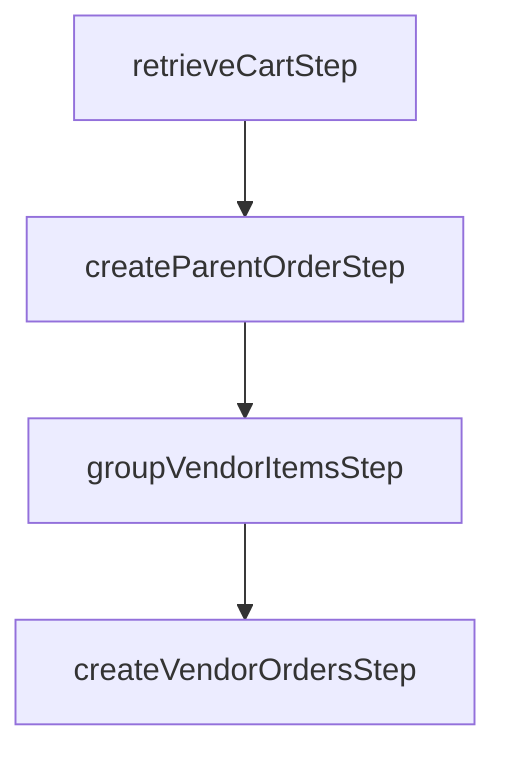

import { Github, PlaySolid } from "@medusajs/icons"

export const metadata = {
  title: `Marketplace Recipe: Vendors Example`,
}

# {metadata.title}

This document provides an example of implementing the marketplace recipe.

<Note>

You can implement the marketplace as you see fit for your use case. This is only an example of one way to implement it.

</Note>

## Features

By following this example, you’ll have a marketplace with the following features:

1. Multiple vendors, each having vendor admins.
2. Vendor admins manage the vendor’s products and orders.
3. On order creation, the order is split into multiple orders for each vendor.
4. All other commerce features that Medusa provides.

<CardList items={[
  {
    href: "https://github.com/medusajs/examples/tree/main/marketplace",
    title: "Marketplace Example Repository",
    text: "Find the full code for this recipe example in this repository.",
    startIcon: <Github />,
    showLinkIcon: false
  },
  {
    href: "https://res.cloudinary.com/dza7lstvk/raw/upload/v1720603521/OpenApi/Marketplace_OpenApi_n458oh.yml",
    title: "OpenApi Specs for Postman",
    text: "Imported this OpenApi Specs file into tools like Postman.",
    startIcon: <PlaySolid />,
    showLinkIcon: false
  },
]} />

---

<Note type="check">

- [A new Medusa application installed.](!docs!#get-started)

</Note>

## Step 1: Create Marketplace Module

The first step is to create a marketplace module that holds the data models for a vendor and an admin. 

Create the directory `src/modules/marketplace`.

### Create Data Models

Create the file `src/modules/marketplace/models/vendor.ts` with the following content:

```ts title="src/modules/marketplace/models/vendor.ts"
import { model } from "@medusajs/utils"
import VendorAdmin from "./vendor-admin"

const Vendor = model.define("vendor", {
  id: model.id().primaryKey(),
  handle: model.text(),
  name: model.text(),
  logo: model.text().nullable(),
  admins: model.hasMany(() => VendorAdmin),
})

export default Vendor
```

This creates a `Vendor` data model, which represents a business that sells its products in the marketplace.

Notice that the `Vendor` has many admins whose data model you’ll create next.

Create the file `src/modules/marketplace/models/vendor-admin.ts` with the following content:

```ts title="src/modules/marketplace/models/vendor-admin.ts"
import { model } from "@medusajs/utils"
import Vendor from "./vendor"

const VendorAdmin = model.define("vendor_admin", {
  id: model.id().primaryKey(),
  first_name: model.text().nullable(),
  last_name: model.text().nullable(),
  email: model.text().unique(),
  vendor: model.belongsTo(() => Vendor, {
    mappedBy: "admins",
  }),
})

export default VendorAdmin
```

This creates a `VendorAdmin` data model, which represents an admin of a vendor.

### Create Main Module Service

Next, create the main service of the module at `src/modules/marketplace/service.ts` with the following content:

```ts title="src/modules/marketplace/service.ts"
import { MedusaService } from "@medusajs/utils"
import Vendor from "./models/vendor"
import VendorAdmin from "./models/vendor-admin"
import { CreateVendorData, VendorData } from "./types"

class MarketplaceModuleService extends MedusaService({
  Vendor,
  VendorAdmin,
}) {
}

export default MarketplaceModuleService
```

The service extends the [service factory](!docs!/advanced-development/modules/service-factory), which provides basic data-management features.

### Create Module Definition

After that, create the module definition at `src/modules/marketplace/index.ts` with the following content:

```ts title="src/modules/marketplace/index.ts"
import { Module } from "@medusajs/utils"
import MarketplaceModuleService from "./service"

export const MARKETPLACE_MODULE = "marketplaceModuleService"

export default Module(MARKETPLACE_MODULE, {
  service: MarketplaceModuleService,
})
```

### Add Module to Medusa Configuration

Finally, add the module to the list of modules in `medusa-config.js`:

```ts title="medusa-config.js"
module.exports = defineConfig({
  // ...
  modules: {
    marketplaceModuleService: {
      resolve: "./modules/marketplace",
    },
  },
})
```

### Further Reads

- [How to Create a Module](!docs!/basics/modules-and-services)
- [How to Create Data Models](!docs!/basics/data-models)

---

## Step 2: Define Links to Product and Order Data Models

Each vendor has products and orders. So, in this step, you’ll define links between the `Vendor` data model and the `Product` and `Order` data models from the Product and Order modules, respectively.

<Note title="Tip">

If your use case requires linking the vendor to other data models, such as `SalesChannel`, define those links in a similar manner.

</Note>

Create the file `src/links/vendor-product.ts` with the following content:

```ts title="src/links/vendor-product.ts"
import { defineLink } from "@medusajs/utils"
import MarketplaceModule from "../modules/marketplace"
import ProductModule from "@medusajs/product"

export default defineLink(
  MarketplaceModule.linkable.vendor,
  {
    linkable: ProductModule.linkable.product,
    isList: true,
  }
)
```

This adds a list link between the `Vendor` and `Product` data models, indicating that a vendor record can be linked to many product records.

Then, create the file `src/links/vendor-order.ts` with the following content:

```ts title="src/links/vendor-order.ts"
import { defineLink } from "@medusajs/utils"
import MarketplaceModule from "../modules/marketplace"
import OrderModule from "@medusajs/order"

export default defineLink(
  MarketplaceModule.linkable.vendor,
  {
    linkable: OrderModule.linkable.order,
    isList: true,
  }
)
```

This adds a list link between the `Vendor` and `Order` data models, indicating that a vendor record can be linked to many order records.

### Further Read

- [How to Define Module Links](!docs!/advanced-development/modules/module-links)

---

## Step 3: Generate and Run Migrations

To create tables for the marketplace data models in the database, start by generating the migrations for the Marketplace Module with the following command:

```bash
npx medusa migrations generate marketplaceModuleService
```

This generates a migration in the `src/modules/marketeplace/migrations` directory.

Then, to reflect the migration and the module links in the database, run the following command:

```bash
npx medusa migrations run
```

---

## Step 4: Create Vendor Admin Workflow

In this step, you’ll create the workflow used to create a vendor admin.

The workflow’s steps are:

1. Create the vendor admin using the Marketplace Module’s main service.
2. Create a `vendor` [actor type](../../../../commerce-modules/auth/auth-identity-and-actor-types/page.mdx) to authenticate the vendor admin using the Auth Module.

First, create the file `src/workflows/marketplace/create-vendor-admin/steps/create-vendor-admin.ts` with the following content:

```ts title="src/workflows/marketplace/create-vendor-admin/steps/create-vendor-admin.ts"
import { 
  createStep,
  StepResponse,
} from "@medusajs/workflows-sdk"
import { CreateVendorAdminWorkflowInput } from ".."
import MarketplaceModuleService from "../../../../modules/marketplace/service"
import { MARKETPLACE_MODULE } from "../../../../modules/marketplace"

const createVendorAdminStep = createStep(
  "create-vendor-admin-step",
  async ({ 
    admin: adminData,
  }: Pick<CreateVendorAdminWorkflowInput, "admin">, 
  { container }) => {
    const marketplaceModuleService: MarketplaceModuleService = 
      container.resolve(MARKETPLACE_MODULE)

    const vendorAdmin = await marketplaceModuleService.createVendorAdmins(
      adminData
    )

    return new StepResponse(vendorAdmin)
  }
)

export default createVendorAdminStep
```

This is the first step that creates the vendor admin and returns it.

Then, create the workflow at `src/workflows/marketplace/create-vendor-admin/index.ts` with the following content:

export const vendorAdminWorkflowHighlights = [
  ["24", "setAuthAppMetadataStep", "Step is imported from `@medusajs/core-flows`."]
]

```ts title="src/workflows/marketplace/create-vendor-admin/index.ts" highlights={vendorAdminWorkflowHighlights}
import { createWorkflow } from "@medusajs/workflows-sdk"
import { 
  setAuthAppMetadataStep,
} from "@medusajs/core-flows"
import createVendorAdminStep from "./steps/create-vendor-admin"

export type CreateVendorAdminWorkflowInput = {
  admin: {
    email: string
    first_name?: string
    last_name?: string
    vendor_id: string
  }
  authIdentityId: string
}

const createVendorAdminWorkflow = createWorkflow(
  "create-vendor-admin",
  function (input: CreateVendorAdminWorkflowInput) {
    const vendorAdmin = createVendorAdminStep({
      admin: input.admin,
    })

    setAuthAppMetadataStep({
      authIdentityId: input.authIdentityId,
      actorType: "vendor",
      value: vendorAdmin.id,
    })

    return vendorAdmin
  }
)

export default createVendorAdminWorkflow
```

This runs the `createVendorAdminStep`, then the `setAuthAppMetadataStep` imported from `@medusajs/core-flows`, which creates the `vendor` actor type.

The workflow returns the created vendor admin.

### Further Read

- [How to Create a Workflow](!docs!/basics/workflows)
- [What is an Actor Type](../../../../commerce-modules/auth/auth-identity-and-actor-types/page.mdx)
- [How to Create an Actor Type](../../../../commerce-modules/auth/create-actor-type/page.mdx)

---

## Step 5: Create Vendor API Route

In this step, you’ll create the API route that runs the workflow from the previous step.

Start by creating the file `src/api/vendors/route.ts` with the following content:

export const vendorRouteSchemaHighlights = [
  ["10", "schema", "Define the fields expected in the request body."],
]

```ts title="src/api/vendors/route.ts" highlights={vendorRouteSchemaHighlights}
import { 
  AuthenticatedMedusaRequest, 
  MedusaResponse,
} from "@medusajs/medusa"
import { MedusaError } from "@medusajs/utils"
import { z } from "zod"
import MarketplaceModuleService from "../../modules/marketplace/service"
import createVendorAdminWorkflow from "../../workflows/marketplace/create-vendor-admin"

const schema = z.object({
  name: z.string(),
  handle: z.string().optional(),
  logo: z.string().optional(),
  admin: z.object({
    email: z.string(),
    first_name: z.string().optional(),
    last_name: z.string().optional(),
  }).strict(),
}).strict()

type RequestBody = {
  name: string,
  handle?: string,
  logo?: string,
  admin: {
    email: string,
    first_name?: string,
    last_name?: string
  }
}

```

This defines the schema to be accepted in the request body.

Then, add the route handler to the same file:

export const vendorRouteHighlights = [
  ["14", "parse", "Validate the request body and, if valid, retrieve it as an object."],
  ["20", "createVendors", "Create the vendor using the Marketplace Module's main service."],
  ["23", "createVendorAdminWorkflow", "Execute the workflow created in the first step."],
]

```ts title="src/api/vendors/route.ts" highlights={vendorRouteHighlights}
export const POST = async (
  req: AuthenticatedMedusaRequest<RequestBody>,
  res: MedusaResponse
) => {
  // If `actor_id` is present, the request carries 
  // authentication for an existing vendor admin
  if (req.auth_context?.actor_id) {
    throw new MedusaError(
      MedusaError.Types.INVALID_DATA,
      "Request already authenticated as a vendor."
    )
  }

  const { admin, ...vendorData } = schema.parse(req.body) as RequestBody

  const marketplaceModuleService: MarketplaceModuleService = req.scope
    .resolve("marketplaceModuleService")

  // create vendor
  let vendor = await marketplaceModuleService.createVendors([vendorData])

  // create vendor admin
  await createVendorAdminWorkflow(req.scope)
    .run({
      input: {
        admin: {
          ...admin,
          vendor_id: vendor[0].id,
        },
        authIdentityId: req.auth_context.auth_identity_id,
      },
    })

  // retrieve vendor again with admins
  vendor = await marketplaceModuleService.retrieveVendor(vendor[0].id, {
    relations: ["admins"],
  })

  res.json({
    vendor,
  })
}
```

This API route expects the request header to contain a new vendor admin’s authentication JWT token.

The route handler creates a vendor using the Marketplace Module’s main service and then uses the `createVendorAdminWorkflow` to create an admin for the vendor.

Next, create the file `src/api/middlewares.ts` with the following content:

```ts title="src/api/middlewares.ts"
import { MiddlewaresConfig, authenticate } from "@medusajs/medusa"

export const config: MiddlewaresConfig = {
  routes: [
    {
      matcher: "/vendors",
      method: "POST",
      middlewares: [
        authenticate("vendor", ["session", "bearer"], {
          allowUnregistered: true,
        }),
      ],
    },
    {
      matcher: "/vendors/*",
      middlewares: [
        authenticate("vendor", ["session", "bearer"]),
      ],
    },
  ],
}
```

This applies two middlewares:

1. On the `/vendors` POST API route; it requires authentication but allows unregistered users.
2. On the `/vendors/*` API routes, which you’ll implement in upcoming sections; it requires an authenticated vendor admin.

### Test it Out

To test out the above API route:

1. Start the Medusa application:

```bash npm2yarn
npm run dev
```

2. Retrieve a JWT token from the `/auth/vendor/emailpass` API route:

```bash apiTesting testApiUrl="http://localhost:9000/auth/vendor/emailpass" testApiMethod="POST" testBodyParams={{ "email": "admin@medusa-test.com", "password": "supersecret" }}
curl -X POST 'http://localhost:9000/auth/vendor/emailpass' \
-H 'Content-Type: application/json' \
--data-raw '{
    "email": "admin@medusa-test.com",
    "password": "supersecret"
}'
```

<Note title="Tip">

This route is available because you created the `vendor` actor type previously.

</Note>

3. Send a request to the `/vendors` API route, passing the token retrieved from the previous response in the request header:

```bash
curl -X POST 'http://localhost:9000/vendors' \
-H 'Content-Type: application/json' \
-H 'Authorization: Bearer {token}' \
--data-raw '{
    "name": "Acme",
    "admin": {
        "email": "admin@medusa-test.com",
        "first_name": "Admin",
        "last_name": "Acme"
    }
}'
```

This returns the created vendor and admin.

4. Retrieve an authenticated token of the vendor admin by sending another request to the `/auth/vendor/emailpass` API route:

```bash apiTesting testApiUrl="http://localhost:9000/auth/vendor/emailpass" testApiMethod="POST" testBodyParams={{ "email": "admin@medusa-test.com", "password": "supersecret" }}
curl -X POST 'http://localhost:9000/auth/vendor/emailpass' \
-H 'Content-Type: application/json' \
--data-raw '{
    "email": "admin@medusa-test.com",
    "password": "supersecret"
}'
```

Use this token in the header of later requests that require authentication.

### Further Reads

- [How to Create an API route](!docs!/basics/api-routes)
- [How to Create a Middleware](!docs!/advanced-development/api-routes/middlewares)
- [Learn more about the /auth route](../../../../commerce-modules/auth/authentication-route/page.mdx)

---

## Step 6: Add Product API Routes

In this section, you’ll add two API routes: one to retrieve the vendor’s products and one to create a product.

To create the API route that retrieves the vendor’s products, create the file `src/api/vendors/products/route.ts` with the following content:

export const retrieveProductHighlights = [
  ["16", "retrieveVendorAdmin", "Retrive the vendor admin to retrieve its vendor's ID."],
  ["33", "remoteQuery", "Retrieve the vendor's products using remote query."]
]

```ts title="src/api/vendors/products/route.ts" highlights={retrieveProductHighlights}
import { AuthenticatedMedusaRequest, MedusaResponse } from "@medusajs/medusa"
import { 
  remoteQueryObjectFromString,
} from "@medusajs/utils"
import MarketplaceModuleService from "../../../modules/marketplace/service"
import { MARKETPLACE_MODULE } from "../../../modules/marketplace"

export const GET = async (
  req: AuthenticatedMedusaRequest,
  res: MedusaResponse
) => {
  const remoteQuery = req.scope.resolve("remoteQuery")
  const marketplaceModuleService: MarketplaceModuleService = 
    req.scope.resolve(MARKETPLACE_MODULE)

  const vendorAdmin = await marketplaceModuleService.retrieveVendorAdmin(
    req.auth_context.actor_id,
    {
      relations: ["vendor"],
    }
  )

  const query = remoteQueryObjectFromString({
    entryPoint: "vendor",
    fields: ["products.*"],
    variables: {
      filters: {
        id: [vendorAdmin.vendor.id],
      },
    },
  })

  const result = await remoteQuery(query)

  res.json({
    products: result[0].products,
  })
}
```

This adds a `GET` API route at `/vendors/products` that, using the remote query, retrieves the list of products of the vendor and returns them in the response.

To add the create product API route, add to the same file the following:

export const createProducts1Highlights = [
  ["15", "CreateProductWorkflowInputDTO", "Accept the same request body as Medusa's Create Product API route"],
  ["32", "retrieveVendorAdmin", "Retrive the vendor admin to retrieve its vendor's ID."],
]

```ts title="src/api/vendors/products/route.ts" highlights={createProducts1Highlights}
// other imports...
import { createProductsWorkflow } from "@medusajs/core-flows"
import { 
  CreateProductWorkflowInputDTO,
  IProductModuleService,
  ISalesChannelModuleService,
} from "@medusajs/types"
import { 
  Modules, 
  ModuleRegistrationName,
} from "@medusajs/utils"

// GET method...

type RequestType = CreateProductWorkflowInputDTO

export const POST = async (
  req: AuthenticatedMedusaRequest<RequestType>,
  res: MedusaResponse
) => {
  const remoteLink = req.scope.resolve("remoteLink")
  const marketplaceModuleService: MarketplaceModuleService = 
    req.scope.resolve(MARKETPLACE_MODULE)
  const productModuleService: IProductModuleService = req.scope
    .resolve(ModuleRegistrationName.PRODUCT)
  const salesChannelModuleService: ISalesChannelModuleService = req.scope
    .resolve(ModuleRegistrationName.SALES_CHANNEL)
  // Retrieve default sales channel to make the product available in.
  // Alternatively, you can link sales channels to vendors and allow vendors
  // to manage sales channels
  const salesChannels = await salesChannelModuleService.listSalesChannels()
  const vendorAdmin = await marketplaceModuleService.retrieveVendorAdmin(
    req.auth_context.actor_id,
    {
      relations: ["vendor"],
    }
  )
  
  // TODO create and link product
}
```

This adds a `POST` API route at `/vendors/products`. It resolves the necessary modules' main services, and retrieves the sales channels and vendor admin.

In the place of the `TODO`, add the following:

export const createProducts2Highlights = [
  ["1", "createProductsWorkflow", "Use Medusa's workflow to create a product."],
  ["12", "create", "Create a link between the created product and the vendor."]
]

```ts title="src/api/vendors/products/route.ts" highlights={createProducts2Highlights}
const { result } = await createProductsWorkflow(req.scope)
  .run({
    input: {
      products: [{
        ...req.body,
        sales_channels: salesChannels,
      }],
    },
  })

// link product to vendor
await remoteLink.create({
  [MARKETPLACE_MODULE]: {
    vendor_id: vendorAdmin.vendor.id,
  },
  [Modules.PRODUCT]: {
    product_id: result[0].id,
  },
})

// retrieve product again
const product = await productModuleService.retrieveProduct(
  result[0].id
)

res.json({
  product,
})
```

This creates a product, links it to the vendor, and returns the product in the response.

<Note>

In the route handler, you add the product to the default sales channel. You can, instead, link sales channels with vendors similar to the steps explained in step 2.

</Note>

Finally, apply a middleware on the create products route to validate the request body before executing the route handler:

```ts
import { MiddlewaresConfig, authenticate } from "@medusajs/medusa"
import { validateAndTransformBody } from "@medusajs/medusa/dist/api/utils/validate-body"
import { AdminCreateProduct } from "@medusajs/medusa/dist/api/admin/products/validators"

export const config: MiddlewaresConfig = {
  routes: [
    // ...
    {
      matcher: "/vendors/products",
      method: "POST",
      middlewares: [
        authenticate("vendor", ["session", "bearer"]),
        validateAndTransformBody(AdminCreateProduct),
      ],
    },
  ],
}
```

### Test it Out

To test out the new API routes:

1. Send a `POST` request to `/vendors/products` to create a product:

```bash
curl -X POST 'http://localhost:9000/vendors/products' \
-H 'Content-Type: application/json' \
-H 'Authorization: Bearer {token}' \
--data '{
    "title": "T-Shirt",
    "status": "published",
    "options": [
        {
            "title": "Color",
            "values": ["Blue"]
        }
    ],
    "variants": [
        {
            "title": "T-Shirt",
            "prices": [
                {
                    "currency_code": "eur",
                    "amount": 10
                }
            ],
            "manage_inventory": false,
            "options": {
                "Color": "Blue"
            }
        }
    ]
}'
```

2. Send a `GET` request to `/vendors/products` to retrieve the vendor’s products:

```bash
curl 'http://localhost:9000/vendors/products' \
-H 'Authorization: Bearer {token}'
```

### Further Reads

- [How to use the Remote Query](!docs!/advanced-development/modules/remote-query)
- [How to use the Remote Link](!docs!/advanced-development/modules/remote-link)

---

## Step 7: Create Vendor Order Workflow

In this step, you’ll create a workflow that’s executed when the customer places an order. It has the following steps:



1. Retrieve the customer’s cart using its ID.
2. Create a parent order for the cart and its items.
3. Group the cart items by their product’s associated vendor.
4. For each vendor, create a child order with the cart items of their products.

### retrieveCartStep

Start by creating the first step in the file `src/workflows/marketplace/create-vendor-orders/steps/retrieve-cart.ts`:

```ts title="src/workflows/marketplace/create-vendor-orders/steps/retrieve-cart.ts"
import { 
  createStep,
  StepResponse,
} from "@medusajs/workflows-sdk"
import { ModuleRegistrationName } from "@medusajs/utils"
import { ICartModuleService } from "@medusajs/types"

type StepInput = {
  cart_id: string
}

const retrieveCartStep = createStep(
  "retrieve-cart",
  async ({ cart_id }: StepInput, { container }) => {
    const cartModuleService: ICartModuleService = container
      .resolve(ModuleRegistrationName.CART)

    const cart = await cartModuleService.retrieveCart(cart_id, {
      relations: ["items"],
    })

    return new StepResponse({
      cart,
    })
  }
)

export default retrieveCartStep 
```

This step retrieves the cart by its ID using the Cart Module’s main service and returns it.

### createParentOrderStep

Then, create the second step in the file `src/workflows/marketplace/create-vendor-orders/steps/create-parent-order.ts`:

export const parentOrderHighlights = [
  ["14", "completeCartWorkflow", "Use Medusa's workflow to complete the cart and create an order."]
]

```ts title="src/workflows/marketplace/create-vendor-orders/steps/create-parent-order.ts" highlights={parentOrderHighlights}
import { 
  createStep,
  StepResponse,
} from "@medusajs/workflows-sdk"
import { completeCartWorkflow } from "@medusajs/core-flows"

type StepInput = {
  cart_id: string
}

const createParentOrderStep = createStep(
  "create-parent-order",
  async ({ cart_id }: StepInput, { container }) => {
    const { result } = await completeCartWorkflow(container)
      .run({
        input: {
          id: cart_id,
        },
      })

    return new StepResponse({
      order: result,
    })
  }
)

export default createParentOrderStep
```

This step uses the `completeCartWorkflow` implemented by Medusa to create a parent order and return it.

### groupVendorItemsStep

Next, create the third step in the file `src/workflows/marketplace/create-vendor-orders/steps/group-vendor-items.ts`:

```ts title="src/workflows/marketplace/create-vendor-orders/steps/group-vendor-items.ts"
import { 
  createStep,
  StepResponse,
} from "@medusajs/workflows-sdk"
import { CartDTO, CartLineItemDTO } from "@medusajs/types"
import { remoteQueryObjectFromString } from "@medusajs/utils"

type StepInput = {
  cart: CartDTO
}

const groupVendorItemsStep = createStep(
  "group-vendor-items",
  async ({ cart }: StepInput, { container }) => {
    const remoteQuery = container.resolve("remoteQuery")

    const vendorsItems: Record<string, CartLineItemDTO[]> = {}

    await Promise.all(cart.items?.map(async (item) => {
      const query = remoteQueryObjectFromString({
        entryPoint: "product",
        fields: ["vendor.*"],
        variables: {
          filters: {
            id: [item.product_id],
          },
        },
      })

      const result = await remoteQuery(query)

      const vendorId = result[0].vendor?.id

      if (!vendorId) {
        return
      }
      vendorsItems[vendorId] = [
        ...(vendorsItems[vendorId] || []),
        item,
      ]
    }))

    return new StepResponse({
      vendorsItems,
    })
  }
)

export default groupVendorItemsStep
```

This step groups the items by the vendor associated with the product into an object and returns the object.

### createVendorOrdersStep

Lastly, create the fourth step in the file `src/workflows/marketplace/create-vendor-orders/steps/create-vendor-orders.ts`:

export const vendorOrder1Highlights = [
  ["28", "", "If the `vendorItems` object is empty, return."],
]

```ts title="src/workflows/marketplace/create-vendor-orders/steps/create-vendor-orders.ts" collapsibleLines="1-15" expandMoreLabel="Show Imports" highlights={vendorOrder1Highlights}
import { 
  createStep,
  StepResponse,
} from "@medusajs/workflows-sdk"
import { 
  CartLineItemDTO, 
  OrderDTO,
} from "@medusajs/types"
import { Modules } from "@medusajs/utils"
import { createOrdersWorkflow } from "@medusajs/core-flows"
import MarketplaceModuleService from "../../../../modules/marketplace/service"
import { MARKETPLACE_MODULE } from "../../../../modules/marketplace"
import { VendorData } from "../../../../modules/marketplace/types"

export type VendorOrder = (OrderDTO & {
  vendor: VendorData
})

type StepInput = {
  parentOrder: OrderDTO
  vendorsItems: Record<string, CartLineItemDTO[]>
}

const createVendorOrdersStep = createStep(
  "create-vendor-orders",
  async ({ vendorsItems, parentOrder }: StepInput, { container }) => {
    const vendorIds = Object.keys(vendorsItems)
    if (vendorIds.length === 0) {
      return new StepResponse({
        orders: [],
      })
    }
    const remoteLink = container.resolve("remoteLink")
    const marketplaceModuleService: MarketplaceModuleService = 
      container.resolve(MARKETPLACE_MODULE)
    const isOnlyOneVendorOrder = vendorIds.length === 1

    // TODO handle creating child orders
  }
)

export default createVendorOrdersStep
```

This creates a step that receives the grouped vendor items and the parent order. For now, it only checks if there are any items in `vendorItems` before returning.

Replace the `TODO` with the following:

export const vendorOrder2Highlights = [
  ["1", "isOnlyOneVendorOrder", "If the order has items for one vendor only, the parent order is linked to the vendor."],
]

```ts title="src/workflows/marketplace/create-vendor-orders/steps/create-vendor-orders.ts" highlights={vendorOrder2Highlights}
if (isOnlyOneVendorOrder) {
  const vendorId = vendorIds[0]
  const vendor = await marketplaceModuleService.retrieveVendor(
    vendorId
  )
  // link the parent order to the vendor instead of creating child orders
  await remoteLink.create({
    [MARKETPLACE_MODULE]: {
      vendor_id: vendorId,
    },
    [Modules.ORDER]: {
      order_id: parentOrder.id,
    },
  })

  return new StepResponse({
    orders: [
      {
        ...parentOrder,
        vendor,
      },
    ],
  })
}

// TODO create multiple child orders
```

In the above snippet, if there's only one vendor in the group, the parent order is returned instead of creating child orders.

Replace the new `TODO` with the following snippet:

export const vendorOrder3Highlights = [
  ["4", "map", "Loop over the vendor IDs and create a child order with only their items."],
  ["15", "parent_order_id", "Set the ID of the parent order in the `metadata` property of the child order."],
  ["52", "create", "Create a link between the vendor and the child order."]
]

```ts title="src/workflows/marketplace/create-vendor-orders/steps/create-vendor-orders.ts" highlights={vendorOrder3Highlights}
const createdOrders: VendorOrder[] = []

await Promise.all(
  vendorIds.map(async (vendorId) => {
    const items = vendorsItems[vendorId]
    const vendor = await marketplaceModuleService.retrieveVendor(
      vendorId
    )
    // create an child order
    const { result: childOrder } = await createOrdersWorkflow(container)
      .run({
        input: {
          items,
          metadata: {
            parent_order_id: parentOrder.id,
          },
          // use info from parent
          region_id: parentOrder.region_id,
          customer_id: parentOrder.customer_id,
          sales_channel_id: parentOrder.sales_channel_id,
          email: parentOrder.email,
          currency_code: parentOrder.currency_code,
          shipping_address_id: parentOrder.shipping_address?.id,
          billing_address_id: parentOrder.billing_address?.id,
          // A better solution would be to have shipping methods for each
          // item/vendor. This requires changes in the storefront to commodate that
          // and passing the item/vendor ID in the `data` property, for example.
          // For simplicity here we just use the same shipping method.
          shipping_methods: parentOrder.shipping_methods.map((shippingMethod) => ({
            name: shippingMethod.name,
            amount: shippingMethod.amount,
            shipping_option_id: shippingMethod.shipping_option_id,
            data: shippingMethod.data,
            tax_lines: shippingMethod.tax_lines.map((taxLine) => ({
              code: taxLine.code,
              rate: taxLine.rate,
              provider_id: taxLine.provider_id,
              tax_rate_id: taxLine.tax_rate_id,
              description: taxLine.description,
            })),
            adjustments: shippingMethod.adjustments.map((adjustment) => ({
              code: adjustment.code,
              amount: adjustment.amount,
              description: adjustment.description,
              promotion_id: adjustment.promotion_id,
              provider_id: adjustment.provider_id,
            })),
          })),
        },
      })

    await remoteLink.create({
      [MARKETPLACE_MODULE]: {
        vendor_id: vendorId,
      },
      [Modules.ORDER]: {
        order_id: childOrder.id,
      },
    })

    createdOrders.push({
      ...childOrder,
      vendor,
    })
  })
)

return new StepResponse({
  orders: createdOrders,
})
```

In this snippet, you create multiple child orders for each vendor and link the orders to the vendors.

The created orders are returned in the response.

<Note>

When creating the child orders, the shipping method of the parent is used as-is for simplicity. A better practice would be to allow the customer to choose different shipping methods for each vendor’s items and then store those details in the `data` property of the shipping method.

</Note>

### Create Workflow

Finally, create the workflow at the file `src/workflows/marketplace/create-vendor-orders/index.ts`:

```ts title="src/workflows/marketplace/create-vendor-orders/index.ts" collapsibleLines="1-7" expandMoreLabel="Show Imports"
import { createWorkflow, transform } from "@medusajs/workflows-sdk"
import retrieveCartStep from "./steps/retrieve-cart"
import groupVendorItemsStep from "./steps/group-vendor-items"
import createParentOrderStep from "./steps/create-parent-order"
import createVendorOrdersStep from "./steps/create-vendor-orders"

type WorkflowInput = {
  cart_id: string
}

const createVendorOrdersWorkflow = createWorkflow(
  "create-vendor-order",
  (input: WorkflowInput) => {
    const { cart } = retrieveCartStep(input)

    const { order } = createParentOrderStep(input)

    const { vendorsItems } = groupVendorItemsStep(
      transform({
        cart,
      },
      (data) => data
      )
    )

    const { orders } = createVendorOrdersStep(
      transform({
        order,
        vendorsItems,
      },
      (data) => {
        return {
          parentOrder: data.order,
          vendorsItems: data.vendorsItems,
        }
      }
      )
    )

    return transform({
      order,
      orders,
    },
    (data) => ({
      parent_order: data.order,
      vendor_orders: data.orders,
    })
    )
  }
)

export default createVendorOrdersWorkflow
```

This workflow runs the steps and returns the parent and vendor orders.

### Create API Route Executing the Workflow

You’ll now create the API route that executes the workflow.

Create the file `src/api/store/carts/[id]/complete/route.ts` with the following content:

```ts title="src/api/store/carts/[id]/complete/route.ts"
import { 
  AuthenticatedMedusaRequest, 
  MedusaResponse,
} from "@medusajs/medusa"
import createVendorOrdersWorkflow from "../../../../../workflows/marketplace/create-vendor-orders"

export const POST = async (
  req: AuthenticatedMedusaRequest,
  res: MedusaResponse
) => {
  const cartId = req.params.id

  const { result } = await createVendorOrdersWorkflow(req.scope)
    .run({
      input: {
        cart_id: cartId,
      },
    })

  res.json({
    type: "order",
    order: result.parent_order,
  })
}
```

This API route replaces the [existing API route in the Medusa application](!api!/store#carts_postcartsidcomplete) used to complete the cart and place an order. It executes the workflow and returns the parent order in the response.

### Test it Out

To test this out, it’s recommended to install the [Next.js Starter storefront](../../../../nextjs-starter/page.mdx). Then, add products to the cart and place an order. You can also try placing an order with products from different vendors.

---

## Step 8: Retrieve Vendor Orders API Route

In this step, you’ll create an API route that retrieves a vendor’s orders.

Create the file `src/api/vendors/orders/route.ts` with the following content:

export const getOrderHighlights = [
  ["15", "retrieveVendorAdmin", "Retrive the vendor admin to retrieve its vendor's ID."],
  ["32", "remoteQuery", "Retrieve the orders of the vendor."],
  ["34", "getOrdersListWorkflow", "Use Medusa's workflow to retrieve the list of orders."],
]

```ts title="src/api/vendors/orders/route.ts" highlights={getOrderHighlights} collapsibleLines="1-6" expandMoreLabel="Show Imports"
import { AuthenticatedMedusaRequest, MedusaResponse } from "@medusajs/medusa"
import { remoteQueryObjectFromString } from "@medusajs/utils"
import { getOrdersListWorkflow } from "@medusajs/core-flows"
import MarketplaceModuleService from "../../../modules/marketplace/service"
import { MARKETPLACE_MODULE } from "../../../modules/marketplace"

export const GET = async (
  req: AuthenticatedMedusaRequest,
  res: MedusaResponse
) => {
  const remoteQuery = req.scope.resolve("remoteQuery")
  const marketplaceModuleService: MarketplaceModuleService = 
    req.scope.resolve(MARKETPLACE_MODULE)

  const vendorAdmin = await marketplaceModuleService.retrieveVendorAdmin(
    req.auth_context.actor_id,
    {
      relations: ["vendor"],
    }
  )

  const query = remoteQueryObjectFromString({
    entryPoint: "vendor",
    fields: ["orders.*"],
    variables: {
      filters: {
        id: [vendorAdmin.vendor.id],
      },
    },
  })

  const result = await remoteQuery(query)

  const { result: orders } = await getOrdersListWorkflow(req.scope)
    .run({
      input: {
        fields: [
          "metadata",
          "total",
          "subtotal",
          "shipping_total",
          "tax_total",
          "items.*",
          "items.tax_lines",
          "items.adjustments",
          "items.variant",
          "items.variant.product",
          "items.detail",
          "shipping_methods",
          "payment_collections",
          "fulfillments",
        ],
        variables: {
          filters: {
            id: result[0].orders.map((order) => order.id),
          },
        },
      },
    })

  res.json({
    orders,
  })
}
```

This adds a `GET` API route at `/vendors/orders` that returns a vendor’s list of orders.

### Test it Out

To test it out, send a `GET` request to `/vendors/orders` :

```bash
curl 'http://localhost:9000/vendors/orders' \
-H 'Authorization: Bearer {token}'
```

Make sure to replace the `{token}` with the vendor admin’s token.

You’ll receive in the response the orders of the vendor created in the previous step.

---

## Next Steps

The next steps of this example depend on your use case. This section provides some insight into implementing them.

### Use Existing Features

You can use [Medusa’s admin API routes for orders](!api!/admin) to allow vendors to manage their orders. This requires you to add the following middleware in `src/api/middlewares.ts`:

```ts title="src/api/middlewares.ts"
export const config: MiddlewaresConfig = {
  routes: [
	  // ...
    {
      matcher: "/admin/orders/*",
      method: "POST",
      middlewares: [
        authenticate("vendor", ["session", "bearer"]),
      ],
    },
  ],
}
```

You can also re-create or override any of the existing API routes, similar to what you did with the complete cart API route.

### Link Other Data Models to Vendors

Similar to linking an order and a product to a vendor, you can link other data models to vendors as well.

For example, you can link sales channels to vendors or other settings.

<Note>

[Learn more about module links](!docs!/advanced-development/modules/module-links).

</Note>

### Storefront Development

Medusa provides a Next.js Starter storefront that you can customize to your use case.

You can also create a custom storefront. Check out the [Storefront Development](../../../../storefront-development/page.mdx) section to learn how to create a storefront.

### Admin Development

The Medusa Admin is extendable, allowing you to add widgets to existing pages or create new pages. Learn more about it in [this documentation](!docs!/advanced-development/admin).

If your use case requires bigger customizations to the admin, such as showing different products and orders based on the logged-in vendor, use the [admin API routes](!api!/admin) to build a custom admin.
