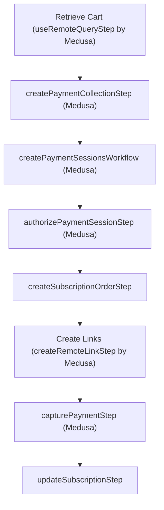

import { Github, PlaySolid } from "@medusajs/icons"

export const metadata = {
  title: `Subscriptions Recipe`,
}

# {metadata.title}

This document provides an example of implementing the subscription recipe.

<Note>

You can implement the subscription recipe as you see fit for your use case. This is only an example of one way to implement it.

</Note>

## Features

By following this example, you’ll have a subscription commerce store with the following features:

1. Subscription-based purchases for a specified interval (monthly or yearly) and period.
2. Customize the admin dashboard to view subscriptions and associated orders.
3. Automatic renewal of the subscription.
4. Automatic subscription expiration tracking.
5. Allow customers to view and cancel their subscriptions.

<CardList items={[
  {
    href: "https://github.com/medusajs/examples/tree/main/subscription",
    title: "Subscription Example Repository",
    text: "Find the full code for this recipe example in this repository.",
    startIcon: <Github />,
    showLinkIcon: false
  },
  {
    href: "https://res.cloudinary.com/dza7lstvk/raw/upload/v1721125608/OpenApi/Subscriptions_OpenApi_b371x4.yml",
    title: "OpenApi Specs for Postman",
    text: "Imported this OpenApi Specs file into tools like Postman.",
    startIcon: <PlaySolid />,
    showLinkIcon: false
  },
]} />

---

<Note type="check">

- [A new Medusa application installed.](!docs!#get-started)

</Note>

## Step 1: Create Subscription Module

The first step is to create a subscription module that holds the subscription's data model and provides data-management features through its service.

Create the directory `src/modules/subscription`.

### Create Data Models

Create the file `src/modules/subscription/models/subscription.ts` with the following content:

export const subscriptionHighlights = [
  ["8", "interval", "Whether the subscription is renewed monthly or yearly."],
  ["9", "period", "How many months/years before a new order is created for the subscription."],
  ["10", "subscription_date", "When the subscription was created."],
  ["11", "last_order_date", "When the last time a new order was created for the subscription"],
  ["12", "next_order_date", "When the subscription’s next order should be created."],
  ["12", "nullable", "In case the subscription doesn’t have a next date or has expired."],
  ["13", "expiration_date", "When the subscription expires."],
  ["14", "metadata", "Any additional data can be held in this property."]
]

```ts title="src/modules/subscription/models/subscription.ts" highlights={subscriptionHighlights}
import { model } from "@medusajs/utils"
import { SubscriptionInterval, SubscriptionStatus } from "../types"

const Subscription = model.define("subscription", {
  id: model.id().primaryKey(),
  status: model.enum(SubscriptionStatus)
    .default(SubscriptionStatus.ACTIVE),
  interval: model.enum(SubscriptionInterval),
  period: model.number(),
  subscription_date: model.dateTime(),
  last_order_date: model.dateTime(),
  next_order_date: model.dateTime().index().nullable(),
  expiration_date: model.dateTime().index(),
  metadata: model.json().nullable(),
})

export default Subscription
```

This creates a `Subscription` data model that holds a subscription’s details, including:

- `interval`: indicates whether the subscription is renewed monthly or yearly.
- `period`: a number indicating how many months/years before a new order is created for the subscription. For example, if `period` is `3` and `interval` is `monthly`, then a new order is created every three months.
- `subscription_date`: when the subscription was created.
- `last_order_date`: when the last time a new order was created for the subscription.
- `next_order_date` : when the subscription’s next order should be created. This property is nullable in case the subscription doesn’t have a next date or has expired.
- `expiration_date`: when the subscription expires.
- `metadata`: any additional data can be held in this JSON property.

Notice that the data models use enums defined in another file. So, create the file `src/modules/subscription/types/index.ts` with the following content:

```ts title="src/modules/subscription/types/index.ts"
export enum SubscriptionStatus {
  ACTIVE = "active",
  CANCELED = "canceled",
  EXPIRED = "expired",
  FAILED = "failed"
}

export enum SubscriptionInterval {
  MONTHLY = "monthly",
  YEARLY = "yearly"
}
```

### Create Main Service

Create the module’s main service in the file `src/modules/subscription/service.ts` with the following content:

```ts title="src/modules/subscription/service.ts"
import { MedusaService } from "@medusajs/utils"
import Subscription from "./models/subscription"

class SubscriptionModuleService extends MedusaService({
  Subscription,
}) {
}

export default SubscriptionModuleService
```

The main service extends the service factory to provide data-management features on the `Subscription` data model.

### Create Module Definition File

Create the file `src/modules/subscription/index.ts` that holds the module’s definition:

```ts title="src/modules/subscription/index.ts"
import { Module } from "@medusajs/utils"
import SubscriptionModuleService from "./service"

export const SUBSCRIPTION_MODULE = "subscriptionModuleService"

export default Module(SUBSCRIPTION_MODULE, {
  service: SubscriptionModuleService,
})
```

This sets the module’s name to `subscriptionModuleService` and its main service to `SubscriptionModuleService`.

### Register Module in Medusa’s Configuration

Finally, add the module into `medusa-config.js`:

```ts title="medusa-config.js"
module.exports = defineConfig({
  // ...
  modules: {
    subscriptionModuleService: {
      resolve: "./modules/subscription",
      definition: {
        isQueryable: true,
      },
    },
  },
})
```

### Further Read

- [How to Create a Module](!docs!/basics/modules-and-services)
- [How to Create a Data Model](!docs!/basics/data-models)
- [Learn more about the service factory](!docs!/advanced-development/modules/service-factory).

---

## Step 2: Define Links

In this step, you’ll define links between the Subscription Module’s `Subscription` data model and the data models of Medusa’s commerce modules.

### Define a Link to Cart

To link a subscription to the cart used to make the purchase, create the file `src/links/subscription-cart.ts` with the following content:

```ts title="src/links/subscription-cart.ts"
import { defineLink } from "@medusajs/utils"
import SubscriptionModule from "../modules/subscription"
import CartModule from "@medusajs/cart"

export default defineLink(
  SubscriptionModule.linkable.subscription,
  CartModule.linkable.cart
)
```

This defines a link between the `Subscription` data model and the Cart Module’s `Cart` data model.

<Note title="Tip">

When you create a new order for the subscription, you’ll retrieve the linked cart and use the same shipping and payment details the customer supplied when the purchase was made.

</Note>

### Define a Link to Customer

To link a subscription to the customer who purchased it, create the file `src/links/subscription-customer.ts` with the following content:

```ts title="src/links/subscription-customer.ts"
import { defineLink } from "@medusajs/utils"
import SubscriptionModule from "../modules/subscription"
import CustomerModule from "@medusajs/customer"

export default defineLink(
  {
    linkable: SubscriptionModule.linkable.subscription,
    isList: true,
  },
  CustomerModule.linkable.customer
)
```

This defines a list link to the `Subscription` data model, since a customer may have multiple subscriptions.

### Define a Link to Order

To link a subscription to the orders created for it, create the file `src/links/subscription-order.ts` with the following content:

```ts title="src/links/subscription-order.ts"
import { defineLink } from "@medusajs/utils"
import SubscriptionModule from "../modules/subscription"
import OrderModule from "@medusajs/order"

export default defineLink(
  SubscriptionModule.linkable.subscription,
  {
    linkable: OrderModule.linkable.order,
    isList: true,
  }
)
```

This defines a list link to the `Order` data model since a subscription has multiple orders.

### Further Reads

- [How to Define a Link](!docs!/advanced-development/modules/module-links)

---

## Step 3: Generate and Run Migrations

To create a table for the `Subscription` data model in the database, start by generating the migrations for the Subscription Module with the following command:

```bash
npx medusa migrations generate subscriptionModuleService
```

This generates a migration in the `src/modules/marketeplace/migrations` directory.

Then, to reflect the migration and the module links in the database, run the following command:

```bash
npx medusa migrations run
```

---

## Step 4: Override createSubscriptions Method in Service

Since the Subscription Module’s main service extends the service factory, it has a generic `createSubscriptions` method that creates one or more subscriptions.

In this step, you’ll override it to add custom logic to the subscription creation that sets its date properties.

### Install moment Library

Before you start, install the [Moment.js library](https://momentjs.com/) to help manipulate and format dates with the following command:

```bash npm2yarn
npm install moment
```

### Add getNextOrderDate Method

In `src/modules/subscription/service.ts`, add the following method to `SubscriptionModuleService`:

export const getNextOrderDateHighlights = [
  ["31", "isAfter", "If the calculated next day is after the expiration date, `null` is returned instead."]
]

```ts title="src/modules/subscription/service.ts" highlights={getNextOrderDateHighlights}
// ...
import moment from "moment"
import { 
  CreateSubscriptionData, 
  SubscriptionData, 
  SubscriptionInterval,
} from "./types"

class SubscriptionModuleService extends MedusaService({
  Subscription,
}) {
  getNextOrderDate({
    last_order_date,
    expiration_date,
    interval,
    period,
  }: {
    last_order_date: Date
    expiration_date: Date
    interval: SubscriptionInterval,
    period: number
  }): Date | null {
    const nextOrderDate = moment(last_order_date)
      .add(
        period, 
        interval === SubscriptionInterval.MONTHLY ? 
          "month" : "year"
      )
    const expirationMomentDate = moment(expiration_date)

    return nextOrderDate.isAfter(expirationMomentDate) ? 
      null : nextOrderDate.toDate()
  }
}
```

This method accepts a subscription’s last order date, expiration date, interval, and period, and uses them to calculate and return the next order date.

If the next order date, calculated from the last order date, exceeds the expiration date, `null` is returned.

### Add getExpirationDate Method

In the same file, add the following method to `SubscriptionModuleService`:

```ts title="src/modules/subscription/service.ts"
class SubscriptionModuleService extends MedusaService({
  Subscription,
}) {
  // ...
  getExpirationDate({
    subscription_date,
    interval,
    period,
  }: {
    subscription_date: Date,
    interval: SubscriptionInterval,
    period: number
  }) {
    return moment(subscription_date)
      .add(
        period,
        interval === SubscriptionInterval.MONTHLY ?
          "month" : "year"
      ).toDate()
  }
}
```

The `getExpirationDate` method accepts a subscription’s date, interval, and period to calculate and return its expiration date.

### Override the createSubscriptions Method

Before overriding the `createSubscriptions` method, add the following types to `src/modules/subscription/types/index.ts`:

```ts title="src/modules/subscription/types/index.ts"
// ...

export type CreateSubscriptionData = {
  interval: SubscriptionInterval
  period: number
  status?: SubscriptionStatus
  subscription_date?: Date
  metadata?: Record<string, unknown>
}

export type SubscriptionData = {
  id: string
  status: SubscriptionStatus
  interval: SubscriptionInterval
  subscription_date: Date
  last_order_date: Date
  next_order_date: Date | null
  expiration_date: Date
  metadata: Record<string, unknown> | null
}

```

Then, in `src/modules/subscription/service.ts`, add the following to override the `createSubscriptions` method:

```ts title="src/modules/subscription/service.ts"
class SubscriptionModuleService extends MedusaService({
  Subscription,
}) {
  // ...
    
  // @ts-expect-error
  async createSubscriptions(
    data: CreateSubscriptionData | CreateSubscriptionData[]
  ): Promise<SubscriptionData[]> {
    const input = Array.isArray(data) ? data : [data]

    const subscriptions = await Promise.all(
      input.map(async (subscription) => {
        const subscriptionDate = subscription.subscription_date || new Date()
        const expirationDate = this.getExpirationDate({
          subscription_date: subscriptionDate,
          interval: subscription.interval,
          period: subscription.period,
        })

        return await super.createSubscriptions({
          ...subscription,
          subscription_date: subscriptionDate,
          last_order_date: subscriptionDate,
          next_order_date: this.getNextOrderDate({
            last_order_date: subscriptionDate,
            expiration_date: expirationDate,
            interval: subscription.interval,
            period: subscription.period,
          }),
          expiration_date: expirationDate,
        })
      })
    )
    
    return subscriptions
  }
}
```

The `createSubscriptions` calculates for each subscription the expiration and next order dates using the methods created earlier. It creates and returns the subscriptions.

This method is used in the next step.

---

## Step 5: Create Subscription Workflow

In this step, you’ll create the workflow that you’ll execute when a customer purchases a subscription.

The workflow accepts a cart’s ID, and it has three steps:

1. Create the order from the cart.
2. Create a subscription.
3. Link the subscription to the order, cart, and customer.

Medusa provides the first and last steps in the `@medusajs/core-flows` package, so you only need to implement the second step.

### Create a Subscription Step (Second Step)

Create the file `src/workflows/create-subscription/steps/create-subscription.ts` with the following content:

export const createSubscriptionsHighlights = [
  ["28", "linkDefs", "An array of links to be created later."],
  ["30", "createSubscriptions", "Create the subscription."],
  ["33", "main_order_id", "Store the ID of the order created for the subscription purhcase."],
  ["43", "subscription", "Pass the subscription to the compensation function."]
]

```ts title="src/workflows/create-subscription/steps/create-subscription.ts" highlights={createSubscriptionsHighlights} collapsibleLines="1-7" expandMoreLabel="Show Imports"
import { createStep, StepResponse } from "@medusajs/workflows-sdk"
import { Modules } from "@medusajs/utils"
import { LinkDefinition } from "@medusajs/modules-sdk"
import { SubscriptionInterval } from "../../../modules/subscription/types"
import SubscriptionModuleService from "../../../modules/subscription/service"
import { SUBSCRIPTION_MODULE } from "../../../modules/subscription"

type StepInput = {
  cart_id: string
  order_id: string
  customer_id?: string
  subscription_data: {
    interval: SubscriptionInterval
    period: number
  }
}

const createSubscriptionStep = createStep(
  "create-subscription",
  async ({ 
    cart_id, 
    order_id, 
    customer_id,
    subscription_data,
  }: StepInput, { container }) => {
    const subscriptionModuleService: SubscriptionModuleService = 
      container.resolve(SUBSCRIPTION_MODULE)
    const linkDefs: LinkDefinition[] = []

    const subscription = await subscriptionModuleService.createSubscriptions({
      ...subscription_data,
      metadata: {
        main_order_id: order_id,
      },
    })

    // TODO add links

    return new StepResponse({
      subscription: subscription[0],
      linkDefs,
    }, {
      subscription: subscription[0],
    })
  }, async ({ subscription }, { container }) => {
    // TODO implement compensation
  }
)

export default createSubscriptionStep
```

This step receives the IDs of the cart, order, and customer, along with the subscription’s details.

In this step, you use the `createSubscriptions` method to create the subscription. In the `metadata` property, you set the ID of the order created on purchase.

The step returns the created subscription as well as an array of links to create. To add the links to be created in the returned array, replace the first `TODO` with the following:

export const createSubscriptionsLinkHighlights = [
  ["1", "push", "Link the subscription to the order."],
  ["10", "push", "Link the subscription to the cart."],
  ["20", "push", "Link the subscription the cart's customer, if available."]
]

```ts title="src/workflows/create-subscription/steps/create-subscription.ts" highlights={createSubscriptionsLinkHighlights}
linkDefs.push({
  [SUBSCRIPTION_MODULE]: {
    "subscription_id": subscription[0].id,
  },
  [Modules.ORDER]: {
    "order_id": order_id,
  },
})

linkDefs.push({
  [SUBSCRIPTION_MODULE]: {
    "subscription_id": subscription[0].id,
  },
  [Modules.CART]: {
    "cart_id": cart_id,
  },
})

if (customer_id) {
  linkDefs.push({
    [SUBSCRIPTION_MODULE]: {
      "subscription_id": subscription[0].id,
    },
    [Modules.CUSTOMER]: {
      "customer_id": customer_id,
    },
  })
}
```

This adds links between:

1. The subscription and the order.
2. The subscription and the cart.
3. The subscription and the customer, if a customer is associated with the cart.

The step also has a compensation function to undo the step’s changes if an error occurs. So, replace the second `TODO` with the following:

```ts title="src/workflows/create-subscription/steps/create-subscription.ts"
const subscriptionModuleService: SubscriptionModuleService = 
    container.resolve(SUBSCRIPTION_MODULE)

await subscriptionModuleService.cancelSubscriptions(subscription.id)
```

The compensation function receives the subscription as a parameter. It cancels the subscription.

### Create Workflow

Create the file `src/workflows/create-subscription/index.ts` with the following content:

export const createSubscriptionWorkflowHighlights = [
  ["24", "completeCartWorkflow", "Complete the cart and create the order."],
  ["30", "createSubscriptionStep", "Create the subscription."],
  ["37", "createRemoteLinkStep", "Create the links returned by the previous step."]
]

```ts title="src/workflows/create-subscription/index.ts" highlights={createSubscriptionWorkflowHighlights} collapsibleLines="1-12" expandMoreLabel="Show Imports"
import { 
  createWorkflow,
} from "@medusajs/workflows-sdk"
import { 
  createRemoteLinkStep,
  completeCartWorkflow,
} from "@medusajs/core-flows"
import { 
  SubscriptionInterval,
} from "../../modules/subscription/types"
import createSubscriptionStep from "./steps/create-subscription"

type WorkflowInput = {
  cart_id: string,
  subscription_data: {
    interval: SubscriptionInterval
    period: number
  }
}

const createSubscriptionWorkflow = createWorkflow(
  "create-subscription",
  (input: WorkflowInput) => {
    const order = completeCartWorkflow.runAsStep({
      input: {
        id: input.cart_id,
      },
    })

    const { subscription, linkDefs } = createSubscriptionStep({
      cart_id: input.cart_id,
      order_id: order.id,
      customer_id: order.customer_id,
      subscription_data: input.subscription_data,
    })

    createRemoteLinkStep(linkDefs)

    return {
      subscription: subscription,
      order: order,
    }
  }
)

export default createSubscriptionWorkflow
```

This workflow accepts the cart’s ID, along with the subscription details. It executes the following steps:

1. `completeCartWorkflow` from `@medusajs/core-flows` that completes a cart and creates an order.
2. `createSubscriptionStep`, which is the step you created previously.
3. `createRemoteLinkStep` from `@medusajs/core-flows`, which accepts links to create. These links are in the `linkDefs` array returned by the previous step.

The workflow returns the created subscription and order.

### Further Reads

- [How to Create a Workflow](!docs!/basics/workflows)
- [Learn more about the compensation function](!docs!/advanced-development/workflows/compensation-function)
- [How to use the Remote Link](!docs!/advanced-development/modules/remote-link)

---

## Step 6: Override Complete Cart API Route

In this step, you’ll change what happens when the [Complete Cart API route](!api!/store#carts_postcartsidcomplete) is used to complete the customer’s purchase and place an order.

Create the file `src/api/store/carts/[id]/complete/route.ts` with the following content:

export const completeCartHighlights = [
  ["17", "remoteQueryObjectFromString", "Retrieve the cart to retrieve the subscription details from the `metadata`."],
  ["31", "", "If the subscription data isn't set in the cart's `metadata`, throw an error"],
  ["38", "createSubscriptionWorkflow", "Execute the workflow created in the previous step."]
]

```ts title="src/api/store/carts/[id]/complete/route.ts" highlights={completeCartHighlights} collapsibleLines="1-10" expandMoreLabel="Show Imports"
import { 
  MedusaRequest, 
  MedusaResponse,
} from "@medusajs/medusa"
import { 
  remoteQueryObjectFromString,
  MedusaError,
} from "@medusajs/utils"
import createSubscriptionWorkflow from "../../../../../workflows/create-subscription"

export const POST = async (
  req: MedusaRequest,
  res: MedusaResponse
) => {
  const remoteQuery = req.scope.resolve("remoteQuery")

  const query = remoteQueryObjectFromString({
    entryPoint: "cart",
    fields: [
      "metadata",
    ],
    variables: {
      filters: {
        id: [req.params.id],
      },
    },
  })
  
  const { metadata } = await remoteQuery(query)

  if (!metadata?.subscription_interval || !metadata.subscription_period) {
    throw new MedusaError(
      MedusaError.Types.INVALID_DATA,
      "Please set the subscription's interval and period first."
    )
  }

  const { result } = await createSubscriptionWorkflow(
    req.scope
  ).run({
    input: {
      cart_id: req.params.id,
      subscription_data: {
        interval: metadata.subscription_interval,
        period: metadata.subscription_period,
      },
    },
  })

  res.json({
    type: "order",
    ...result,
  })
}
```

This overrides the API route at `/store/carts/[id]/complete`.

In the route handler, you retrieve the cart to access it's `metadata` property. If the subscription details aren't stored there, you throw an error.

Then, you use the `createSubscriptionWorkflow` you created to create the order, and return the created order and subscription in the response.

### Storefront Customization

In this section, you'll customize the checkout flow in the [Next.js Starter storefront](../../../../nextjs-starter/page.mdx) to include a subscription form.

After installation, create the file `src/modules/checkout/components/subscriptions/index.tsx` with the following content:

```tsx title="src/modules/checkout/components/subscriptions/index.tsx" badgeLabel="Storefront" badgeColor="orange" collapsibleLines="1-13" expandMoreLabel="Show Imports"
"use client"

import { StoreCart } from "@medusajs/types"
import { Button, clx, Heading, Text } from "@medusajs/ui"
import { CheckCircleSolid } from "@medusajs/icons"
import { usePathname, useRouter, useSearchParams } from "next/navigation"
import { useCallback, useState } from "react"
import Divider from "../../../common/components/divider"
import Input from "../../../common/components/input"
import NativeSelect from "../../../common/components/native-select"
import { capitalize } from "lodash"
import { updateSubscriptionData } from "../../../../lib/data/cart"

export enum SubscriptionInterval {
  MONTHLY = "monthly",
  YEARLY = "yearly"
}

const SubscriptionForm = () => {
  const [interval, setInterval] = useState<SubscriptionInterval>(
    SubscriptionInterval.MONTHLY
  )
  const [period, setPeriod] = useState(1)
  const [isLoading, setIsLoading] = useState(false)

  const searchParams = useSearchParams()
  const router = useRouter()
  const pathname = usePathname()

  const isOpen = searchParams.get("step") === "subscription"

  const createQueryString = useCallback(
    (name: string, value: string) => {
      const params = new URLSearchParams(searchParams)
      params.set(name, value)

      return params.toString()
    },
    [searchParams]
  )

  const handleEdit = () => {
    router.push(pathname + "?" + createQueryString("step", "subscription"), {
      scroll: false,
    })
  }

  const handleSubmit = async () => {
    setIsLoading(true)
    
    updateSubscriptionData(interval, period)
    .then(() => {
      setIsLoading(false)
      router.push(pathname + "?step=review", { scroll: false })
    })
  }

  return (
    <div className="bg-white">
      <div className="flex flex-row items-center justify-between mb-6">
        <Heading
          level="h2"
          className={clx(
            "flex flex-row text-3xl-regular gap-x-2 items-baseline",
            {
              "opacity-50 pointer-events-none select-none":
                !isOpen,
            }
          )}
        >
          Subscription Details
          {!isOpen && <CheckCircleSolid />}
        </Heading>
        {!isOpen && (
          <Text>
            <button
              onClick={handleEdit}
              className="text-ui-fg-interactive hover:text-ui-fg-interactive-hover"
              data-testid="edit-payment-button"
            >
              Edit
            </button>
          </Text>
        )}
      </div>
      <div>
        <div className={isOpen ? "block" : "hidden"}>
          <NativeSelect 
            placeholder="Interval" 
            value={interval} 
            onChange={(e) => 
              setInterval(e.target.value as SubscriptionInterval)
            }
            required
            autoComplete="interval"
          >
            {Object.values(SubscriptionInterval).map(
              (intervalOption, index) => (
                <option key={index} value={intervalOption}>
                  {capitalize(intervalOption)}
                </option>
              )
            )}
          </NativeSelect>
          <Input
            label="Period"
            name="period"
            autoComplete="period"
            value={period}
            onChange={(e) => 
              setPeriod(parseInt(e.target.value))
            }
            required
            type="number"
          />

          <Button
            size="large"
            className="mt-6"
            onClick={handleSubmit}
            isLoading={isLoading}
            disabled={!interval || !period}
          >
            Continue to review
          </Button>
        </div>
      </div>
      <Divider className="mt-8" />
    </div>
  )
}

export default SubscriptionForm
```

This adds a component that displays a form to choose the subscription's interval and period during checkout.

In the component, you use a `updateSubscriptionData` function that sends a request to the Medusa application to update the cart.

To implement it, add to the file `src/lib/data/cart.ts` the following:

```ts title="src/lib/data/cart.ts" badgeLabel="Storefront" badgeColor="orange"
// other imports...
import { SubscriptionInterval } from "../../modules/checkout/components/subscriptions"

// other functions...

export async function updateSubscriptionData(
  subscription_interval: SubscriptionInterval,
  subscription_period: number
) {
  const cartId = getCartId()
  
  if (!cartId) {
    throw new Error("No existing cart found when placing an order")
  }

  await updateCart({
    metadata: {
      subscription_interval,
      subscription_period,
    },
  })
  revalidateTag("cart")
}
```

This updates the cart's `metadata` with the subscription details.

Next, change the `handleSubmit` of the payment step in the file `src/modules/checkout/components/payment/index.tsx` to change to the subscription form as the next step in checkout:

```ts title="src/modules/checkout/components/payment/index.tsx" badgeLabel="Storefront" badgeColor="orange"
const handleSubmit = async () => {
  // ...
  return router.push(
    // was: pathname + "?" + createQueryString("step", "review"),
    pathname + "?" + createQueryString("step", "subscription"),
    {
      scroll: false,
    }
  )  
  // ...
}
```

Finally, add the `SubscriptionForm` in `src/modules/checkout/templates/checkout-form/index.tsx` as the last step:

```tsx title="src/modules/checkout/templates/checkout-form/index.tsx" badgeLabel="Storefront" badgeColor="orange"
// other imports...
import SubscriptionForm from "@modules/checkout/components/subscriptions"

export default async function CheckoutForm({
  cart,
  customer,
}: {
  cart: HttpTypes.StoreCart | null
  customer: HttpTypes.StoreCustomer | null
}) {
  // ...

  return (
    <div>
      {/* ... */}
      {/* After Payment, before Review */}
      <div>
        <SubscriptionForm />
      </div>
      {/* ... */}
    </div>
  )
}
```

## Test Cart Completion and Subscription Creation

To test out the cart completion flow:

1. In the Medusa application's directory, run the following command to start the application:

```bash npm2yarn
npm run dev
```

2. In the Next.js Starter's directory, run the following command to start the storefront:

```bash npm2yarn
npm run dev
```

3. Add a product to the cart and place an order. During checkout, you'll see a Subscription Details step to fill out the interval and period.

### Further Reads

- [How to Create an API Route](!docs!/basics/api-routes)

---

## Step 7: Add Admin API Routes for Subscription

In this step, you’ll add two API routes for admin users:

1. One to list all subscriptions.
2. One to retrieve a subscription.

### List Subscriptions Admin API Route

Create the file `src/api/admin/subscriptions/route.ts` with the following content:

export const listSubscriptionsAdminHighlight = [
  ["18", "remoteQueryObjectFromString", "Retrieve the subscriptions with their orders and customer."]
]

```ts title="src/api/admin/subscriptions/route.ts" highlights={listSubscriptionsAdminHighlight}
import { 
  AuthenticatedMedusaRequest, 
  MedusaResponse,
} from "@medusajs/medusa"
import { remoteQueryObjectFromString } from "@medusajs/utils"

export const GET = async (
  req: AuthenticatedMedusaRequest,
  res: MedusaResponse
) => {
  const remoteQuery = req.scope.resolve("remoteQuery")

  const {
    limit = 20,
    offset = 0,
  } = req.validatedQuery || {}

  const query = remoteQueryObjectFromString({
    entryPoint: "subscription",
    fields: [
      "*",
      "orders.*",
      "customer.*",
      ...(req.validatedQuery?.fields.split(",") || []),
    ],
    variables: {
      skip: offset,
      take: limit,
      order: {
        subscription_date: "DESC",
      },
    },
  })

  const { 
    rows, 
    metadata: { count, take, skip },
  } = await remoteQuery(query)

  res.json({
    subscriptions: rows,
    count,
    limit: take,
    offset: skip,
  })
}
```

This adds a `GET` API route at `/admin/subscriptions`.

In the route handler, you use the remote query to retrieve a subscription with its orders and customer. 

The API route accepts pagination parameters to paginate the subscription list. It returns the subscriptions with pagination parameters in the response.

### Get Subscription Admin API Route

Create the file `src/api/admin/subscriptions/[id]/route.ts` with the following content:

export const getSubscriptionsAdminHighlight = [
  ["13", "remoteQueryObjectFromString", "Retrieve the subscription with its orders and customer."]
]

```ts title="src/api/admin/subscriptions/[id]/route.ts" highlights={getSubscriptionsAdminHighlight}
import { 
  AuthenticatedMedusaRequest, 
  MedusaResponse,
} from "@medusajs/medusa"
import { remoteQueryObjectFromString } from "@medusajs/utils"

export const GET = async (
  req: AuthenticatedMedusaRequest,
  res: MedusaResponse
) => {
  const remoteQuery = req.scope.resolve("remoteQuery")

  const query = remoteQueryObjectFromString({
    entryPoint: "subscription",
    fields: [
      "*",
      "orders.*",
      "customer.*",
      ...(req.validatedQuery?.fields.split(",") || []),
    ],
    variables: {
      filters: {
        id: [req.params.id],
      },
    },
  })

  const result = await remoteQuery(query)

  res.json({
    subscription: result[0],
  })
}
```

This adds a `GET` API route at `/admin/subscriptions/[id]`, where `[id]` is the ID of the subscription to retrieve.

In the route handler, you retrieve a subscription by its ID using the remote query and return it in the response.

In the next section, you’ll extend the Medusa admin and use these API routes to show the subscriptions.

---

## Step 8: Extend Admin

In this step, you’ll add two UI routes:

1. One to view all subscriptions.
2. One to view a single subscription.

### Create Types File

Before creating the UI routes, create the file `src/admin/types/index.ts` that holds types used by the UI routes:

```ts title="src/admin/types/index.ts"
import { 
  OrderDTO,
  CustomerDTO,
} from "@medusajs/types"

export enum SubscriptionStatus {
  ACTIVE = "active",
  CANCELED = "canceled",
  EXPIRED = "expired",
  FAILED = "failed"
}

export enum SubscriptionInterval {
  MONTHLY = "monthly",
  YEARLY = "yearly"
}

export type SubscriptionData = {
  id: string
  status: SubscriptionStatus
  interval: SubscriptionInterval
  subscription_date: string
  last_order_date: string
  next_order_date: string | null
  expiration_date: string
  metadata: Record<string, unknown> | null
  orders?: OrderDTO[]
  customer?: CustomerDTO
}

```

### Create Subscriptions List UI Route

To create the subscriptions list UI route, create the file `src/admin/routes/subscriptions/page.tsx` with the following content:

export const list1Highlights = [
  ["9", "subscriptions", "The subscriptions list to show the admin."],
  ["15", "getBadgeColor", "Get the color to be used for the status's badge."],
  ["28", "getStatusTitle", "Capitalize the status for the text shown in the status's badge."],
  ["88", "label", "Show a sidebar item to access this UI route."]
]

```tsx title="src/admin/routes/subscriptions/page.tsx" highlights={list1Highlights} collapsibleLines="1-7" expandMoreLabel="Show Imports"
import { defineRouteConfig } from "@medusajs/admin-shared"
import { ClockSolid } from "@medusajs/icons"
import { Container, Heading, Table, Badge } from "@medusajs/ui"
import { useState } from "react"
import { SubscriptionData, SubscriptionStatus } from "../../types"
import { Link } from "react-router-dom"

const SubscriptionsPage = () => {
  const [subscriptions, setSubscriptions] = useState<
    SubscriptionData[]
  >([])
  
  // TODO add pagination + fetch subscriptions

  const getBadgeColor = (status: SubscriptionStatus) => {
    switch(status) {
      case SubscriptionStatus.CANCELED:
        return "orange"
      case SubscriptionStatus.FAILED:
        return "red"
      case SubscriptionStatus.EXPIRED:
        return "grey"
      default:
        return "green"
    }
  }
  
  const getStatusTitle = (status: SubscriptionStatus) => {
    return status.charAt(0).toUpperCase() + 
      status.substring(1)
  }

  return (
    <Container>
      <Heading level="h1">Subscriptions</Heading>
      <Table>
        <Table.Header>
          <Table.Row>
            <Table.HeaderCell>#</Table.HeaderCell>
            <Table.HeaderCell>Main Order</Table.HeaderCell>
            <Table.HeaderCell>Customer</Table.HeaderCell>
            <Table.HeaderCell>Subscription Date</Table.HeaderCell>
            <Table.HeaderCell>Expiry Date</Table.HeaderCell>
            <Table.HeaderCell>Status</Table.HeaderCell>
          </Table.Row>
        </Table.Header>
        <Table.Body>
          {subscriptions.map((subscription) => (
            <Table.Row key={subscription.id}>
              <Table.Cell>
                <Link to={`/subscriptions/${subscription.id}`}>
                {subscription.id}
                </Link>
              </Table.Cell>
              <Table.Cell>
                <Link to={`/orders/${subscription.metadata.main_order_id}`}>
                  View Order
                </Link>
              </Table.Cell>
              <Table.Cell>
                {subscription.customer && (
                  <Link to={`/customers/${subscription.customer.id}`}>
                    {subscription.customer.email}
                  </Link>
                )}
              </Table.Cell>
              <Table.Cell>
                {(new Date(subscription.subscription_date)).toDateString()}
              </Table.Cell>
              <Table.Cell>
              {(new Date(subscription.expiration_date)).toDateString()}
              </Table.Cell>
              <Table.Cell>
                <Badge color={getBadgeColor(subscription.status)}>
                  {getStatusTitle(subscription.status)}
                </Badge>
              </Table.Cell>
            </Table.Row>
          ))}
        </Table.Body>
      </Table>
      {/* TODO add pagination */}
    </Container>
  )
}

export const config = defineRouteConfig({
  label: "Subscriptions",
  icon: ClockSolid,
})

export default SubscriptionsPage
```

This creates a React component that displays a table of subscriptions to the admin. It also adds a new “Subscriptions” sidebar item to access the page.

To fetch the subscriptions from the API route created in the previous step, replace the first `TODO` with the following:

export const list2Highlights = [
  ["7", "currentPage", "The current page number"],
  ["8", "pageLimit", "The number of subscriptions to retrieve per page."],
  ["9", "count", "The total count of subscriptions."],
  ["10", "pagesCount", "The number of pages based on `count` and `pageLimit`."],
  ["13", "canNextPage", "Returns whether there’s a next page based on whether `currentPage` is greater than `pagesCount - 1`."],
  ["17", "canPreviousPage", "Returns whether there’s a previous page based on whether `currentPage` is greater than `0`."],
]

```tsx title="src/admin/routes/subscriptions/page.tsx" highlights={list2Highlights}
// other imports...
import { useMemo } from "react"

const SubscriptionsPage = () => {
  // ...
    
  const [currentPage, setCurrentPage] = useState(0)
  const pageLimit = 20
  const [count, setCount] = useState(0)
  const pagesCount = useMemo(() => {
    return count / pageLimit
  }, [count])
  const canNextPage = useMemo(
    () => currentPage < pagesCount - 1, 
    []
  )
  const canPreviousPage = useMemo(
    () => currentPage > 0, 
    []
  )

  const nextPage = () => {
    if (canNextPage) {
      setCurrentPage((prev) => prev + 1)
    }
  }

  const previousPage = () => {
    if (canPreviousPage) {
      setCurrentPage((prev) => prev - 1)
    }
  }
  
  // TODO fetch subscriptions
    
  // ...
}
```

You now implement the pagination mechanism with the following variables:

- `currentPage`: a state variable that holds the current page number.
- `pageLimit`: the number of subscriptions to retrieve per page.
- `count`: A state variable that holds the total count of subscriptions.
- `pagesCount`: A memoized variable that holds the number of pages based on `count` and `pageLimit`.
- `canNextPage`: A memoized variable indicating whether there’s a next page based on whether `currentPage` is greater than `pagesCount - 1`.
- `canPreviousPage`: A memoized variable indicating whether there’s a previous page based on whether `currentPage` is greater than `0`.

You also implement a `nextPage` function to increment `currentPage`, and a `previousPage` function to decrement `currentPage`.

To fetch the subscriptions, replace the new `TODO` with the following:

```tsx title="src/admin/routes/subscriptions/page.tsx"
// other imports...
import { useEffect } from "react"

const SubscriptionsPage = () => {
  // ...
    
   useEffect(() => {
    const query = new URLSearchParams({
      limit: `${pageLimit}`,
      offset: `${pageLimit * currentPage}`,
    })
    
    fetch(`/admin/subscriptions?${query.toString()}`, {
      credentials: "include",
    })
    .then((res) => res.json())
    .then(({ 
      subscriptions: data, 
      count,
    }) => {
      setSubscriptions(data)
      setCount(count)
    })
  }, [currentPage])
    
  // ...
}
```

You fetch the subscriptions in `useEffect` whenever `currentPage` changes. You send a request to the `/admin/subscriptions` API route with pagination parameters, then set the `subscriptions` state variable with the received data.

Finally, replace the `TODO` in the return statement with the following:

```tsx title="src/admin/routes/subscriptions/page.tsx"
// other imports...
import { useEffect } from "react"

const SubscriptionsPage = () => {
  // ...
    
  return (
    <Container>
      {/* ... */}
      <Table.Pagination
        count={count}
        pageSize={pageLimit}
        pageIndex={currentPage}
        pageCount={pagesCount}
        canPreviousPage={canPreviousPage}
        canNextPage={canNextPage}
        previousPage={previousPage}
        nextPage={nextPage}
      />
    </Container>
  )
}
```

You show the pagination controls to switch between pages at the end of the table.

### Create a Single Subscription UI Route

To create the UI route or page that shows the details of a single subscription, create the file `src/admin/routes/subscriptions/[id]/page.tsx` with the following content:

```tsx title="src/admin/routes/subscriptions/[id]/page.tsx"
import { 
  Container,
  Heading,
  Table,
} from "@medusajs/ui"
import { useEffect, useState } from "react"
import { useParams, Link } from "react-router-dom"
import { SubscriptionData } from "../../../types"

const SubscriptionPage = () => {
  const { id } = useParams()
  const [subscription, setSubscription] = useState<
    SubscriptionData | undefined
  >()

  useEffect(() => {
    fetch(`/admin/subscriptions/${id}`, {
      credentials: "include",
    })
    .then((res) => res.json())
    .then(({ subscription: data }) => {
      setSubscription(data)
    })
  }, [id])

  return <Container>
    {subscription && (
      <>
        <Heading level="h1">Orders of Subscription #{subscription.id}</Heading>
        <Table>
          <Table.Header>
            <Table.Row>
              <Table.HeaderCell>#</Table.HeaderCell>
              <Table.HeaderCell>Date</Table.HeaderCell>
              <Table.HeaderCell>View Order</Table.HeaderCell>
            </Table.Row>
          </Table.Header>
          <Table.Body>
            {subscription.orders.map((order) => (
              <Table.Row key={order.id}>
                <Table.Cell>{order.id}</Table.Cell>
                <Table.Cell>{(new Date(order.created_at)).toDateString()}</Table.Cell>
                <Table.Cell>
                  <Link to={`/orders/${order.id}`}>
                    View Order
                  </Link>
                </Table.Cell>
              </Table.Row>
            ))}
          </Table.Body>
        </Table>
      </>
    )}
  </Container>
}

export default SubscriptionPage
```

This creates the React component used to display a subscription’s details page.

In this component, you retrieve the subscription’s details using the `/admin/subscriptions/[id]` API route that you created in the previous section.

The component renders a table of the subscription’s orders.

### Test the UI Routes

To test the UI routes, run the Medusa application and go to `http://localhost:9000/app`.

After you log-in, you’ll find a new sidebar item “Subscriptions”. Once you click on it, you’ll see the list of subscription purchases.

To view a subscription’s details, click on its ID, which opens the subscription details page. This page contains the subscription’s orders.

### Further Reads

- [How to Create UI Routes](!docs!/advanced-development/admin/ui-routes)

---

## Step 9: Create New Subscription Orders Workflow

In this step, you’ll create a workflow to create a new subscription order. Later, you’ll execute this workflow in a scheduled job.

The workflow has eight steps:



1. Retrieve the subscription’s linked cart. Medusa provides a `useRemoteQueryStep` in the `@medusajs/core-flows` package that can be used as a step.
2. Create a payment collection for the new order. Medusa provides a `createPaymentCollectionsStep` in the `@medusajs/core-flows` package that you can use.
3. Create payment sessions in the payment collection. Medusa provides a `createPaymentSessionsWorkflow` in the `@medusajs/core-flows` package that can be used as a step.
4. Authorize the payment session. Medusa also provides the `authorizePaymentSessionStep` in the `@medusajs/core-flows` package, which can be used.
5. Create the subscription’s new order.
6. Create links between the subscription and the order using the `createRemoteLinkStep` provided in the `@medusajs/core-flows` package.
7. Capture the order’s payment using the `capturePaymentStep` provided by Medusa in the `@medusajs/core-flows` package.
8. Update the subscription’s `last_order_date` and `next_order_date` properties.

You’ll only implement the fifth and eighth steps.

<Note>

This guide doesn’t explain payment-related flows and concepts in detail. For more details, refer to the [Payment Module](../../../../commerce-modules/payment/page.mdx).

</Note>

### Create createSubscriptionOrderStep (Fifth Step)

Create the file `src/workflows/create-subscription-order/steps/create-subscription-order.ts` with the following content:

export const createSubscriptionOrderStep1Highlights = [
  ["22", "getOrderData", "Format the order's input data from the cart."],
  ["32", "linkDefs", "An array of links to be created."],
  ["34", "createOrdersWorkflow", "Use Medusa's workflow to create the order."],
  ["57", "order", "Pass the order to the compensation function."]
]

```ts title="src/workflows/create-subscription-order/steps/create-subscription-order.ts" highlights={createSubscriptionOrderStep1Highlights} collapsibleLines="1-15" expandMoreLabel="Show Imports"
import { createStep, StepResponse } from "@medusajs/workflows-sdk"
import { 
  CartWorkflowDTO,
  PaymentCollectionDTO,
  IOrderModuleService,
} from "@medusajs/types"
import { 
  Modules,
  ModuleRegistrationName,
} from "@medusajs/utils"
import { createOrdersWorkflow } from "@medusajs/core-flows"
import { LinkDefinition } from "@medusajs/modules-sdk"
import { SubscriptionData } from "../../../modules/subscription/types"
import { SUBSCRIPTION_MODULE } from "../../../modules/subscription"

type StepInput = {
  subscription: SubscriptionData
  cart: CartWorkflowDTO
  payment_collection: PaymentCollectionDTO
}

function getOrderData(cart: CartWorkflowDTO) {
  // TODO format order's data
}

const createSubscriptionOrderStep = createStep(
  "create-subscription-order",
  async ({ 
    subscription, cart, payment_collection,
  }: StepInput, 
  { container, context }) => {
    const linkDefs: LinkDefinition[] = []

    const { result: order } = await createOrdersWorkflow(container)
      .run({
        input: getOrderData(cart),
        context,
        container
      })

    // TODO add links to linkDefs

    return new StepResponse({
      order,
      linkDefs,
    }, {
      order,
    })
  },
  async ({ order }, { container }) => {
    // TODO add compensation function
  }
)

export default createSubscriptionOrderStep
```

This creates a `createSubscriptionOrderStep` that uses the `createOrdersWorkflow`, which Medusa provides in the `@medusajs/core-flows` package. The step returns the created order and an array of links to be created.

In this step, you use a `getOrderData` function to format the order’s input data.

Replace the `getOrderData` function definition with the following:

```ts title="src/workflows/create-subscription-order/steps/create-subscription-order.ts"
function getOrderData(cart: CartWorkflowDTO) {
  return {
    region_id: cart.region_id,
    customer_id: cart.customer_id,
    sales_channel_id: cart.sales_channel_id,
    email: cart.email,
    currency_code: cart.currency_code,
    shipping_address: {
      ...cart.shipping_address,
      id: null,
    },
    billing_address: {
      ...cart.billing_address,
      id: null,
    },
    items: cart.items,
    shipping_methods: cart.shipping_methods.map((method) => ({
      name: method.name,
      amount: method.amount,
      is_tax_inclusive: method.is_tax_inclusive,
      shipping_option_id: method.shipping_option_id,
      data: method.data,
      tax_lines: method.tax_lines.map((taxLine) => ({
        description: taxLine.description,
        tax_rate_id: taxLine.tax_rate_id,
        code: taxLine.code,
        rate: taxLine.rate,
        provider_id: taxLine.provider_id,
      })),
      adjustments: method.adjustments.map((adjustment) => ({
        code: adjustment.code,
        amount: adjustment.amount,
        description: adjustment.description,
        promotion_id: adjustment.promotion_id,
        provider_id: adjustment.provider_id,
      })),
    })),
  }
}
```

This formats the order’s data using the cart originally used to make the subscription purchase.

Next, to add links to the returned `linkDefs` array, replace the `TODO` in the step with the following:

export const createSubscriptionOrderStep2Highlights = [
  ["2", "", "Add a link to be created between the order and the payment collection."],
  ["10", "", "Add a link to be created between the subscription and the order."]
]

```ts title="src/workflows/create-subscription-order/steps/create-subscription-order.ts" highlights={createSubscriptionOrderStep2Highlights}
linkDefs.push({
  [Modules.ORDER]: {
    order_id: order.id,
  },
  [Modules.PAYMENT]: {
    payment_collection_id: payment_collection.id,
  },
},
{
  [SUBSCRIPTION_MODULE]: {
    subscription_id: subscription.id,
  },
  [Modules.ORDER]: {
    order_id: order.id,
  },
})
```

This adds links to be created into the `linkDefs` array between the new order and payment collection, and the new order and its subscription.

Finally, replace the `TODO` in the compensation function to cancel the order in case of an error:

```ts title="src/workflows/create-subscription-order/steps/create-subscription-order.ts"
const orderModuleService: IOrderModuleService = container.resolve(
  ModuleRegistrationName.ORDER
)

await orderModuleService.cancel(order.id)
```

### Create updateSubscriptionStep (Eighth Step)

Before creating the seventh step, add in `src/modules/subscription/service.ts` the following new method:

```ts title="src/modules/subscription/service.ts"
class SubscriptionModuleService extends MedusaService({
  Subscription,
}) {
  // ...
  async recordNewSubscriptionOrder(id: string): Promise<SubscriptionData[]> {
    const subscription = await this.retrieveSubscription(id)

    const orderDate = new Date()

    return await this.updateSubscriptions({
      id,
      last_order_date: orderDate,
      next_order_date: this.getNextOrderDate({
        last_order_date: orderDate,
        expiration_date: subscription.expiration_date,
        interval: subscription.interval,
        period: subscription.period,
      }),
    })
  }
}
```

The `recordNewSubscriptionOrder` method updates a subscription’s `last_order_date` with the current date and calculates the next order date using the `getNextOrderDate` method added previously.

Then, to create the step that updates a subscription after its order is created, create the file `src/workflows/create-subscription-order/steps/update-subscription.ts` with the following content:

export const updateSubscriptionStepHighlights = [
  ["22", "prevSubscriptionData", "Retrieve the old subscription data to pass it to the compensation function."],
  ["28", "recordNewSubscriptionOrder", "Update the subscription's `last_order_date` and `next_order_date`."],
  ["35", "prev_data", "Pass the old subscription data to the compensation function."]
]

```ts title="src/workflows/create-subscription-order/steps/update-subscription.ts" highlights={updateSubscriptionStepHighlights} collapsibleLines="1-9" expandMoreLabel="Show Imports"
import { 
  createStep, 
  StepResponse,
} from "@medusajs/workflows-sdk"
import { 
  SUBSCRIPTION_MODULE,
} from "../../../modules/subscription"
import SubscriptionModuleService from "../../../modules/subscription/service"

type StepInput = {
  subscription_id: string
}

const updateSubscriptionStep = createStep(
  "update-subscription",
  async ({ subscription_id }: StepInput, { container }) => {
    const subscriptionModuleService: SubscriptionModuleService = 
      container.resolve(
        SUBSCRIPTION_MODULE
      )

    const prevSubscriptionData = await subscriptionModuleService
      .retrieveSubscription(
        subscription_id
      )

    const subscription = await subscriptionModuleService
      .recordNewSubscriptionOrder(
        subscription_id
      )

    return new StepResponse({
      subscription,
    }, {
      prev_data: prevSubscriptionData,
    })
  },
  async ({ 
    prev_data,
  }, { container }) => {
    // TODO add compensation
  }
)

export default updateSubscriptionStep
```

This creates the `updateSubscriptionStep` that updates the subscriber using the `recordNewSubscriptionOrder` method of the Subscription Module’s main service. It returns the updated subscription.

Before updating the subscription, the step retrieves the old data and passes it to the compensation function to undo the changes on the subscription.

So, replace the `TODO` in the compensation function with the following:

```ts title="src/workflows/create-subscription-order/steps/update-subscription.ts"
const subscriptionModuleService: SubscriptionModuleService = 
  container.resolve(
    SUBSCRIPTION_MODULE
  )

await subscriptionModuleService.updateSubscriptions({
  id: prev_data.id,
  last_order_date: prev_data.last_order_date,
  next_order_date: prev_data.next_order_date,
})
```

This updates the subscription’s `last_order_date` and `next_order_date` properties to the values before the update.

### Create Workflow

Finally, create the file `src/workflows/create-subscription-order/index.ts` with the following content:

export const createSubscriptionOrderWorkflowHighlights = [
  ["30", "useRemoteQueryStep", "Retrieve the cart linked to the subscription."],
  ["57", "createPaymentCollectionsStep", "Create a payment collection using the same information in the cart."],
  ["64", "createPaymentSessionsWorkflow", "Create a payment session in the payment collection from the previous step."],
  ["73", "authorizePaymentSessionStep", "Authorize the payment session created from the first step."],
  ["78", "createSubscriptionOrderStep", "Create the new order for the subscription."],
  ["84", "createRemoteLinkStep", "Create links returned by the previous step."],
  ["86", "capturePaymentStep", "Capture the order’s payment."],
  ["91", "updateSubscriptionStep", "Update the subscription’s `last_order_date` and `next_order_date`."]
]

```ts title="src/workflows/create-subscription-order/index.ts" highlights={createSubscriptionOrderWorkflowHighlights} collapsibleLines="1-22" expandMoreLabel="Show Imports"
import { createWorkflow } from "@medusajs/workflows-sdk"
import { 
  useRemoteQueryStep,
  createPaymentSessionsWorkflow,
  createRemoteLinkStep,
  capturePaymentStep,
} from "@medusajs/core-flows"
import { 
  CartWorkflowDTO,
} from "@medusajs/types"
import { 
  SubscriptionData,
} from "../../modules/subscription/types"
import { 
  authorizePaymentSessionStep,
} from "@medusajs/core-flows/dist/payment/steps/authorize-payment-session"
import { 
  createPaymentCollectionsStep,
} from "@medusajs/core-flows/dist/definition/cart/steps/create-payment-collection"
import createSubscriptionOrderStep from "./steps/create-subscription-order"
import updateSubscriptionStep from "./steps/update-subscription"

type WorkflowInput = {
  subscription: SubscriptionData
}

const createSubscriptionOrderWorkflow = createWorkflow(
  "create-subscription-order",
  (input: WorkflowInput) => {
    const { cart } = useRemoteQueryStep({
      entry_point: "subscription",
      fields: [
        "*",
        "cart.*",
        "cart.items.*",
        "cart.items.tax_lines.*",
        "cart.items.adjustments.*",
        "cart.shipping_address.*",
        "cart.billing_address.*",
        "cart.shipping_methods.*",
        "cart.shipping_methods.tax_lines.*",
        "cart.shipping_methods.adjustments.*",
        "cart.payment_collection.*",
        "cart.payment_collection.payment_sessions.*",
      ],
      variables: {
        filters: {
          id: [input.subscription.id],
        },
      },
      list: false,
      throw_if_key_not_found: true,
    }) as {
      cart: CartWorkflowDTO
    }

    const payment_collection = createPaymentCollectionsStep([{
      region_id: cart.region_id,
      currency_code: cart.currency_code,
      amount: cart.payment_collection.amount,
      metadata: cart.payment_collection.metadata,
    }])[0]

    const paymentSession = createPaymentSessionsWorkflow.runAsStep({
      input: {
        payment_collection_id: payment_collection.id,
        provider_id: cart.payment_collection.payment_sessions[0].provider_id,
        data: cart.payment_collection.payment_sessions[0].data,
        context: cart.payment_collection.payment_sessions[0].context,
      },
    })

    const payment = authorizePaymentSessionStep({
      id: paymentSession.id,
      context: paymentSession.context,
    })

    const { order, linkDefs } = createSubscriptionOrderStep({
      subscription: input.subscription,
      cart,
      payment_collection,
    })

    createRemoteLinkStep(linkDefs)

    capturePaymentStep({
      payment_id: payment.id,
      amount: payment.amount,
    })

    updateSubscriptionStep({
      subscription_id: input.subscription.id,
    })

    return {
      order,
    }
  }
)

export default createSubscriptionOrderWorkflow
```

The workflow runs the following steps:

1. `useRemoteQueryStep` to retrieve the details of the cart linked to the subscription.
2. `createPaymentCollectionsStep` to create a payment collection using the same information in the cart.
3. `createPaymentSessionsWorkflow` to create a payment session in the payment collection from the previous step.
4. `authorizePaymentSessionStep` to authorize the payment session created from the first step.
5. `createSubscriptionOrderStep` to create the new order for the subscription.
6. `createRemoteLinkStep` to create links returned by the previous step.
7. `capturePaymentStep` to capture the order’s payment.
8. `updateSubscriptionStep` to update the subscription’s `last_order_date` and `next_order_date`.

In the next step, you’ll execute the workflow in a scheduled job.

### Further Reads

- [Payment Module](../../../../commerce-modules/payment/page.mdx)

---

## Step 10: Create New Subscription Orders Scheduled Job

In this step, you’ll create a scheduled job that runs once a day. It finds all subscriptions whose `next_order_date` property is the current date and uses the workflow from the previous step to create an order for them.

Create the file `src/jobs/create-subscription-orders.ts` with the following content:

export const createSubscriptionOrdersJob1Highlights = [
  ["15", "page", "The current page number"],
  ["16", "limit", "The number of subscriptions per page."],
  ["17", "pagesCount", "The total number of pages."],
  ["20", "beginningToday", "Get the date for today at `00:00:00`."],
  ["26", "endToday", "Get the date for today at `23:59:59`."],
  ["36", "$gte", "The `next_order_date` must be greater than or equal to `beginningToday`."],
  ["37", "$lte", "The `next_order_date` must be less than or equal to `endToday`."],
]

```ts title="src/jobs/create-subscription-orders.ts" highlights={createSubscriptionOrdersJob1Highlights} collapsibleLines="1-7" expandMoreLabel="Show Imports"
import { MedusaContainer } from "@medusajs/types"
import SubscriptionModuleService from "../modules/subscription/service"
import { SUBSCRIPTION_MODULE } from "../modules/subscription"
import moment from "moment"
import createSubscriptionOrderWorkflow from "../workflows/create-subscription-order"
import { SubscriptionStatus } from "../modules/subscription/types"

export default async function createSubscriptionOrdersJob(
  container: MedusaContainer
) {
  const subscriptionModuleService: SubscriptionModuleService =
    container.resolve(SUBSCRIPTION_MODULE)
  const logger = container.resolve("logger")

  let page = 0
  const limit = 20
  let pagesCount = 0

  do {
    const beginningToday = moment(new Date()).set({
      second: 0,
      minute: 0,
      hour: 0,
    })
    .toDate()
    const endToday = moment(new Date()).set({
      second: 59,
      minute: 59,
      hour: 23,
    })
    .toDate()
  
    const [subscriptions, count] = await subscriptionModuleService
      .listAndCountSubscriptions({
        next_order_date: {
          $gte: beginningToday,
          $lte: endToday,
        },
        status: SubscriptionStatus.ACTIVE,
      }, {
        skip: page * limit,
        take: limit,
      })    

      // TODO create orders for subscriptions

    if (!pagesCount) {
      pagesCount = count / limit
    }
  
    page++
  } while (page < pagesCount - 1)
}

export const config = {
  name: "create-subscription-orders",
  schedule: "0 0 * * *", // Every day at midnight
}
```

This creates a scheduled job that runs once a day.

In the scheduled job, you retrieve subscriptions whose `next_order_date` is between the beginning and end of today, and whose `status` is `active`. You also support paginating the subscriptions in case there are more than `20` matching those filters.

To create orders for the subscriptions returned, replace the `TODO` with the following:

```ts title="src/jobs/create-subscription-orders.ts"
await Promise.all(
  subscriptions.map(async (subscription) => {
    try {
      const  { result } = await createSubscriptionOrderWorkflow(container)
        .run({
          input: {
            subscription,
          },
        })

      logger.info(`Created new order ${
        result.order.id
      } for subscription ${subscription.id}`)
    } catch (e) {
      logger.error(
        `Error creating a new order for subscription ${subscription.id}`,
        e
      )
    }
  })
)
```

This loops over the returned subscriptions and executes the `createSubscriptionOrderWorkflow` from the previous step to create the order.

### Further Reads

- [How to Create a Scheduled Job](!docs!/basics/scheeduled-jobs)

---

## Step 11: Expire Subscriptions Scheduled Job

In this step, you’ll create a scheduled job that finds subscriptions whose `expiration_date` is the current date and marks them as expired.

Before creating the scheduled job, add in `src/modules/subscription/service.ts` a new method:

```ts title="src/modules/subscription/service.ts"
class SubscriptionModuleService extends MedusaService({
  Subscription,
}) {
  // ...
  async expireSubscription(id: string | string[]): Promise<SubscriptionData[]> {
    const input = Array.isArray(id) ? id : [id]

    return await this.updateSubscriptions({
      selector: {
        id: input,
      },
      data: {
        next_order_date: null,
        status: SubscriptionStatus.EXPIRED,
      },
    })
  }
}
```

The `expireSubscription` updates the following properties of the specified subscriptions:

1. Set `next_order_date` to `null` as there are no more orders.
2. Set the `status` to `expired`.

Then, create the file `src/jobs/expire-subscription-orders.ts` with the following content:

export const expireSubscriptionOrdersJobHighlights = [
  ["14", "page", "The current page number"],
  ["15", "limit", "The number of subscriptions per page."],
  ["16", "pagesCount", "The total number of pages."],
  ["19", "beginningToday", "Get the date for today at `00:00:00`."],
  ["25", "endToday", "Get the date for today at `23:59:59`."],
  ["35", "$gte", "The `expiration_date` must be greater than or equal to `beginningToday`."],
  ["36", "$lte", "The `expiration_date` must be less than or equal to `endToday`."],
  ["46", "expireSubscription", "Set the subscriptions as expired."]
]

```ts title="src/jobs/expire-subscription-orders.ts" highlights={expireSubscriptionOrdersJobHighlights} collapsibleLines="1-6" expandMoreLabel="Show Imports"
import { MedusaContainer } from "@medusajs/types"
import SubscriptionModuleService from "../modules/subscription/service"
import { SUBSCRIPTION_MODULE } from "../modules/subscription"
import moment from "moment"
import { SubscriptionStatus } from "../modules/subscription/types"

export default async function expireSubscriptionOrdersJob(
  container: MedusaContainer
) {
  const subscriptionModuleService: SubscriptionModuleService =
    container.resolve(SUBSCRIPTION_MODULE)
  const logger = container.resolve("logger")

  let page = 0
  const limit = 20
  let pagesCount = 0

  do {
    const beginningToday = moment(new Date()).set({
      second: 0,
      minute: 0,
      hour: 0,
    })
    .toDate()
    const endToday = moment(new Date()).set({
      second: 59,
      minute: 59,
      hour: 23,
    })
    .toDate()
  
    const [subscriptions, count] = await subscriptionModuleService
      .listAndCountSubscriptions({
        expiration_date: {
          $gte: beginningToday,
          $lte: endToday,
        },
        status: SubscriptionStatus.ACTIVE,
      }, {
        skip: page * limit,
        take: limit,
      })    

    const subscriptionIds = subscriptions.map((subscription) => subscription.id)

    await subscriptionModuleService.expireSubscription(subscriptionIds)

    logger.log(`Expired ${subscriptionIds}.`)

    if (!pagesCount) {
      pagesCount = count / limit
    }
  
    page++
  } while (page < pagesCount - 1)
}

export const config = {
  name: "expire-subscriptions",
  schedule: "0 0 * * *", // Every day at midnight
}
```

This scheduled job runs once a day.

In the scheduled job, you find all subscriptions whose `expiration_date` is between the beginning and end of today and their status is `active`. Then, you use the `expireSubscription` method to expire those subscriptions.

You also implement pagination in case there are more than `20` expired subscriptions.

---

## Step 12: Add Customer API Routes

In this step, you’ll add two API routes for authenticated customers:

1. View their list of subscriptions.
2. Cancel a subscription.

### Create Subscriptions List API Route

Create the file `src/api/store/customers/me/subscriptions/route.ts` with the following content:

```ts title="src/api/store/customers/me/subscriptions/route.ts"
import { 
  AuthenticatedMedusaRequest, 
  MedusaResponse,
} from "@medusajs/medusa"
import { remoteQueryObjectFromString } from "@medusajs/utils"

export const GET = async (
  req: AuthenticatedMedusaRequest,
  res: MedusaResponse
) => {
  const remoteQuery = req.scope.resolve("remoteQuery")

  const query = remoteQueryObjectFromString({
    entryPoint: "customer",
    fields: [
      "subscriptions.*",
    ],
    variables: {
      filters: {
        id: [req.auth_context.actor_id],
      },
    },
  })

  const result = await remoteQuery(query)

  res.json({
    subscriptions: result[0].subscriptions,
  })
}
```

This adds an API route at `/store/customers/me/subscriptions`.

In the route handler, you retrieve the authenticated customer’s subscriptions using the remote query and return them in the response.

### Cancel Subscription API Route

Before creating this API route, add in `src/modules/subscription/service.ts` the following new method:

```ts title="src/modules/subscription/service.ts"
class SubscriptionModuleService extends MedusaService({
  Subscription,
}) {
  // ...
    
  async cancelSubscriptions(
    id: string | string[]): Promise<SubscriptionData[]> {
    const input = Array.isArray(id) ? id : [id]

    return await this.updateSubscriptions({
      selector: {
        id: input,
      },
      data: {
        next_order_date: null,
        status: SubscriptionStatus.CANCELED,
      },
    })
  }
}
```

The `cancelSubscriptions` method updates the specified subscribers to set their `next_order_date` to `null` and their status to `canceled`.

Then, create the file `src/api/store/customers/me/subscriptions/[id]/route.ts` with the following content:

```ts title="src/api/store/customers/me/subscriptions/[id]/route.ts"
import { 
  AuthenticatedMedusaRequest, 
  MedusaResponse,
} from "@medusajs/medusa"
import SubscriptionModuleService from "../../../../../../modules/subscription/service"
import { 
  SUBSCRIPTION_MODULE,
} from "../../../../../../modules/subscription"

export const POST = async (
  req: AuthenticatedMedusaRequest,
  res: MedusaResponse
) => {
  const subscriptionModuleService: SubscriptionModuleService =
    req.scope.resolve(SUBSCRIPTION_MODULE)

  const subscription = await subscriptionModuleService.cancelSubscriptions(
    req.params.id
  )

  res.json({
    subscription,
  })
}
```

This adds an API route at `/store/customers/me/subscriptions/[id]`. In the route handler, you use the `cancelSubscriptions` method added above to cancel the subscription whose ID is passed as a path parameter.

### Test it Out

To test out the above API routes, first, log in as a customer with the following request:

```bash
curl -X POST 'http://localhost:9000/auth/customer/emailpass' \
-H 'Content-Type: application/json' \
--data-raw '{
    "email": "customer@gmail.com",
    "password": "supersecret"
}'
```

Make sure to replace the `email` and `password` with the correct credentials.

<Note>

If you don’t have a customer account, create one either using the Next.js Starter storefront or by following [this guide](../../../../storefront-development/customers/register/page.mdx).

</Note>

Then, send a `GET` request to `/store/customers/me/subscriptions` to retrieve the customer’s subscriptions:

```bash
curl 'http://localhost:9000/store/customers/me/subscriptions' \
-H 'Authorization: Bearer {token}'
```

Where `{token}` is the token retrieved from the previous request.

To cancel a subscription, send a `POST` request to `/store/customers/me/subscriptions/[id]`, replacing the `[id]` with the ID of the subscription to cancel:

```bash
curl -X POST 'http://localhost:9000/store/customers/me/subscriptions/01J2VB8TVC14K29FREQ2DRS6NA' \
-H 'Authorization: Bearer {token}'
```

---

## Next Steps

The next steps of this example depend on your use case. This section provides some insight into implementing them.

### Use Existing Features

To manage the orders created for a subscription, or other functionalities, use Medusa’s existing [Admin API routes](!api!/admin).

### Link Subscriptions to Other Data Models

If your use case requires a subscription to have relations to other existing data models, you can create links to them, similar to step 2.

For example, you can link a subscription to a promotion to offer a subscription-specific discount.

### Storefront Development

Medusa provides a Next.js Starter storefront that you can customize to your use case.

You can also create a custom storefront. To learn how visit the [Storefront Development](../../../../storefront-development/page.mdx) section.
