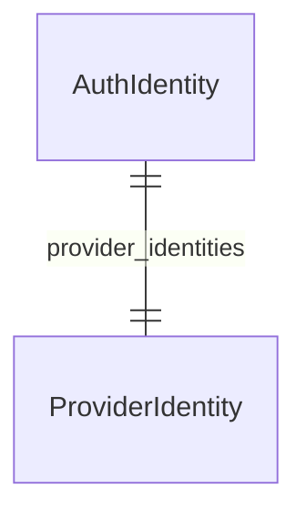

import { TypeList } from "docs-ui"

# Auth Module Data Models Reference

This documentation provides a reference to the data models in the Auth Module

## Relations Overview

## Classes

- [AuthIdentity](../../auth_models/classes/auth_models.AuthIdentity/page.mdx)
- [ProviderIdentity](../../auth_models/classes/auth_models.ProviderIdentity/page.mdx)
