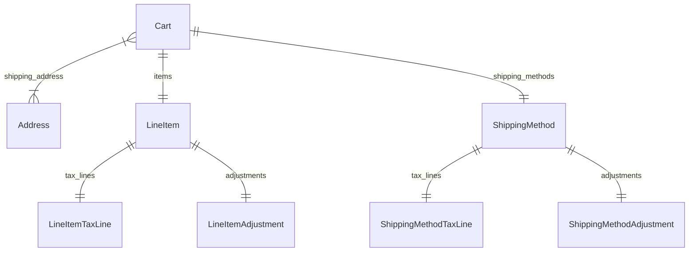

import { TypeList } from "docs-ui"

# Cart Module Data Models Reference

This documentation provides a reference to the data models in the Cart Module

## Relations Overview

## Classes

- [Address](../../cart_models/classes/cart_models.Address/page.mdx)
- [Cart](../../cart_models/classes/cart_models.Cart/page.mdx)
- [LineItemAdjustment](../../cart_models/classes/cart_models.LineItemAdjustment/page.mdx)
- [LineItemTaxLine](../../cart_models/classes/cart_models.LineItemTaxLine/page.mdx)
- [LineItem](../../cart_models/classes/cart_models.LineItem/page.mdx)
- [ShippingMethodAdjustment](../../cart_models/classes/cart_models.ShippingMethodAdjustment/page.mdx)
- [ShippingMethodTaxLine](../../cart_models/classes/cart_models.ShippingMethodTaxLine/page.mdx)
- [ShippingMethod](../../cart_models/classes/cart_models.ShippingMethod/page.mdx)
