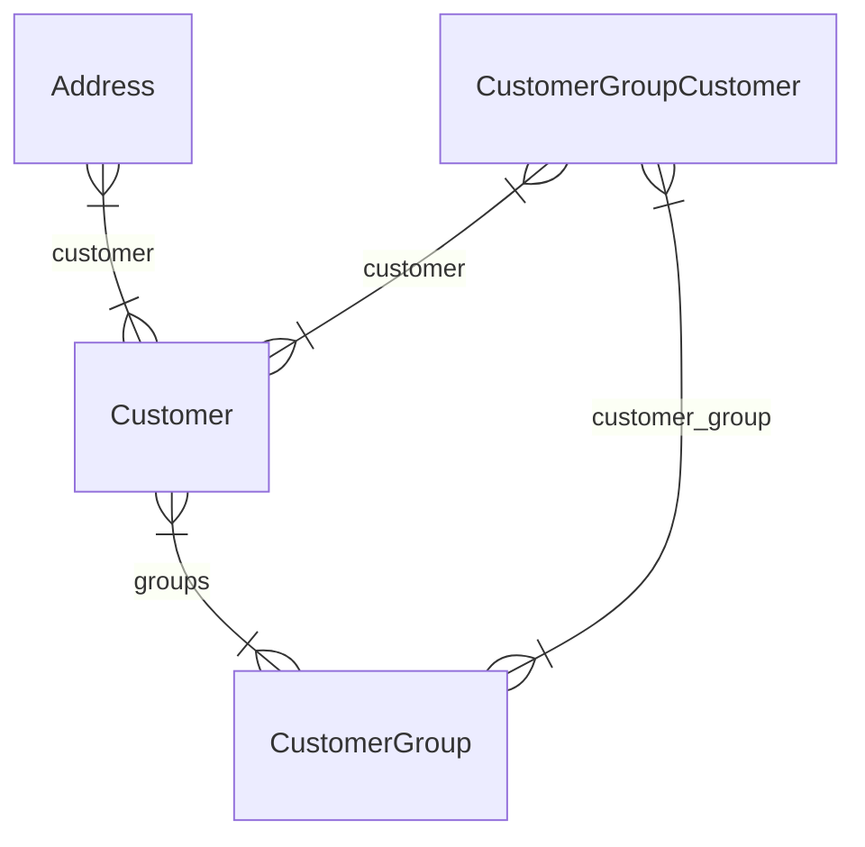

import { TypeList } from "docs-ui"

# Customer Module Data Models Reference

This documentation provides a reference to the data models in the Customer Module

## Relations Overview

## Classes

- [Address](../../customer_models/classes/customer_models.Address/page.mdx)
- [CustomerGroupCustomer](../../customer_models/classes/customer_models.CustomerGroupCustomer/page.mdx)
- [CustomerGroup](../../customer_models/classes/customer_models.CustomerGroup/page.mdx)
- [Customer](../../customer_models/classes/customer_models.Customer/page.mdx)
