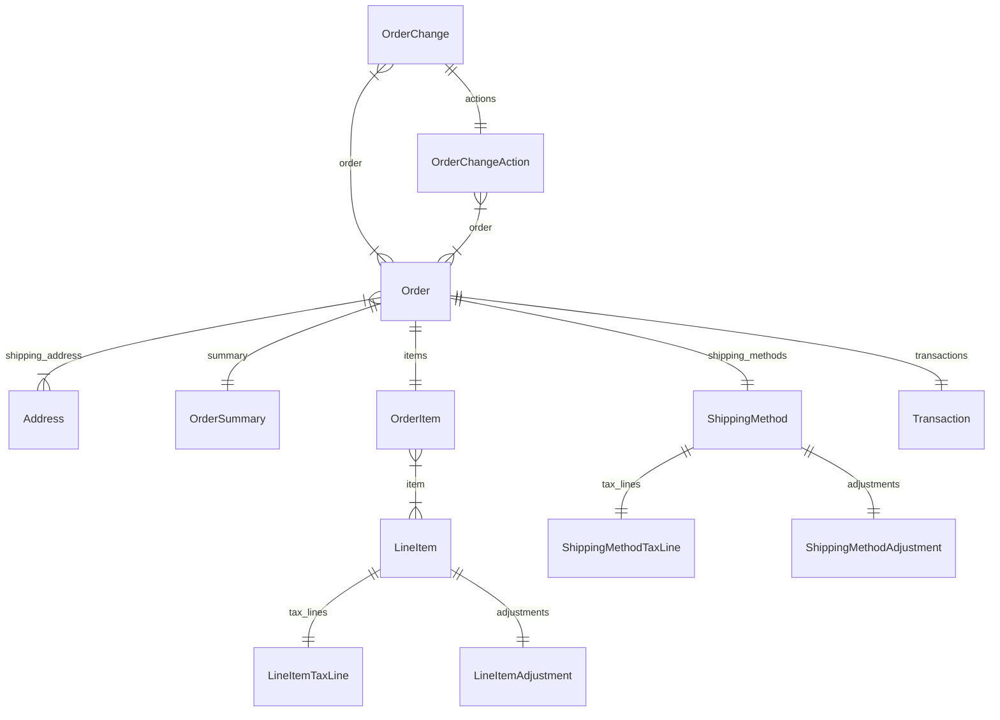

import { TypeList } from "docs-ui"

# Order Module Data Models Reference

This documentation provides a reference to the data models in the Order Module

## Relations Overview

## Classes

- [Address](../../order_models/classes/order_models.Address/page.mdx)
- [LineItemAdjustment](../../order_models/classes/order_models.LineItemAdjustment/page.mdx)
- [LineItemTaxLine](../../order_models/classes/order_models.LineItemTaxLine/page.mdx)
- [LineItem](../../order_models/classes/order_models.LineItem/page.mdx)
- [OrderChangeAction](../../order_models/classes/order_models.OrderChangeAction/page.mdx)
- [OrderChange](../../order_models/classes/order_models.OrderChange/page.mdx)
- [OrderItem](../../order_models/classes/order_models.OrderItem/page.mdx)
- [OrderSummary](../../order_models/classes/order_models.OrderSummary/page.mdx)
- [Order](../../order_models/classes/order_models.Order/page.mdx)
- [ShippingMethodAdjustment](../../order_models/classes/order_models.ShippingMethodAdjustment/page.mdx)
- [ShippingMethodTaxLine](../../order_models/classes/order_models.ShippingMethodTaxLine/page.mdx)
- [ShippingMethod](../../order_models/classes/order_models.ShippingMethod/page.mdx)
- [Transaction](../../order_models/classes/order_models.Transaction/page.mdx)
