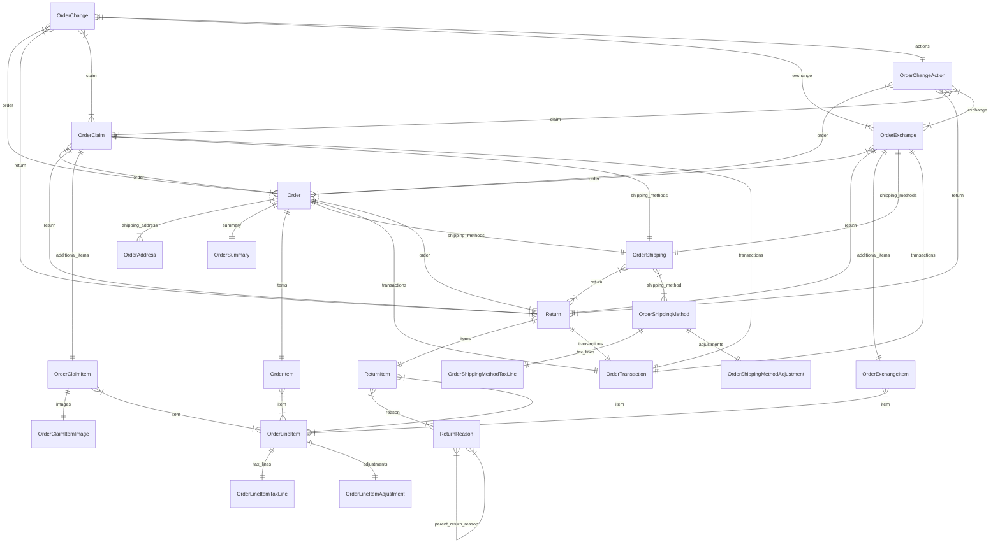

import { TypeList } from "docs-ui"

# Order Module Data Models Reference

This documentation provides a reference to the data models in the Order Module

## Relations Overview

## Classes

- [OrderAddress](../../order_models/classes/order_models.OrderAddress/page.mdx)
- [OrderClaimItemImage](../../order_models/classes/order_models.OrderClaimItemImage/page.mdx)
- [OrderClaimItem](../../order_models/classes/order_models.OrderClaimItem/page.mdx)
- [OrderClaim](../../order_models/classes/order_models.OrderClaim/page.mdx)
- [OrderExchangeItem](../../order_models/classes/order_models.OrderExchangeItem/page.mdx)
- [OrderExchange](../../order_models/classes/order_models.OrderExchange/page.mdx)
- [OrderLineItemAdjustment](../../order_models/classes/order_models.OrderLineItemAdjustment/page.mdx)
- [OrderLineItemTaxLine](../../order_models/classes/order_models.OrderLineItemTaxLine/page.mdx)
- [OrderLineItem](../../order_models/classes/order_models.OrderLineItem/page.mdx)
- [OrderChangeAction](../../order_models/classes/order_models.OrderChangeAction/page.mdx)
- [OrderChange](../../order_models/classes/order_models.OrderChange/page.mdx)
- [OrderItem](../../order_models/classes/order_models.OrderItem/page.mdx)
- [OrderShipping](../../order_models/classes/order_models.OrderShipping/page.mdx)
- [OrderSummary](../../order_models/classes/order_models.OrderSummary/page.mdx)
- [Order](../../order_models/classes/order_models.Order/page.mdx)
- [ReturnItem](../../order_models/classes/order_models.ReturnItem/page.mdx)
- [ReturnReason](../../order_models/classes/order_models.ReturnReason/page.mdx)
- [Return](../../order_models/classes/order_models.Return/page.mdx)
- [OrderShippingMethodAdjustment](../../order_models/classes/order_models.OrderShippingMethodAdjustment/page.mdx)
- [OrderShippingMethodTaxLine](../../order_models/classes/order_models.OrderShippingMethodTaxLine/page.mdx)
- [OrderShippingMethod](../../order_models/classes/order_models.OrderShippingMethod/page.mdx)
- [OrderTransaction](../../order_models/classes/order_models.OrderTransaction/page.mdx)
