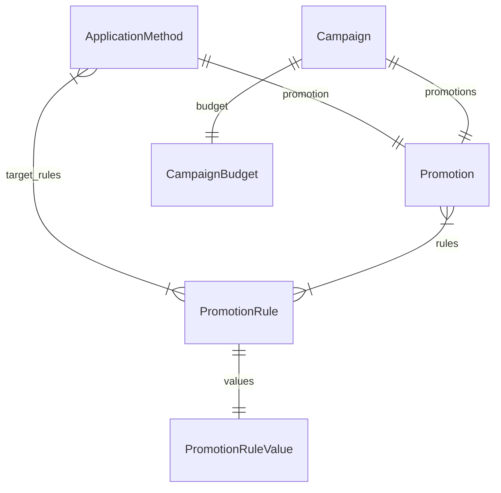

import { TypeList } from "docs-ui"

# Promotion Module Data Models Reference

This documentation provides a reference to the data models in the Promotion Module

## Relations Overview

## Classes

- [ApplicationMethod](../../promotion_models/classes/promotion_models.ApplicationMethod/page.mdx)
- [CampaignBudget](../../promotion_models/classes/promotion_models.CampaignBudget/page.mdx)
- [Campaign](../../promotion_models/classes/promotion_models.Campaign/page.mdx)
- [PromotionRuleValue](../../promotion_models/classes/promotion_models.PromotionRuleValue/page.mdx)
- [PromotionRule](../../promotion_models/classes/promotion_models.PromotionRule/page.mdx)
- [Promotion](../../promotion_models/classes/promotion_models.Promotion/page.mdx)
