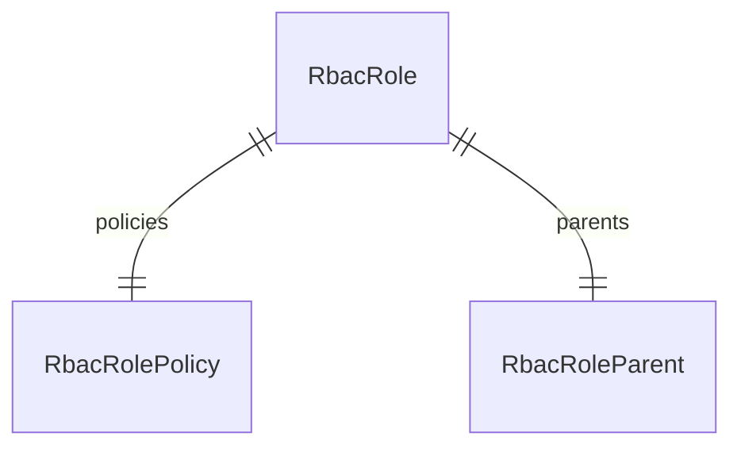

import { TypeList } from "docs-ui"

# RBAC Module Data Models Reference

<EnterpriseNotice featureName="role-based access control feature" featureFlag="rbac" featureFlagHref="/resources/commerce-modules/rbac#how-to-use-the-rbac-module" />

This documentation provides a reference to the data models in the RBAC Module

## Relations Overview

## Data Models

- [RbacPolicy](../../rbac_models/variables/rbac_models.RbacPolicy/page.mdx)
- [RbacRole](../../rbac_models/variables/rbac_models.RbacRole/page.mdx)
- [RbacRoleParent](../../rbac_models/variables/rbac_models.RbacRoleParent/page.mdx)
- [RbacRolePolicy](../../rbac_models/variables/rbac_models.RbacRolePolicy/page.mdx)
