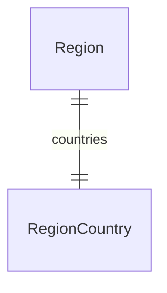

import { TypeList } from "docs-ui"

# Region Module Data Models Reference

This documentation provides a reference to the data models in the Region Module

## Relations Overview

## Data Models

- [RegionCountry](../../region_models/variables/region_models.RegionCountry/page.mdx)
- [Region](../../region_models/variables/region_models.Region/page.mdx)
