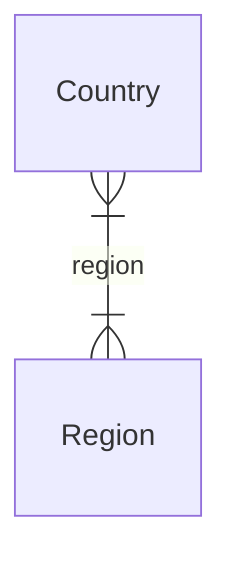

import { TypeList } from "docs-ui"

# Region Module Data Models Reference

This documentation provides a reference to the data models in the Region Module

## Relations Overview

## Classes

- [Country](../../region_models/classes/region_models.Country/page.mdx)
- [Region](../../region_models/classes/region_models.Region/page.mdx)
