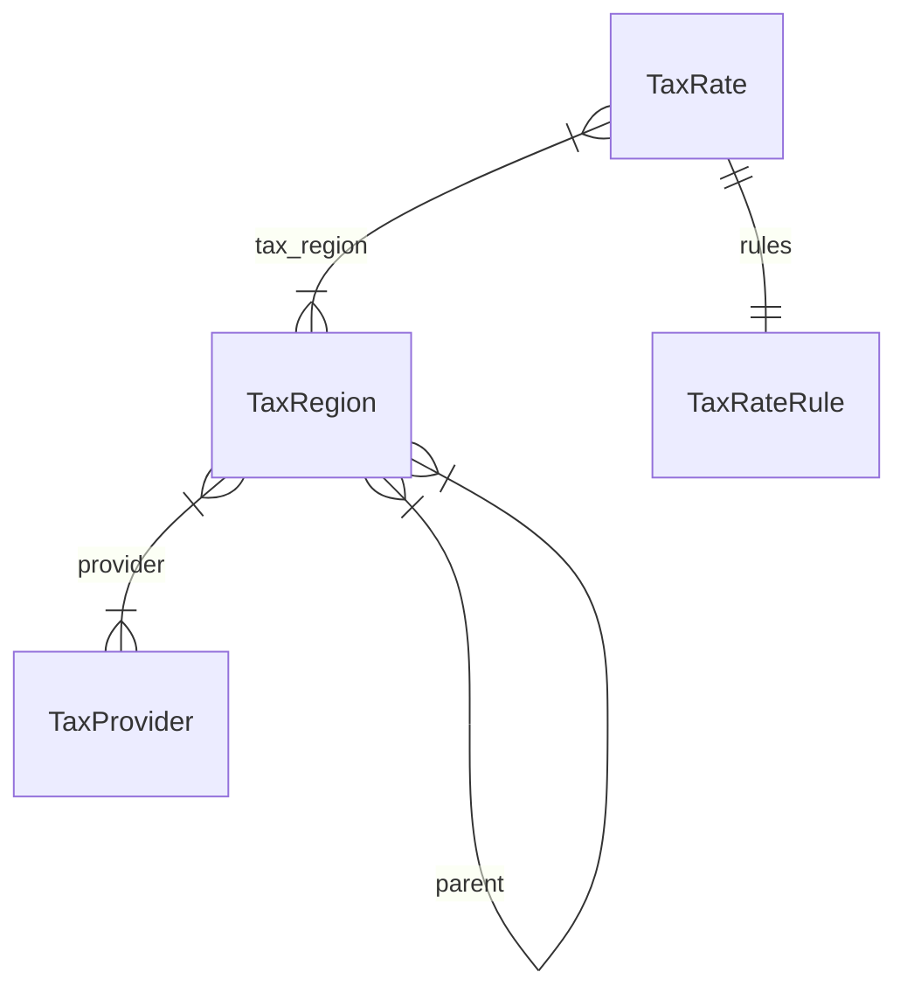

import { TypeList } from "docs-ui"

# Tax Module Data Models Reference

This documentation provides a reference to the data models in the Tax Module

## Relations Overview

## Classes

- [TaxProvider](../../tax_models/classes/tax_models.TaxProvider/page.mdx)
- [TaxRateRule](../../tax_models/classes/tax_models.TaxRateRule/page.mdx)
- [TaxRate](../../tax_models/classes/tax_models.TaxRate/page.mdx)
- [TaxRegion](../../tax_models/classes/tax_models.TaxRegion/page.mdx)
